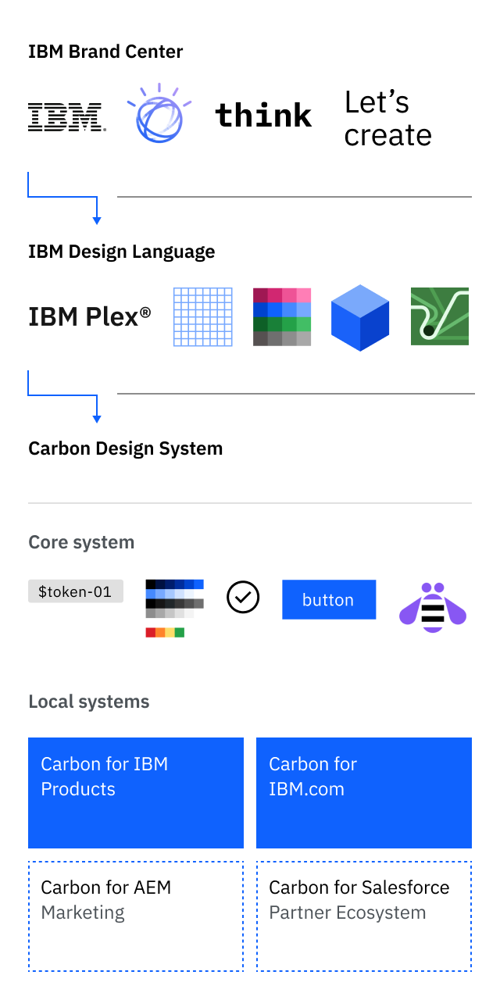
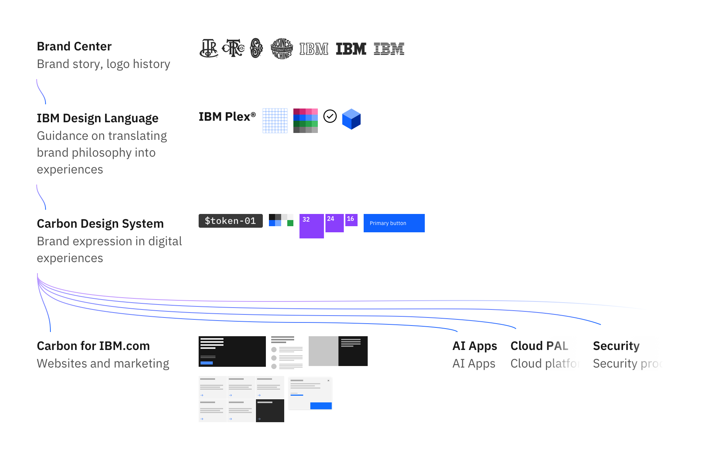

<PageDescription>

Carbon for IBM.com is the open source design system for IBM.com's web experiences. The system consists of working code, design tools, and resources for page owners, designers, and developers creating pages for the IBM.com website.

</PageDescription>

<AnchorLinks>

<AnchorLink>Overview</AnchorLink>
<AnchorLink>Our place in the ecosystem</AnchorLink>
<AnchorLink>What we provide</AnchorLink>
<AnchorLink>Questions</AnchorLink>

</AnchorLinks>

## Overview

Carbon for IBM.com is for IBM teams building web experiences for the IBM.com site. It is built upon the foundational components of the Carbon Design System, with additional components and styling developed for the more editorial approach required of IBM's web pages.

The system is developed and maintained by the Digital Design Squad—a core team of designers, developers, and writers.

Carbon for IBM.com components are built with [Web Components](https://www.ibm.com/standards/carbon/web-components/?path=/story/overview-getting-started--page).

## Our place in the ecosystem

When you hear about people talking about Carbon, it's important to know that it's more than just one website.

The following diagram shows the relationships of assets and guidance across IBM—from the foundations of Brand and the IBM Design Language, to the digital implementation in the Carbon Design System that in turn provides the foundation for our products and web pages.

<ArtDirection>

</ArtDirection>

<Caption>Carbon for IBM.com in the IBM ecosystem</Caption>

## What we provide

Carbon for IBM.com is focused on supporting everyone creating IBM.com applications and web pages. The system provides features and components relevant to IBM.com.

- Component code and usage guidance (incl. Masthead and Footer)
- Layout patterns usage and code (incl. Lead Space and Table of Contents)
- Design assets
- Web Components framework
- Accessibility tested and compliant
- Google Analytics
- Services and utilities (required Tealium)
- Weekly Office Hours to support work in progress
- Slack Support channel for any questions
