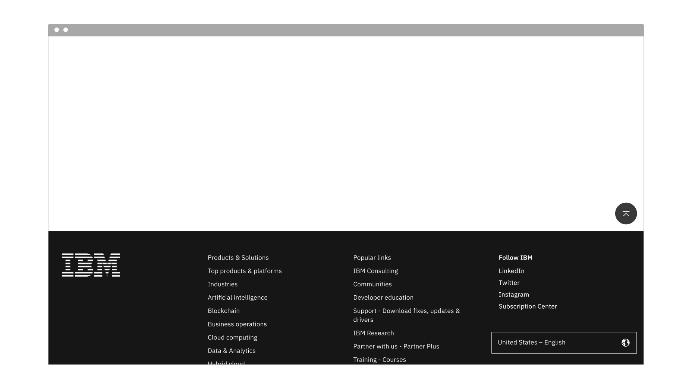

import ComponentDescription from 'components/ComponentDescription';
import ComponentFooter from 'components/ComponentFooter';
import ResourceLinks from 'components/ResourceLinks';

<ComponentDescription name="Back to top" type="ui" />{' '}

<AnchorLinks>

<AnchorLink>Resources</AnchorLink>
<AnchorLink>Overview</AnchorLink>
<AnchorLink>Content guidance</AnchorLink>
<AnchorLink>Feedback</AnchorLink>

</AnchorLinks>

<ResourceLinks name="Back to top" type="ui" />

## Overview

Back to top lives in the bottom right of the page, and only appears when the document height is 3x greater than the viewport.
Once it reaches the top of the footer it becomes static and scrolls with the rest of the content on the page until users scroll up again.
Upon interacting with the component, the page will scroll back to the top, and the component will disappear accordingly.

<Row>
<Column colMd={8} colLg={8}>

</Column>
</Row>

<Title>Use case</Title>

## Content guidance

| Element                                                                      | Content type | Required | Instances | Character limit  (English / translated) | Notes                                            |
| ---------------------------------------------------------------------------- | ------------ | -------- | --------- | ------------------------------------------- | ------------------------------------------------ |
| [Button (icon)](https://www.carbondesignsystem.com/components/button/usage/) | Component    | Yes      | 1         | –                                           | Button appears when scroll begins and is sticky. |
| Image alt text                                                               | Text         | No       | 1         | 20 / 32                                     |                                                  |

<ComponentFooter name="Back to top" type="ui" />
