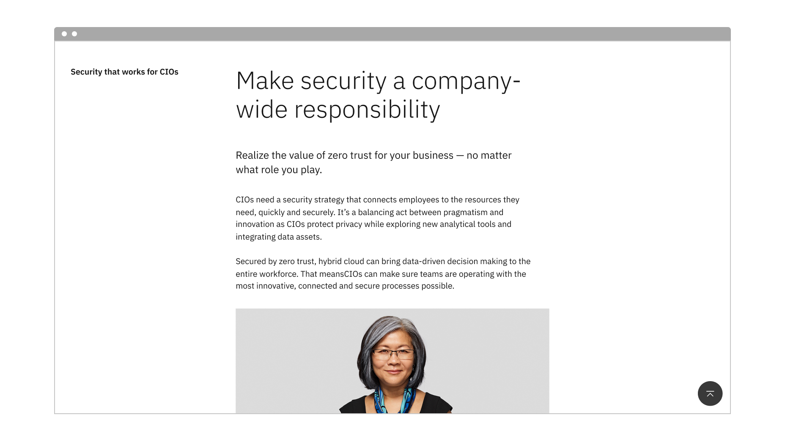

import ComponentDescription from "components/ComponentDescription";
import ComponentFooter from "components/ComponentFooter";

<ComponentDescription name="Back to top" type="ui" />

<InlineNotification>

**Note:** Additional usage guidelines are coming soon.

</InlineNotification>

<AnchorLinks>

<AnchorLink>Default</AnchorLink>
<AnchorLink>Design and functional specifications</AnchorLink>
<AnchorLink>Development documentation</AnchorLink>
<AnchorLink>Feedback</AnchorLink>

</AnchorLinks>

## Default

Back to top lives in the bottom right of the page, and only appears if the page is long enough as users are scrolling down the page. Once it reaches the footer it becomes static and scrolls with the rest of the content on the page until users scroll up again.

<Row>
<Column colMd={8} colLg={8}>

</Column>
</Row>

<Title>Use case</Title>

<ComponentFooter name="Back to top" type="ui" />
