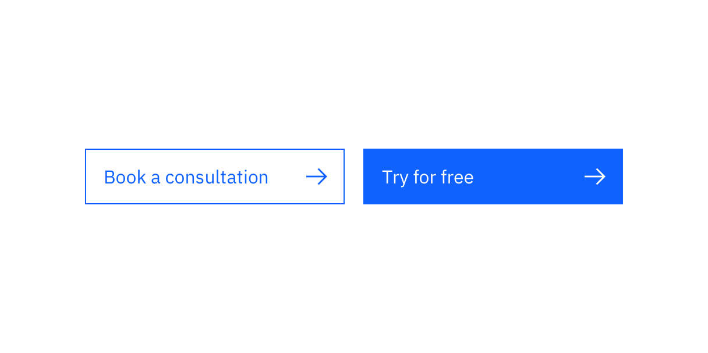

import ComponentDescription from "components/ComponentDescription";
import ComponentFooter from "components/ComponentFooter";

<ComponentDescription name="Button group" type="ui" />

<InlineNotification>

**Note:** Additional usage guidelines are coming soon.

</InlineNotification>

<AnchorLinks>

<AnchorLink>Content guidance</AnchorLink>
<AnchorLink>Design and functional specifications</AnchorLink>
<AnchorLink>Development documentation</AnchorLink>
<AnchorLink>Feedback</AnchorLink>

</AnchorLinks>

## Default

Button group sets buttons at 16px apart, and matches width of all buttons to the longest button in the group.

<Row>
<Column colMd={8} colLg={8}>

<Caption>Even though the label of primary button is shorter, the button has the same width as the other button</Caption>
</Column>
</Row>

## Content guidance

| Field                                                                                                            | Field type | Required | Cardinality         | Notes                                                                                |
| ---------------------------------------------------------------------------------------------------------------- | ---------- | -------- | ------------------- | ------------------------------------------------------------------------------------ |
| <a href="https://www.carbondesignsystem.com/components/button/usage" target="_blank" rel="noreferrer">Button</a> | Component  | Yes      | Two or more buttons | There is one primary button shown at the end. The rest of the buttons are secondary. |

<ComponentFooter name="Button group" type="ui" />
