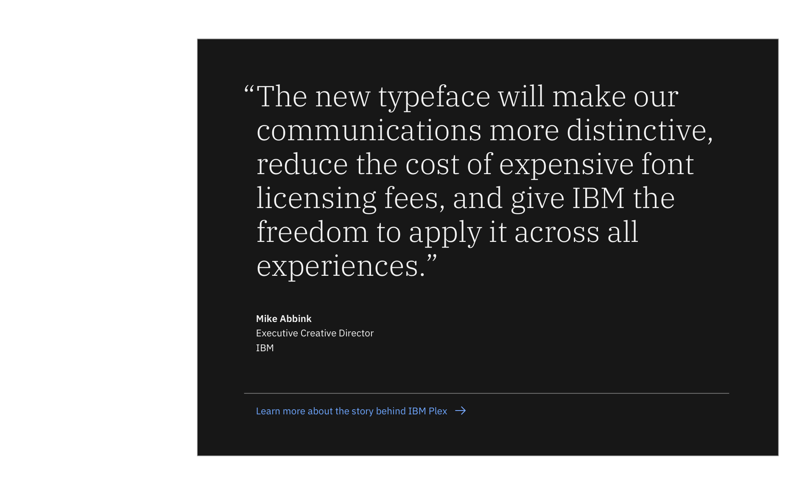

import ComponentDescription from 'components/ComponentDescription';
import ComponentFooter from 'components/ComponentFooter';
import ResourceLinks from 'components/ResourceLinks';

<ComponentDescription name="Callout quote" type="layout" />

<AnchorLinks>

<AnchorLink>Resources</AnchorLink>
<AnchorLink>Overview</AnchorLink>
<AnchorLink>Content guidance</AnchorLink>
<AnchorLink>Feedback</AnchorLink>

</AnchorLinks>

<ResourceLinks name="Callout quote" type="layout" />

## Overview

The Callout quote pattern uses high contrast colors to create a delightful pause in the narrative and create a powerful
impression on the user.

 

## Content guidance

| Element                                                          | Content type | Required | Instances | Character limit  (English / translated) | Notes                                                                                                                                                                  |
| ---------------------------------------------------------------- | ------------ | -------- | --------- | ------------------------------------------- | ---------------------------------------------------------------------------------------------------------------------------------------------------------------------- |
| Primary copy                                                     | Text         | Yes      | 1         | 200 / 260                                   | Quote.                                                                                                                                                                 |
| Copy 1                                                           | Text         | No       | 1         | 65 / 85                                     | For example, name.                                                                                                                                                     |
| Copy 2                                                           | Text         | No       | 1         | 65 / 85                                     | For example, role.                                                                                                                                                     |
| Copy 3                                                           | Text         | No       | 1         | 65 / 85                                     | For example, company.                                                                                                                                                  |
| Quotation mark type                                              | Option list  | No       | 1         | –                                           | Double curved (default) (“”)  Single curved (‘’)  Double angle («»)  Single angle (‹›) Low high reversed double curved („ “) Corner bracket (「」) |
| [CTA](https://www.ibm.com/standards/carbon/components/cta/#text) | Component    | No       | 1         | –                                           | Text style CTA only.                                                                                                                                                   |

For more information, see the [character count standards](https://www.ibm.com/standards/carbon/guidelines/content#character-count-standards).

<ComponentFooter name="Callout quote" type="layout" />
