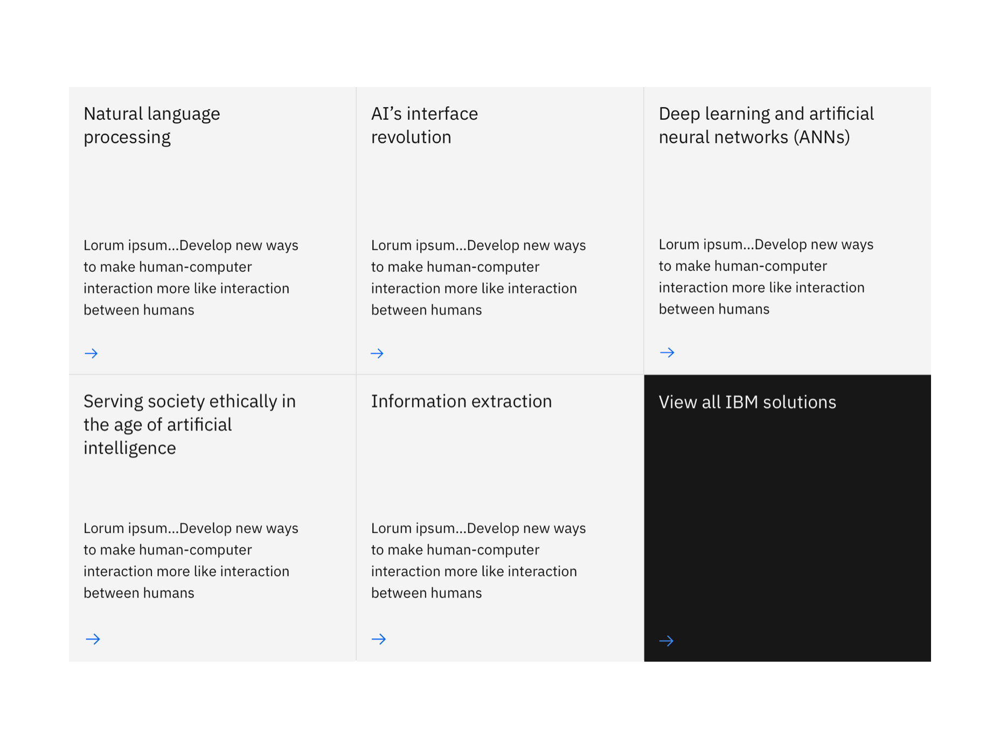
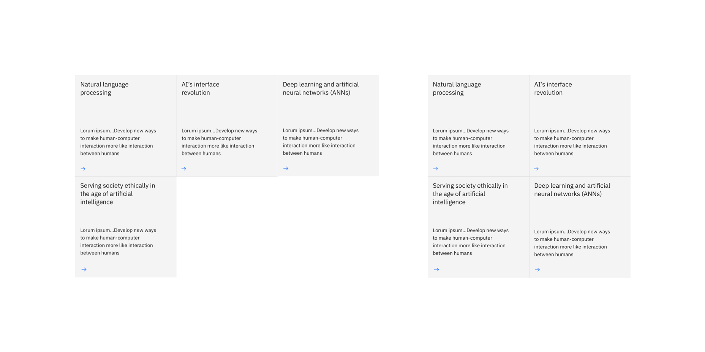
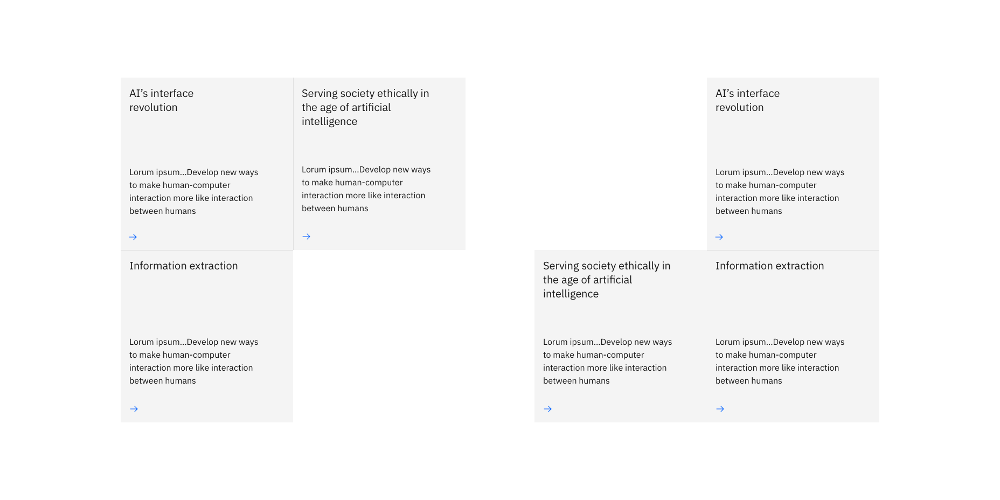

import ComponentDescription from 'components/ComponentDescription';
import ComponentFooter from 'components/ComponentFooter';
import ResourceLinks from 'components/ResourceLinks';

<ComponentDescription name="Card group" type="layout" />

<AnchorLinks>

<AnchorLink>Resources</AnchorLink>
<AnchorLink>Overview</AnchorLink>
<AnchorLink>Variations</AnchorLink>
<AnchorLink>Modifiers</AnchorLink>
<AnchorLink>Content guidance</AnchorLink>
<AnchorLink>Feedback</AnchorLink>

</AnchorLinks>

<ResourceLinks name="Card group" type="layout" />

## Overview

Card group by default arranges cards on a collapsed grid, and applies a 1px border between neighboring cards. An optional CTA card in an inverse theme can be added for visual impact. Only one CTA card is allowed per group.

<Row>
<Column colMd={8} colLg={8}>

<Caption>Example of a card group with inversely-themed CTA card</Caption>

</Column>
</Row>

## Variations

### Card group with card in card

Card in card can be used with the card group component to give focus to the first card.

<Row>
<Column colMd={8} colLg={8}>

<Caption>
  Card group with card in card above. The example shown here is using the narrow
  grid.
</Caption>

</Column>
</Row>

## Modifiers

Card group allows the following properties to be modified to achieve a wide range of designs.

### Cards per row

Cards per row dictates the number of cards in a row. Sometimes this can be adjusted based on total card number or breakpoint to avoid orphaning single card in the last row.

<Caption>
  To avoid having a single card on a row (as shown in the left image), you
  change change the cards per row setting from 3 to 2, to achieve a 2x2
  configuration (as shown in the right image).
</Caption>

### Offset

Offset adds empty card slots to the beginning of the group, and can be used to achieve L shape card groups.

<Caption>Card groups with 3 cards in two different shapes.</Caption>

## Content guidance

| Element                                                                            | Content type | Required | Instances | Character limit  (English / translated) | Notes                                                             |
| ---------------------------------------------------------------------------------- | ------------ | -------- | --------- | ------------------------------------------- | ----------------------------------------------------------------- |
| [Card](https://www.ibm.com/standards/carbon/components/cards#card)                 | Component    | Yes      | Min 2     | –                                           | Maximum of 1 offset card when using offset styling. Default is 0. |
| [Card in card](https://www.ibm.com/standards/carbon/components/cards#card-in-card) | Component    | No       | 1         | –                                           | 1 card in card above a maximum of 6 cards in a 3:X layout.        |
| CTA card                                                                           | UI Element   | No       | 1         | 25 / 35                                     |                                                                   |

For more information, see the [character count standards](https://www.ibm.com/standards/carbon/guidelines/content#character-count-standards).

<ComponentFooter name="Card group" type="layout" />
