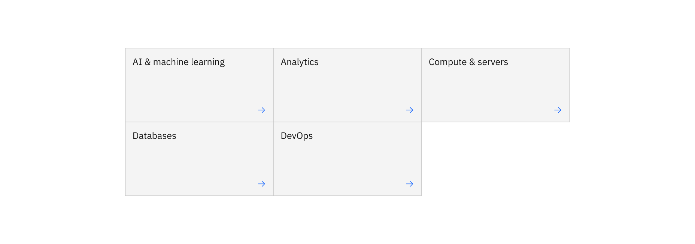

import ComponentDescription from 'components/ComponentDescription';
import ComponentFooter from 'components/ComponentFooter';
import ResourceLinks from 'components/ResourceLinks';

<ComponentDescription name="Card group" type="layout" />

<AnchorLinks>

<AnchorLink>Overview</AnchorLink>
<AnchorLink>Variations</AnchorLink>
<AnchorLink>Modifiers</AnchorLink>
<AnchorLink>Resources</AnchorLink>
<AnchorLink>Content guidance</AnchorLink>
<AnchorLink>Feedback</AnchorLink>

</AnchorLinks>

## Overview

Card group arranges the various [cards](../components/cards) types within a grid and offers additional modifiers:

- cards per row
- offset cards
- gutter modes for spacing between cards

Card group works well when each card can link to a separate resource. If you are looking for a component to only display information and media instead of linking, consider using [content items](../components/content-item).

<Row>
<Column colMd={8} colLg={8}>

<Caption>Example of a card group in wide grid mode </Caption>

</Column>
</Row>

## Variations

### Card group with card in card

Card in card can be used with the card group component to give focus to the first card. This works well when you need to give prominence to a single card in the group, with other cards providing secondary resources.

<Row>

<Column colMd={8} colLg={8}>

<Caption>
  Card group with card in card above, all cards using the condensed grid
</Caption>

</Column>

</Row>

## Modifiers

### Cards per row

Cards per row dictates the number of cards in a given row in the group. Depending on the total number of cards, this can be adjusted to avoid orphaning a single card in the last row.

_Note: card groups should always adhere to the 2x grid and therefore we do not recommend selecting an odd number of cards per row (i.e. 5). In general 2–4 cards works best with most Carbon for IBM.com layout configurations._

<Caption>
  To avoid having a single card on a row (as shown in the left image), you
  change change the cards per row setting from 3 to 2, to achieve a 2x2
  configuration (as shown in the right image).
</Caption>

### Gutter mode

Card group has the option to change the way the cards sit on the 2x grid using gutter modes. These different modes change the spacing between cards and allow for more variety in how card group displays.

See Carbon Design System's [Gutter modes](https://carbondesignsystem.com/guidelines/2x-grid/usage/#gutter-modes) documentation for more information.

#### Condensed

The condensed grid mode hangs the cards on both sides of the columns and leaves 1px of space between each card.

<Caption>
  Card group in the condensed gutter mode
</Caption>

#### Narrow

The narrow gutter mode hangs the card 16px on the left side of the column and leaves 16px of space between each card.

<Caption>
  Card group in the narrow gutter mode
</Caption>

#### Wide

The wide gutter mode aligns the cards to the columns of the grid and leaves 32px of space between each card.

<Caption>
  Card group in the wide gutter mode
</Caption>

### Offset

Offset adds an empty card slot to the beginning of the group, and can be used to achieve additional white space at the start of the card group. This can help vary the layout of card groups within a particular page.

<Row>

<Column colMd={8} colLg={8}>

<Caption>Example of an offset card group</Caption>

</Column>

</Row>

<ResourceLinks name="Card group" type="layout" />

## Content guidance

| Element                                                                            | Content type | Required | Instances | Character limit  (English / translated) | Notes                                                             |
| ---------------------------------------------------------------------------------- | ------------ | -------- | --------- | ------------------------------------------- | ----------------------------------------------------------------- |
| [Card](https://www.ibm.com/standards/carbon/components/cards#card)                 | Component    | Yes      | Min 2     | –                                           | Maximum of 1 offset card when using offset styling. Default is 0. |
| [Card in card](https://www.ibm.com/standards/carbon/components/cards#card-in-card) | Component    | No       | 1         | –                                           | 1 card in card above a maximum of 6 cards in a 3:X layout.        |
| CTA card                                                                           | UI Element   | No       | 1         | 25 / 35                                     |                                                                   |

For more information, see the [character count standards](https://www.ibm.com/standards/carbon/guidelines/content#character-count-standards).

<ComponentFooter name="Card group" type="layout" />
