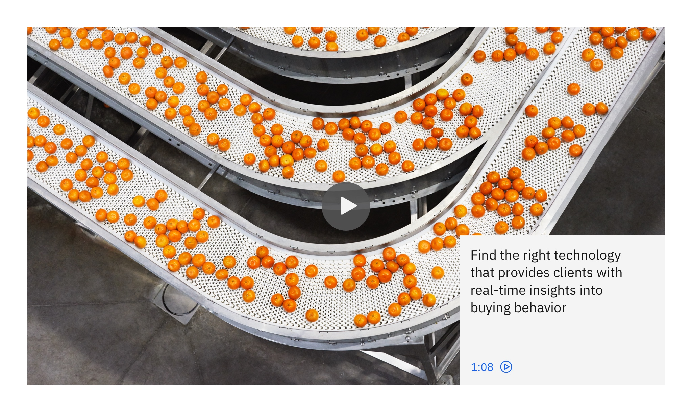

import { ComponentStatus } from "components/ComponentList";
import ComponentDescription from "components/ComponentDescription";
import ComponentFeedback from "components/ComponentFeedback";

<ComponentDescription name="Card in card" type="ui" />

<InlineNotification>

**Note:** Additional usage guidelines are coming soon.

</InlineNotification>

<AnchorLinks>

<AnchorLink>Default</AnchorLink>
<AnchorLink>Design and functional specifications</AnchorLink>
<AnchorLink>Development documentation</AnchorLink>
<AnchorLink>Feedback</AnchorLink>

</AnchorLinks>

## Default

Card in card shares the same functionality and text content requirements of a standard card, but requires a large media. Card in card is often used in a [Card group](https://www.ibm.com/standards/web/carbon-for-ibm-dotcom/components/card-group) to as a featured card.

<Row>
<Column colMd={8} colLg={8}>

</Column>
</Row>

 

## Design and functional specifications

For more details, [see design](https://ibm.box.com/s/jad2fd65p56odcme9aoy1lgmuo1xaifu) and [functional specs]().

 

## Development documentation

<ComponentStatus name="Card in card" type="ui" />

 

## Feedback

<ComponentFeedback />
