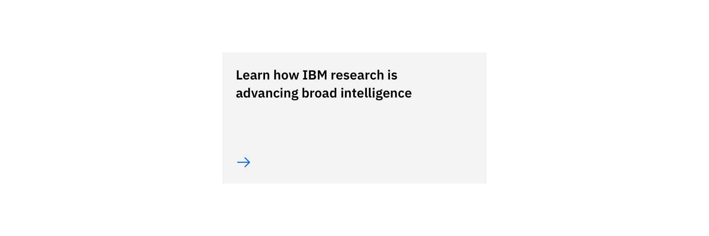

<PageDescription>

The Card link is a card that acts as a CTA (call-to-action), typically used at the end of a section of a page.

</PageDescription>

<AnchorLinks>

<AnchorLink>Default</AnchorLink>
<AnchorLink>Design and functional specifications</AnchorLink>
<AnchorLink>Development documentation</AnchorLink>
<AnchorLink>Feedback</AnchorLink>

</AnchorLinks>

## Default
Card links contain a heading, the CTA (call-to-action), and an action icon within a tile. The entire card is clickable.

<Row>
<Column colMd={8} colLg={8}>

</Column>
</Row>

## Design and functional specifications

The design specs and functional specs for Card link can be viewed <a href="https://ibm.box.com/s/1u2m0fqdtrumog0ie2c4tfyyyn1clyj7" target="_blank">here</a>.

## Development documentation

| Language      | Status        | Sandbox                                                                              |
| ------------- | -----------   | ------------------------------------------------------------------------             |
| React         | 
<pre>Stable</pre>
        | <a href="https://ibmdotcom-react.mybluemix.net/?path=/story/components-cardlink--default" target="_blank">View storybook</a>|
| Web Components       | 
<pre>Under construction</pre>
  | Coming soon |

## Feedback

Help us improve this component by providing feedback, asking questions, and leaving any other comments on <a href="https://github.com/carbon-design-system/ibm-dotcom-library" target="_blank">GitHub</a>.
