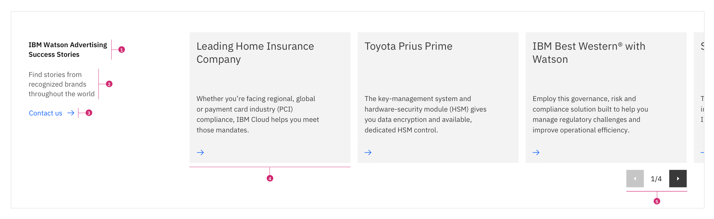
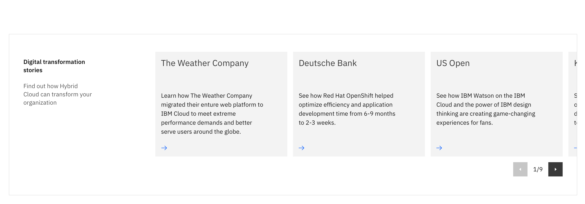

import ComponentDescription from 'components/ComponentDescription';
import ComponentFooter from 'components/ComponentFooter';
import ResourceLinks from 'components/ResourceLinks';

<ComponentDescription name="Card section carousel" type="layout" />

<AnchorLinks>

<AnchorLink>Resources</AnchorLink>
<AnchorLink>Overview</AnchorLink>
<AnchorLink>Anatomy</AnchorLink>
<AnchorLink>Usage guidance</AnchorLink>
<AnchorLink>Content guidance</AnchorLink>
<AnchorLink>Feedback</AnchorLink>

</AnchorLinks>

<ResourceLinks name="Card section carousel" type="layout" />

## Overview

This layout component is commonly used when you have a large amount of similar content needed on a page, but you don’t want to increase the screen real estate. It includes a headline, cards, controls, an optional sub-copy, and an optional CTA text link.

 

## Anatomy

1. **Headline**: Heading copy for the carousel component and is required.
2. **Subheading**: Additional sub copy usually used to elaborates on the main headline above it and is optional.
3. **CTA text link**: Call to action text link for directing the user to an action based off the content in the carousel and is optional.
4. **Cards**: The main content of the carousel lives in the cards. This card can be designed with any variations of the [Card](https://www.ibm.com/standards/carbon/components/card) component.
5. **Controls**: Icon buttons and pagination provide navigational controls for browsing through the carousel. These are required in the Carousel component, and you can learn more about the Carousel [here](https://www.ibm.com/standards/carbon/components/carousel).

 

## Usage guidance

### When should I use the Card section carousel?

- Use when you have multiple related content pieces but screen real estate is limited.
- Use when you have exploratory content that isn't necessary but helpful for the user.
- Use when you want to tease user with additional related content.

### When should I not use the Card section carousel?

- Do not use when content frames are not related.
- Do not use when users need to consume all carousel content because most users won't view every slide.

### Content

- The recommended amount of content is a minimum of 5 cards and maximum of 15 cards to avoid excessive clicking for the user.
- Make sure content in the carousel is related.
- Do not add essential content to a carousel. Essential content could include navigational or wayfinding content links.
- Prioritize the most important content at the beginning of the carousel.
- Carousel content should be simple and concise.
- Common content used in carousels includes use cases, news articles, client testimonials, and quotes.
- Make sure carousel content can be accessed outside the carousel in a menu, footer, and navigational page.

 

<Row>
<Column colMd={8} colLg={12} >
  <DoDontExample caption="It is not recommended to exceed 5 paginations of content within the carousel.">

  </DoDontExample>
</Column>
</Row>

 

 

<Row>
<Column colMd={8} colLg={12}>
  <DoDontExample caption="Never use essential content such as navigational links in the carousel.">

  </DoDontExample>
</Column>
</Row>

## Content guidance

| Element                                                              | Content type | Required | Instances | Character limit  (English / translated) | Notes                           |
| -------------------------------------------------------------------- | ------------ | -------- | --------- | ------------------------------------------- | ------------------------------- |
| Content section                                                      | Component    | Yes      | 1         | –                                           |                                 |
| [Cards](hhttps://www.ibm.com/standards/carbon/components/cards/)     | Component    | Yes      | Min 4     | –                                           | Card types should not be mixed. |
| [Carousel](https://www.ibm.com/standards/carbon/components/carousel) | Component    | Yes      | 1         | –                                           |                                 |

For more information, see the [character count standards](https://www.ibm.com/standards/carbon/guidelines/content/#character-count-standards).

<ComponentFooter name="Card section carousel" type="layout" />
