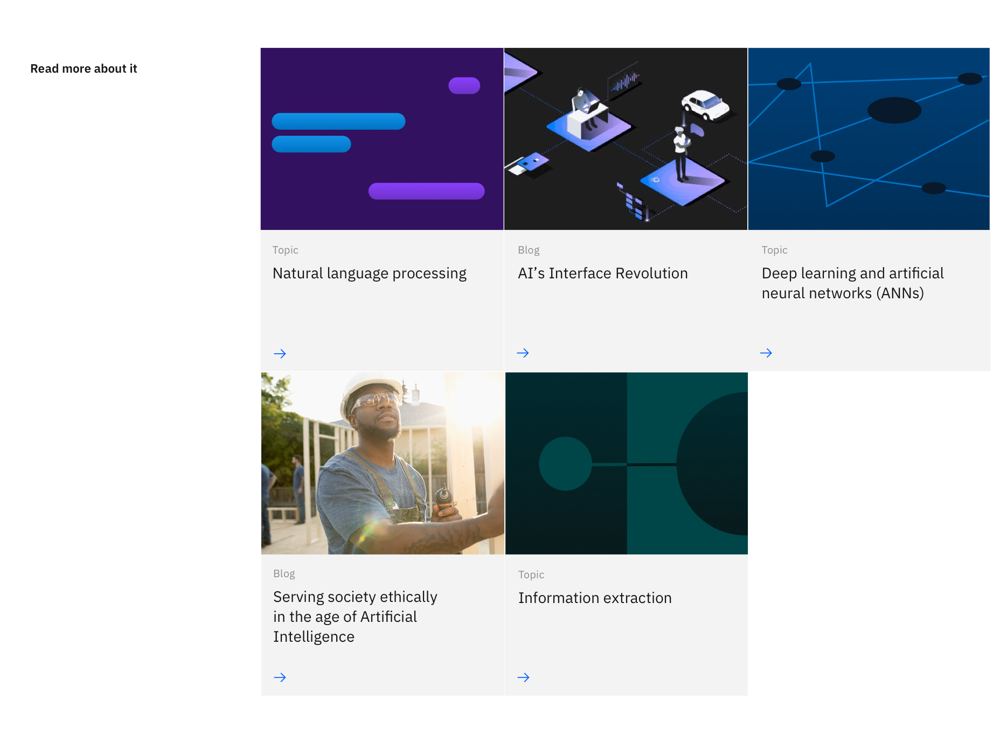

import { ComponentStatus } from 'components/ComponentList';
import ComponentDescription from 'components/ComponentDescription';
import ComponentFeedback from 'components/ComponentFeedback';

<ComponentDescription name="Card section - with images" type="ui" />

<AnchorLinks>
  
<AnchorLink>Default</AnchorLink>
<AnchorLink>Design and functional specifications</AnchorLink>
<AnchorLink>Development documentation</AnchorLink>
<AnchorLink>Feedback</AnchorLink>

</AnchorLinks>

## Default

Card section &mdash; with images is typically used for presenting resources or links.

## Design and functional specifications

The design specs and functional specs for the Card section - with images can be viewed <a href="https://ibm.box.com/s/u4acyo9oeqya8xidimxtidh8k8y08fza" target="_blank">here</a>.

## Development documentation

<ComponentStatus name="Card section - with images" type="ui" />

## Feedback

<ComponentFeedback />

