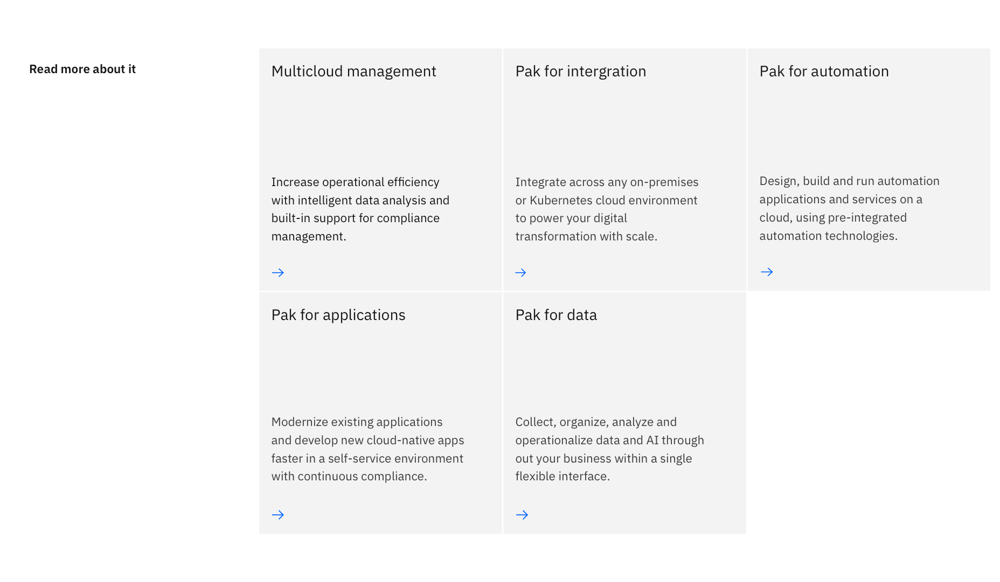
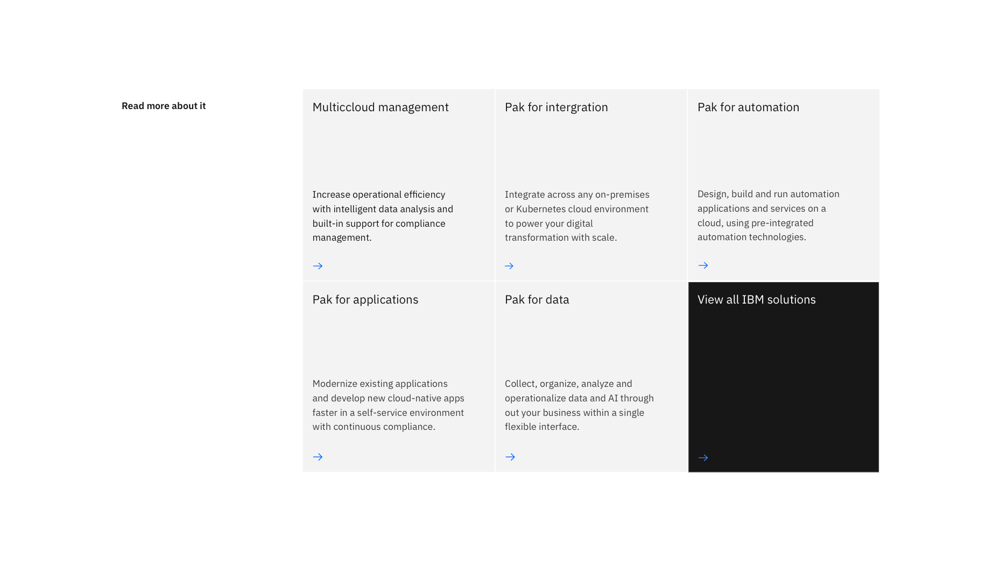
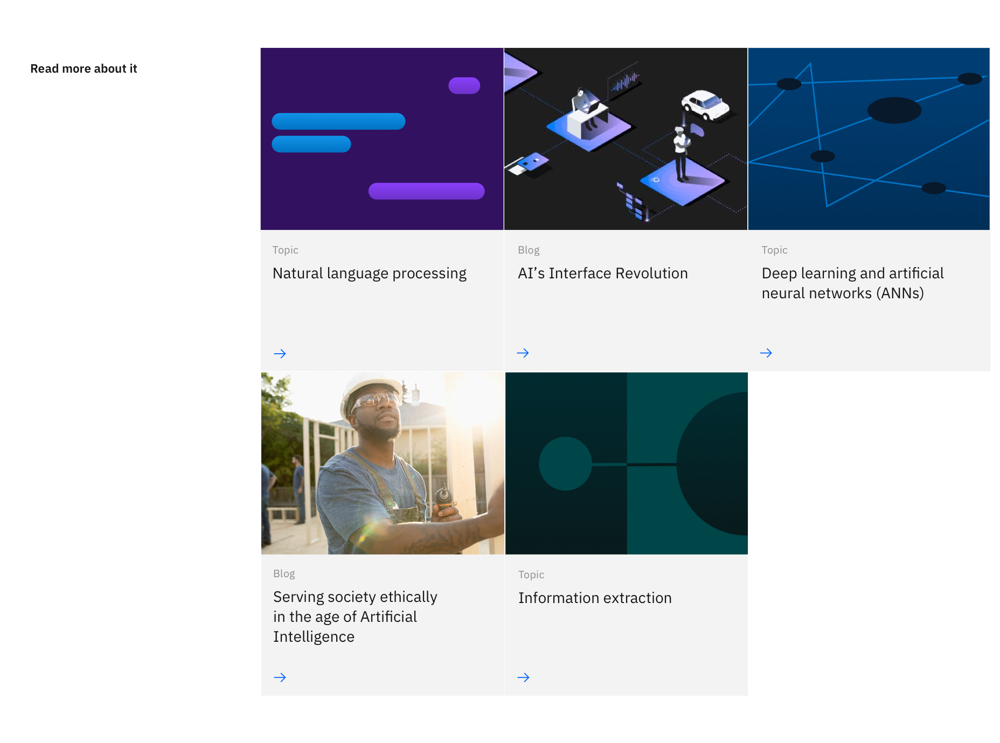

import ComponentDescription from 'components/ComponentDescription';
import ComponentFooter from 'components/ComponentFooter';
import sketchSymbol from '../../images/icon/sketch-symbol.svg';
import githubSymbol from '../../images/icon/github-icon.svg';
import reactSymbol from '../../images/icon/react-icon.svg';
import webComponentsSymbol from '../../images/icon/web-components-icon.svg';
import ResourceLinks from 'components/ResourceLinks';

<ComponentDescription name="Card section" type="layout" />

<AnchorLinks>
  <AnchorLink>Overview</AnchorLink>
  <AnchorLink>Card section</AnchorLink>
  <AnchorLink>Card section with images</AnchorLink>
  <AnchorLink>Feedback</AnchorLink>
</AnchorLinks>

## Overview

Card section and Card section with images are section-level components. The left side container of each includes a
section heading, while the right side includes an array of cards, either with body copy (Card section) or images (Card
section with images). Both components use the underlying component [Card group](/components/card-group).

## Card section

Card section uses cards with a header and body copy to present links to other pages within IBM.com.

<Caption>An example of Card section</Caption>

### Modifiers

#### With CTA

In this variation, the last card in the Card group is set to high contrast and can be used to highlight the primary
action that the user can take.

<Caption>
  When Card section has a CTA, the last card will be set to high contrast.
</Caption>

<ResourceLinks name="Card section" type="layout" multiComponent />

### Content guidance for Card section

| Element                                                             | Content type | Required | Instances | Character limit  (English / translated) | Notes                                                                                                                                                                          |
| ------------------------------------------------------------------- | ------------ | -------- | --------- | ------------------------------------------- | ------------------------------------------------------------------------------------------------------------------------------------------------------------------------------ |
| Heading                                                             | Text         | Yes      | 1         | 25 / 35                                     |                                                                                                                                                                                |
| [Card](https://www.ibm.com/standards/carbon/components/cards/#card) | Component    | Yes      | 2–9       | –                                           | If using a CTA card. the max is 8 cards plus 1 CTA card.                                                                                                                       |
| CTA (card)                                                          | Component    | No       | 1         | –                                           | This CTA is from the [Card group](https://www.ibm.com/standards/carbon/components/card-group/) component, please use the above link to find more information on this CTA type. |

For more information, see the [character count standards](https://www.ibm.com/standards/carbon/guidelines/content#character-count-standards).

## Card section with images

Card section with images brings images into each card in the section. Like Card section, this component is used for
presenting resources or links, but presents images instead of body copy in each card.

When using this component, avoid using a CTA card as this will cause the card heading to misalign.

<Caption>An example of Card section with images</Caption>

<ResourceLinks name="Card section images" type="layout" multiComponent />

### Content guidance for Card section with images

| Element                                                             | Content type | Required | Instances | Character limit  (English / translated) | Notes                                            |
| ------------------------------------------------------------------- | ------------ | -------- | --------- | ------------------------------------------- | ------------------------------------------------ |
| Heading                                                             | Text         | Yes      | 1         | 25 / 35                                     |                                                  |
| [Card](https://www.ibm.com/standards/carbon/components/cards/#card) | Component    | Yes      | 2–9       | –                                           | For this component, you must use the image card. |

For more information, see the [character count standards](https://www.ibm.com/standards/carbon/guidelines/content#character-count-standards).

<ComponentFooter name="Card section" type="layout" />
