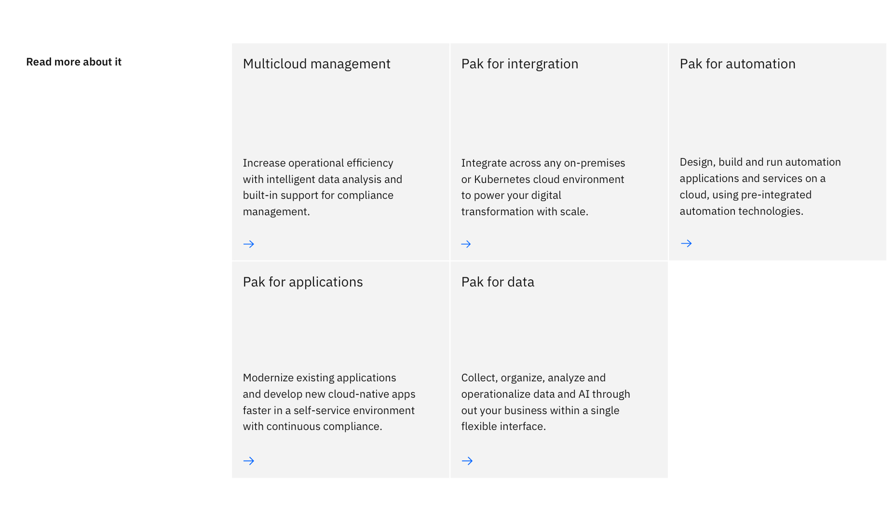
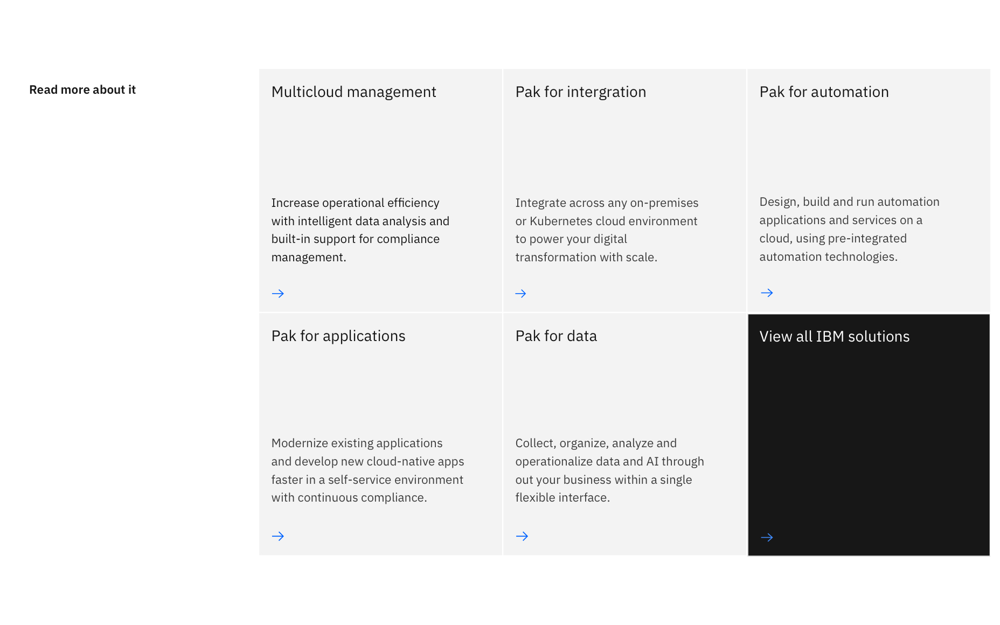

import ComponentDescription from "components/ComponentDescription";
import ComponentFooter from "components/ComponentFooter";
import sketchSymbol from '../../images/sketch-symbol.svg';
import githubSymbol from '../../images/icon/github-icon.svg';
import reactSymbol from '../../images/react-icon.svg';
import webComponentsSymbol from '../../images/web-components-icon.svg';
import ResourceLinks from "components/ResourceLinks";

<ComponentDescription name="Card section" type="layout" />

<AnchorLinks>
<AnchorLink>Overview</AnchorLink>
<AnchorLink>Card section</AnchorLink>
<AnchorLink>Card Section with images</AnchorLink>
<AnchorLink>Feedback</AnchorLink>
</AnchorLinks>

## Overview

Card section is a collection of text-based cards presented in a full-width section with a left-column header. This pattern is typically used for presenting resources or links.

## Card section

Card section is a collection of text-based cards presented in a full-width section with a left-column header. This pattern is typically used for presenting resources or links.

<Caption>An example of Card section</Caption>

### Modifiers

#### With CTA

In this variation, the last card in the Card group is set to high contrast and can be used to highlight the primary action that the user may take.

<Caption>When Card section has a CTA, the last card will be set to high contrast</Caption>

<ResourceLinks name="Card section" type="layout" />

### Content guidance

| Field                                                                           | Field type | Required | Cardinality | Max character size (English / translated) | Notes                                                                                                               |
| ------------------------------------------------------------------------------- | ---------- | -------- | ----------- | ----------------------------------------- | ------------------------------------------------------------------------------------------------------------------- |
| Headline                                                                        | Short copy | Yes      | 1           | Mini (25 / 35)                            | –                                                                                                                   |
| [Card](https://www.ibm.com/standards/carbon/components/card) | Component  | Yes      | 2–6         | –                                         | For this component, you must use the simple card.                                                                   |
| CTA (card)                                                                      | Component  | No       | 1           | –                                         | This CTA is from the "Card group" component. Please go to that component to find more information on this CTA type. |

Note: This uses the underlying component "Card group". You can find more information about that component <a href="https://www.ibm.com/standards/carbon/components/card-group">here</a>.

To see the list of all character count standards, go to this <a href="https://github.com/carbon-design-system/carbon-for-ibm-dotcom-website/wiki/Character-count-standards" target="_blank" rel="noreferrer noopener nofollow">link</a>.

## Card section with images
Card section with images brings images into each card in the section. Like Card section, this components is typically used for presenting resources or links, but also presents images in each card.

<Caption>An example of Card section with images</Caption>

### Resources for Card section with images

<CardGroup>
  <MiniCard
    title="Design specifications"
    href="https://ibm.ent.box.com/folder/102045217811?s=u4acyo9oeqya8xidimxtidh8k8y08fza"
  >
    
  </MiniCard>
  <MiniCard
    title="Functional specifications"
    href="https://github.com/carbon-design-system/carbon-for-ibm-dotcom-website/wiki/Card-section-images"
  >
    
  </MiniCard>
  <MiniCard
    title="React Storybook"
    href="https://www.ibm.com/standards/carbon/react/?path=/story/components-card-section-images--default"
  >
    
  </MiniCard>
  <MiniCard
    title="Web Components Storybook"
    href="https://www.ibm.com/standards/carbon/web-components/?path=/story/components-card-section-images--default"
  >
    
  </MiniCard>
</CardGroup>

### Content guidance

| Field                                                                           | Field type | Required | Cardinality | Max character size (English / translated) | Notes                                            |
| ------------------------------------------------------------------------------- | ---------- | -------- | ----------- | ----------------------------------------- | ------------------------------------------------ |
| Headline                                                                        | Short copy | Yes      | 1           | Mini (25 / 35)                            | –                                                |
| [Card](https://www.ibm.com/standards/carbon/components/card) | Component  | Yes      | 2–6         | –                                         | For this component, you must use the image card. |

Note: This uses the underlying component "Card group". You can find more information about that component <a href="https://www.ibm.com/standards/carbon/components/card-group">here</a>.

To see the list of all character count standards, go to this <a href="https://github.com/carbon-design-system/carbon-for-ibm-dotcom-website/wiki/Character-count-standards" target="_blank" rel="noreferrer noopener nofollow">link</a>.

<ComponentFooter name="Card section" type="layout" />
