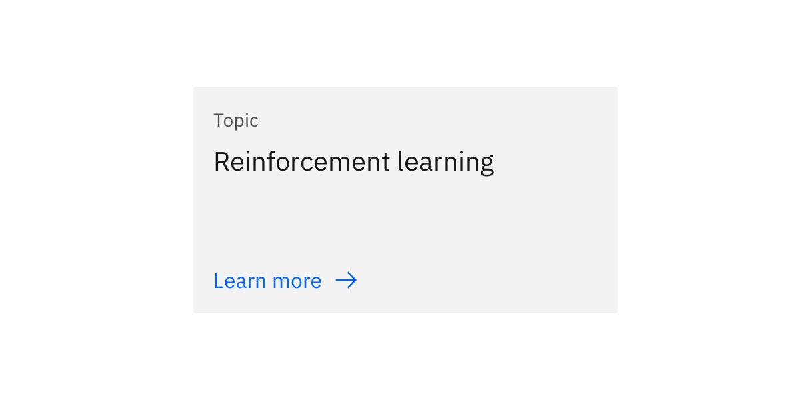
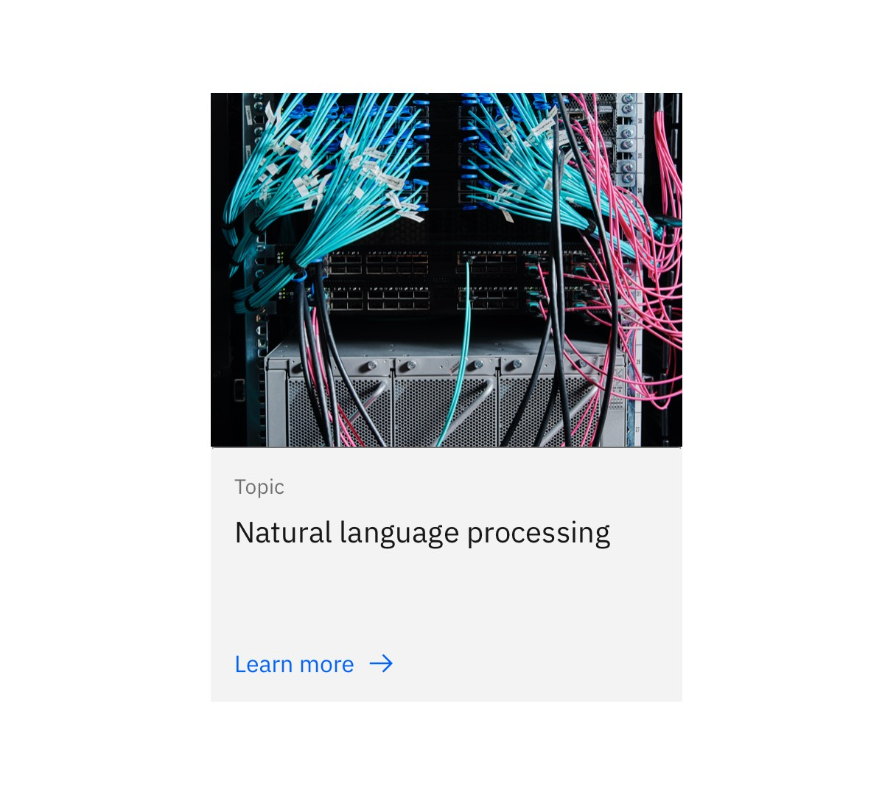

import { ComponentStatus } from 'components/ComponentList';

<PageDescription>

The Card is a clickable UI item that is used to present content in a concise and readable way.

</PageDescription>

<AnchorLinks>

<AnchorLink>Default</AnchorLink>
<AnchorLink>Variations</AnchorLink>
<AnchorLink>Design and functional specifications</AnchorLink>
<AnchorLink>Development documentation</AnchorLink>
<AnchorLink>Feedback</AnchorLink>

</AnchorLinks>

## Default
The default Card is a simple text-based card. It includes a main title, optional eyebrow, body copy, and CTA (call-to-action). The Card can be used to create other card-based components such as [Content group — with cards](https://ibm-dotcom-library.mybluemix.net/patterns/content-group-with-cards) and [Card section.](https://ibm-dotcom-library.mybluemix.net/patterns/card-section)

<Row>
<Column colMd={8} colLg={8}>

</Column>
</Row>

## Variations

### With image
The Card can also include an image. In this variation, the image appears above the text and is set to 4:3 aspect ratio. This variation can be used to create other card-based components such as Card group — with images.

<Row>
<Column colMd={8} colLg={8}>

</Column>
</Row>

## Design and functional specifications
The design specs and functional specs for Card can be viewed [here](https://ibm.box.com/s/3ma5hudlb59s3jossq96yxduqyj68pq7).

## Development documentation

<ComponentStatus name="Card" type="ui" />

## Feedback

Help us improve this component by providing feedback, asking questions, and leaving any other comments on <a href="https://github.com/carbon-design-system/ibm-dotcom-library" target="_blank">GitHub</a>.
