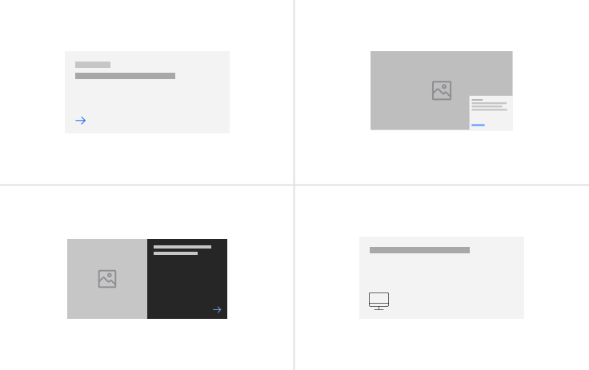

import ComponentDescription from "components/ComponentDescription";
import ComponentFooter from "components/ComponentFooter";
import ResourceLinks from "components/ResourceLinks";

<ComponentDescription name="Card" type="ui" />

<AnchorLinks>
<AnchorLink>Overview</AnchorLink>
<AnchorLink>Card</AnchorLink>
<AnchorLink>Card in card</AnchorLink>
<AnchorLink>Feature card</AnchorLink>
<AnchorLink>Pictogram card</AnchorLink>
<AnchorLink>Feedback</AnchorLink>
</AnchorLinks>

## Overview

To be written.

## Card

The card component is the workhorse for many different page types. The default design includes a heading and a CTA (call-to-action), and optional extras include include an eyebrow, copy, and media. By adding and removing optional content, the card has a wide range of design possibilities.

The card can also be used to create other card-based components such as [Content group cards](https://www.ibm.com/standards/carbon/components/content-group-cards) and [Card section](https://www.ibm.com/standards/carbon/components/card-section).

<Row>
<Column colMd={8} colLg={8}>

<Caption>Example cards with varying content configurations</Caption>

</Column>
</Row>

<ResourceLinks name="Card" type="ui" multiComponent/>

## Card in card

Card in card shares the same functionality and text content requirements of a standard card, but requires a large media. Card in card is often used in a [Card group](https://www.ibm.com/standards/carbon/components/card-group) to as a featured card.

<Row>
<Column colMd={8} colLg={8}>

</Column>
</Row>

<ResourceLinks name="Card in card" type="ui" multiComponent/>

## Feature card

Feature card is used for highlighting a piece of content on page. It should be used sparingly to be effective.

Feature card has two sizes: medium and large. Medium is the default size, occupying 8 columns and consisting of an image, heading, and CTA (call-to-action). The large feature card occupies 12 columns and allows for the addition of an eyebrow as well as body copy. 

<Row>
<Column colMd={6} colLg={8}>

<Caption>Example of a medium feature card with image, heading, and CTA</Caption>

</Column>
</Row>

<Row>
<Column colMd={12} colLg={12}>

<Caption>Example of a large feature card with image, eyebrow, heading, body copy, and CTA</Caption>

</Column>
</Row>

<ResourceLinks name="Feature card" type="ui" multiComponent/>

### Content guidance

| Element                                                                 | Content type  | Required | Instances | Character count  (English / translated) | Notes                   |
| ----------------------------------------------------------------------- | ------------- | -------- | --------- | ------------------------------------------- | ----------------------- |
| Eyebrow                                                                 | Short copy    | No       | 1         | Mini (25 / 35)                              | Feature card large only |
| Heading                                                                 | Short copy    | Yes      | 1         | XS (65 / 85)                                |                         |
| Copy                                                                    | Long copy     | No       | 1         | LL (200 / 260)                              | Feature card large only |
| Image                                                                   | Media         | Yes      | 1         | –                                           |                         |
| URL                                                                     | Link          | Yes      | 1         | –                                           |                         |
| [Type](https://www.ibm.com/standards/carbon/components/cta) (ex. Local) | Option list   | Yes      | 1         | –                                           |                         |

To see the list of all character count standards, go to this <a href="https://github.com/carbon-design-system/carbon-for-ibm-dotcom-website/wiki/Character-count-standards" target="_blank">link</a>.

## Cards with pictograms

The card can also feature a pictogram element. Pictograms provide a lot of visual interest and can improve the overall look of the page. They can also support the user experience when paired with content that has common visual associations. However, keep in mind that meanings of pictograms can differ heavily across cultures, and so they should be selected and used carefully.

Cards with pictogram offers two pictogram positions: top-aligned or bottom-aligned.

<Row>
<Column colMd={8} colLg={8}>

<Caption>Left: Card with bottom-aligned pictogram. Right: Card with top-aligned pictogram.</Caption>

</Column>
</Row>

### Bottom-aligned pictogram

Bottom-aligning the pictogram ensures that the card heading is the first element read. This helps when the message is not immediately decipherable from the pictogram.

An added bonus for the bottom-aligned pictogram is the feature of showing copy on hover. One thing to note with this feature is that the pictogram is hidden on mobile in order to keep the copy visible.

<Row>
<Column colMd={8} colLg={8}>

<Caption>Example of copy being shown on hover with bottom-aligned pictogram</Caption>

</Column>
</Row>

### Top-aligned pictogram

Top-aligning the pictogram should only be used when the pictogram is strongly and precisely associated with the card heading. For example, an airplane is the perfect choice for "Aerospace and defence", as shown in the above example. 

<ComponentFooter name="Card" type="ui" />
