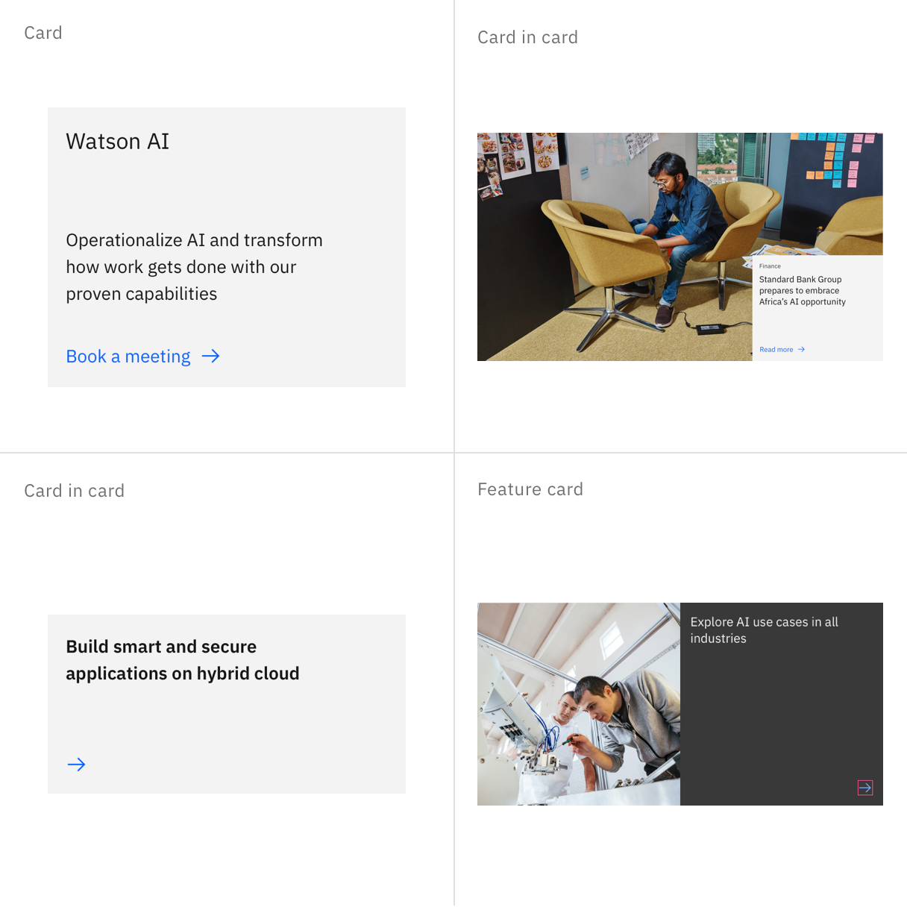
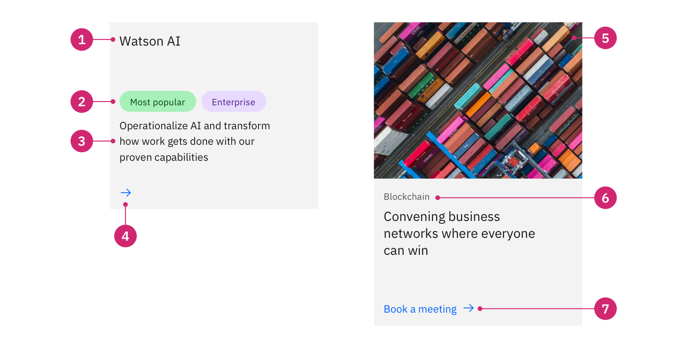
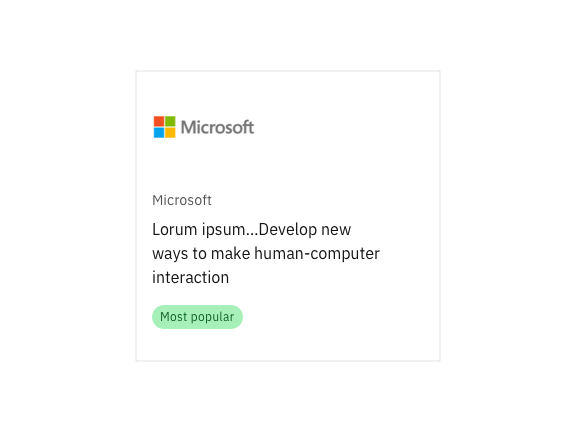
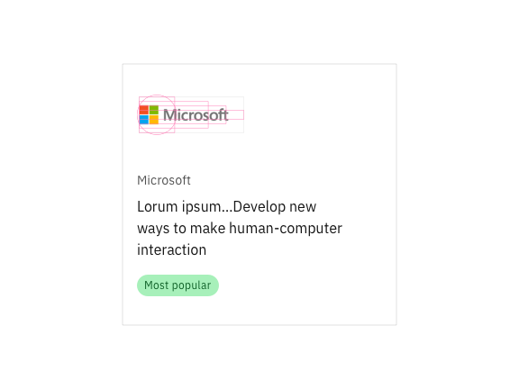
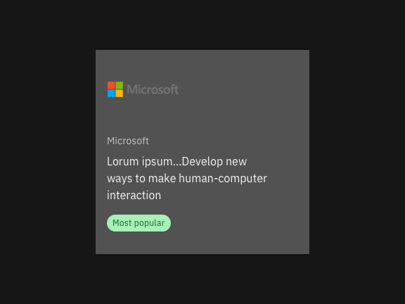
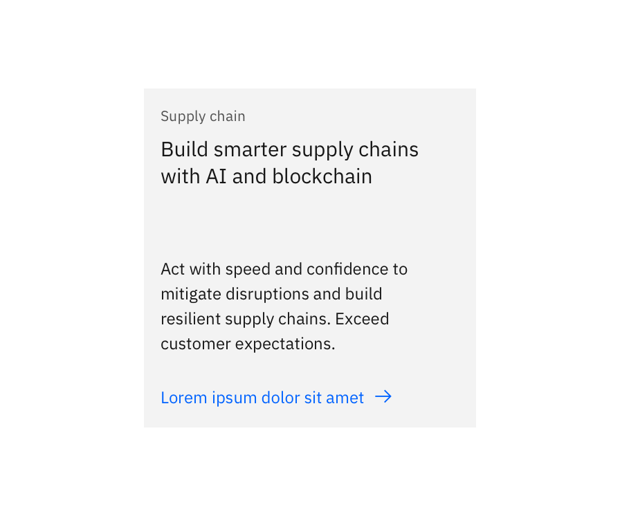
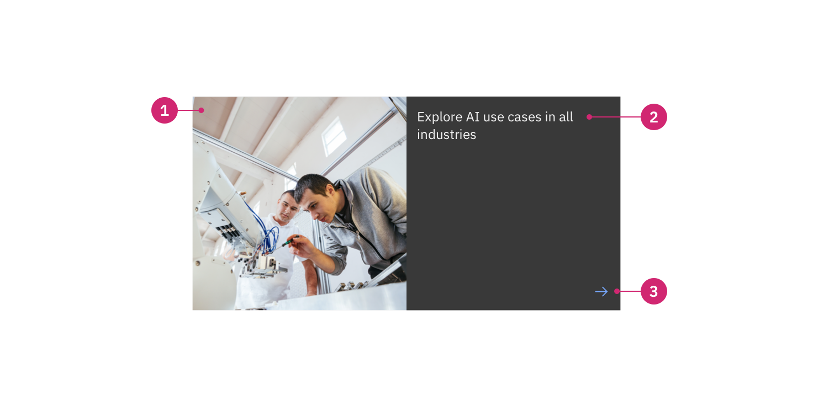

import ComponentDescription from 'components/ComponentDescription';
import ComponentFooter from 'components/ComponentFooter';
import ResourceLinks from 'components/ResourceLinks';

<ComponentDescription name="Card" type="ui" />

<AnchorLinks>
  <AnchorLink>Overview</AnchorLink>
  <AnchorLink>Card</AnchorLink>
  <AnchorLink>Card in card</AnchorLink>
  <AnchorLink>Card link</AnchorLink>
  <AnchorLink>Feature card</AnchorLink>
  <AnchorLink>Feedback</AnchorLink>
</AnchorLinks>

## Overview

Cards present content with calls to action in a concise yet engaging style. [Card](#card) is often used to navigate
users to information-rich articles. [Card link](#card-link) is presented within the context of other content and
provides a path to more information about the subject. [Card in card](#card-in-card) provides a rich image option, with
an inset card providing the call to action for more information. [Feature card](#feature-card) highlights a piece of
content on the page, and should be used sparingly.

<Row>
<Column colMd={8} colLg={8}>

</Column>
</Row>

## Card

The Card component can be used in many different page types. The default design includes a heading and a call to action,
and optional extras include an eyebrow, copy, and media. By adding and removing optional content, the card
offers a wide range of design possibilities.

The Card component can also be used to create other card-based components such as
[Content group cards](https://www.ibm.com/standards/carbon/components/content-group-cards) and
[Card section](https://www.ibm.com/standards/carbon/components/card-section).

<Row>
<Column colMd={8} colLg={8}>

</Column>
</Row>

1. **Heading:** Heading has the highest information hierarchy on a card, and should be succinct and descriptive.
2. **Body copy:** Optional body copy can be added for additional descriptions.
3. **Tag:** Add categories or special callouts to each card.
4. **CTA type:** When using an icon, the default is `ArrowRight`.
5. **Media:** Can be an image or a video.
6. **Eyebrow:** Provides additional context for the heading in short form.
7. **CTA link:** Can be used along with an icon to give more context.

For information about required and optional elements, see the [content guidance table](#content-guidance-for-card).

<Row>
<Column colMd={8} colLg={8}>

<Caption>Example cards with varying content configurations</Caption>

</Column>
</Row>

### Modifiers

#### Logo

The card can feature a logo at the top of the card. A logo can provide quick identification of a brand and be particularly useful for company success stories or case studies. For information about content in logo cards, see the [content guidance table](#content-guidance-for-logo-card).

The logo image is contained within a set aspect ratio of 2:1 and is a fixed size at all breakpoints. A logo grid template is available in the card [design specifications](https://ibm.ent.box.com/folder/95514001950?s=qqw0soczjpawvuh9j3x19fmcoqk1zsw7) file to help place the logos correctly within the image container and ensure all logos appear at an equal visual hierarchy.

<Row>

<Column colMd={4} colLg={4}>

<Caption>Example of card with logo modifier</Caption>

</Column>

<Column colMd={4} colLg={4}>

<Caption>Logo grid overlaying a card with logo modifier</Caption>

</Column>

</Row>

The logo is best displayed with a transparent background, or a background color that matches the card color can be used when necessary. See the [color usage guidance](https://www.carbondesignsystem.com/guidelines/color/usage) to set the correct color within a given theme when producing the logo images. Follow any brand guidance when using company logos and consider what color the logo will be placed on and provide an image that will be accessible for the user. See the [Logo grid tips and techniques](https://www.ibm.com/standards/carbon/components/logo-grid/#tips-and-techniques) for additional logo usage guidance.

<DoDontRow>
  <DoDont caption="Use a combination of theme and backgound that provides enough contrast between the card and the logo">

  </DoDont>
  <DoDont type="dont" caption="Avoid using logos on a theme that do not provide enough contrast">

  </DoDont>
</DoDontRow>

#### Pictogram

The card can also feature a pictogram element.
[Pictograms](https://www.ibm.com/design/language/iconography/pictograms/library) provide a lot of visual interest to a card, and can enhance the overall look of a page when used intentionally. They can support the user experience when paired with content that has common visual associations. Keep in mind that meanings of pictograms can differ heavily across cultures, and so they should be selected and used carefully. For information about content in pictogram cards, see the
[content guidance table](#content-guidance-for-pictogram-card).

Cards with pictograms offer two pictogram alignments: top-aligned or bottom-aligned.

<InlineNotification>

**Alignment:** We highly recommend using the bottom-aligned layout to achieve consistency with the updated [Carbon tile guidance](https://carbondesignsystem.com/components/tile/usage/).

</InlineNotification>

<Row>
<Column colMd={8} colLg={8}>

<Caption>
  Left: Card with bottom-aligned pictogram. Right: Card with top-aligned
  pictogram.
</Caption>

</Column>
</Row>

Bottom-aligning the pictogram ensures that the card heading is the first element the user reads. This helps when the
message is not immediately decipherable from the pictogram. An added bonus for the bottom-aligned pictogram is the feature of showing copy on hover.

Top-aligning the pictogram should only be used when the pictogram is strongly and precisely associated with the card heading. For example, an airplane is the perfect choice for "Aerospace and defense", as shown in the above example.

#### Static

By default, the entire Card is clickable with a single destination, but by adding the Static modifier you can add
multiple links to a single card. This can be useful when you have multiple interactive elements on a single card that
take the user to different pages. Static cards can appear with or without a border.

<Row>

<Column colMd={4} colLg={4}>

<Caption>Example of card with static modifier with a border</Caption>

</Column>

<Column colMd={4} colLg={4}>

<Caption>Example of card with static modifier without a border</Caption>

</Column>

</Row>

<ResourceLinks name="Card" type="ui" multiComponent />

### Content guidance for Card

| Element                                                    | Content type                                                                                                                       | Required | Instances | Character limit  (English / translated) | Notes                                                             |
| ---------------------------------------------------------- | ---------------------------------------------------------------------------------------------------------------------------------- | -------- | --------- | ------------------------------------------- | ----------------------------------------------------------------- |
| Eyebrow                                                    | Text                                                                                                                               | No       | 1         | 20 / 32                                     |                                                                   |
| Heading                                                    | Text                                                                                                                               | Yes      | 1         | 65 / 85                                     |                                                                   |
| Media                                                      | [Image](https://www.ibm.com/standards/carbon/components/images/) or [Video](https://www.ibm.com/standards/carbon/components/video) | No       | 1         | –                                           | 4:3 aspect ratio in grid, file original aspect ratio in lightbox. |
| Image alt text                                             | Text                                                                                                                               | No       | 1         | 75 / 100                                    | Image description for accessibility.                              |
| Copy                                                       | Text                                                                                                                               | No       | 1         | 200 / 260                                   |                                                                   |
| [CTA](https://www.ibm.com/standards/carbon/components/cta) | Component                                                                                                                          | Yes      | 1         | 25 / 35                                     | Text style only.                                                  |
| Tag group                                                  | Component                                                                                                                          | No       | 1         | 20 / 32                                     | One or more tags.                                                 |

For more information, see the
[character count standards](https://www.ibm.com/standards/carbon/guidelines/content#character-count-standards).

### Content guidance for Logo card

When a logo is added to a Card, the Card's appearance and content guidance changes.

| Element        | Content type                                                     | Required | Instances | Character limit  (English / translated) | Notes                                                                                                                                 |
| -------------- | ---------------------------------------------------------------- | -------- | --------- | ------------------------------------------- | ------------------------------------------------------------------------------------------------------------------------------------- |
| Logo           | [Image](https://www.ibm.com/standards/carbon/components/images/) | Yes      | 1         | –                                           | 2:1 aspect ratio in grid, see [design specifications](https://ibm.ent.box.com/folder/95514001950?s=qqw0soczjpawvuh9j3x19fmcoqk1zsw7). |
| Image alt text | Text                                                             | No       | 1         | 75 / 100                                    | Image description of logo for accessibility.                                                                                          |
| Eyebrow        | Text                                                             | Yes      | 1         | 20 / 32                                     |                                                                                                                                       |
| Heading        | Text                                                             | No       | 1         | 65 / 85                                     |                                                                                                                                       |
| Copy           | Text                                                             | Yes      | 1         | 200 / 260                                   |                                                                                                                                       |
| Tag group      | Component                                                        | No       | 1         | 20 / 32                                     | One or more tags.                                                                                                                     |

For more information, see the
[character count standards](https://www.ibm.com/standards/carbon/guidelines/content#character-count-standards).

### Content guidance for Pictogram card

When a pictogram is added to a Card, the Card's appearance and content guidance changes.

| Element   | Content type | Required | Instances | Character limit  (English / translated) | Notes                                             |
| --------- | ------------ | -------- | --------- | ------------------------------------------- | ------------------------------------------------- |
| Heading   | Text         | Yes      | 1         | 40 / 55                                     |                                                   |
| Copy      | Text         | No       | 1         | 65 / 85                                     | Hover over copy on bottom-aligned pictogram only. |
| Pictogram | Element      | Yes      | 1         | –                                           | Top- or bottom-aligned.                           |

For more information, see the
[character count standards](https://www.ibm.com/standards/carbon/guidelines/content#character-count-standards).

## Card in card

Card in card shares the same functionality and text content requirements of a standard card, but requires a large media
element. Card in card is often used in a [Card group](https://www.ibm.com/standards/carbon/components/card-group) to as
a featured card.

<Row>
<Column colMd={8} colLg={8}>

</Column>
</Row>

1. **Media:** Can be an image or a video.
2. **Eyebrow:** Provides additional context for the heading in short form.
3. **Heading:** Heading has the highest information hierarchy on a card, and should be succinct and descriptive.
4. **CTA type:** When using an icon, the default is `ArrowRight`.
5. **CTA link:** Can be used with an icon to give more context.

For information about required and optional elements, see the
[content guidance table](#content-guidance-for-card-in-card).

<ResourceLinks name="Card in card" type="ui" multiComponent />

### Content guidance for Card in card

| Element                                                    | Content type                                                                                                                       | Required | Instances | Character limit  (English / translated) | Notes                                |
| ---------------------------------------------------------- | ---------------------------------------------------------------------------------------------------------------------------------- | -------- | --------- | ------------------------------------------- | ------------------------------------ |
| Eyebrow                                                    | Text                                                                                                                               | No       | 1         | 20 / 32                                     |                                      |
| Heading                                                    | Text                                                                                                                               | Yes      | 1         | 65 / 85                                     |                                      |
| Media                                                      | [Image](https://www.ibm.com/standards/carbon/components/images/) or [Video](https://www.ibm.com/standards/carbon/components/video) | Yes      | 1         | –                                           | Full width, 16:9 aspect ratio.       |
| Image alt text                                             | Text                                                                                                                               | No       | 1         | 75 / 100                                    | Image description for accessibility. |
| [CTA](https://www.ibm.com/standards/carbon/components/cta) | Component                                                                                                                          | Yes      | 1         | 25 / 35                                     | Card style only.                     |

For more information, see the
[character count standards](https://www.ibm.com/standards/carbon/guidelines/content#character-count-standards).

## Card link

Unlike Card, which can be used as a standalone component, Card link should always be accompanied by contextual copy on
the page. Card links contain a heading, an optional CTA (call-to-action), and optional body copy. The entire card is
clickable.

<Row>
<Column colMd={8} colLg={8}>

</Column>
</Row>

1. **Heading:** Heading has the highest information hierarchy on a card, and should be succinct and descriptive.
2. **Body copy:** Optional body copy can be added for additional description.
3. **CTA type:** When using an icon, the default is `ArrowRight`.

For information about required and optional elements, see the [content guidance table](#content-guidance-for-card-link).

<ResourceLinks name="Card link" type="ui" multiComponent />

### Content guidance for Card link

| Element                                                    | Content type | Required | Instances | Character limit  (English / translated) | Notes            |
| ---------------------------------------------------------- | ------------ | -------- | --------- | ------------------------------------------- | ---------------- |
| Heading                                                    | Text         | Yes      | 1         | 25 / 35                                     |                  |
| Copy                                                       | Text         | No       | 1         | 40 / 55                                     |                  |
| [CTA](https://www.ibm.com/standards/carbon/components/cta) | Component    | Yes      | 1         | –                                           | Icon style only. |

For more information, see the
[character count standards](https://www.ibm.com/standards/carbon/guidelines/content#character-count-standards).

## Feature card

Feature card is used for visually highlighting an important piece of content on page and driving users to that content. It should be used sparingly to be effective. Feature
card contains options for size and color scheme.

### Modifiers

#### Size

The medium version of feature card is the default size, occupying eight columns and consisting of an image, heading, and CTA (call-to-action).

<Row>
<Column colMd={8} colLg={8}>

<Caption>
  An example of feature card – medium using the regular color scheme.
</Caption>

</Column>
</Row>

The large version of feature card occupies twelve columns and allows for the addition of an eyebrow as well as body copy. Use the large version for a more prominent call-to-action, and/or when you need to support the heading with additional copy.

<Row>
<Column colMd={8} colLg={8}>

<Caption>
  An example of feature card – large using the regular color scheme.
</Caption>

</Column>
</Row>

#### Color scheme

Both sizes of Feature card have additional color schemes to enable more flexibility in how feature card appears on the page. These include the default `regular` color scheme, as well as `inverse` color scheme. The `regular` color scheme is the default to reduce high contrast moments in IBM.com pages, and should be used most of the time.

Note that the color scheme effects the background, border, heading, and icon in both variants. In the large size, eyebrow and body copy are also effected. Consider these changes when creating or choosing image assets displayed in feature card.

<ResourceLinks name="Feature card" type="ui" multiComponent />

<ComponentFooter name="Card" type="ui" />
