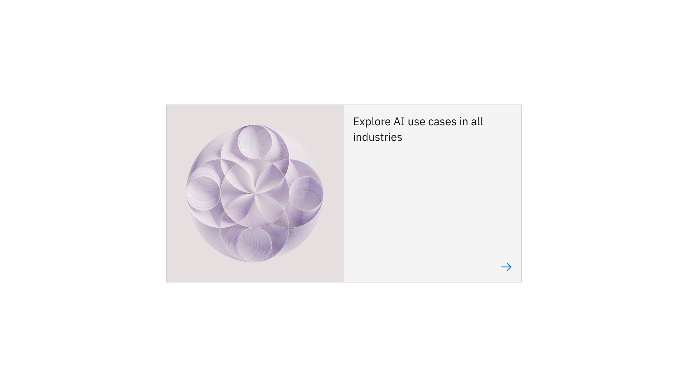

import ComponentDescription from 'components/ComponentDescription';
import ComponentFooter from 'components/ComponentFooter';
import ResourceLinks from 'components/ResourceLinks';

<ComponentDescription name="Card" type="ui" />

<AnchorLinks>
  <AnchorLink>Overview</AnchorLink>
  <AnchorLink>Card</AnchorLink>
  <AnchorLink>Card in card</AnchorLink>
  <AnchorLink>Card link</AnchorLink>
  <AnchorLink>Feature card</AnchorLink>
  <AnchorLink>Feedback</AnchorLink>
</AnchorLinks>

<InlineNotification>

All cards have been updated to follow the guidance for base and clickable [tiles](https://carbondesignsystem.com/components/tile/usage/) from Carbon Design System.

</InlineNotification>

## Overview

Cards present content with calls to action in a concise yet engaging style. [Card](#card) is often used to navigate
users throughout IBM.com. [Card link](#card-link) is presented within the context of other content and
provides a path to more information about the subject. [Card in card](#card-in-card) provides a rich image option, with
an inset card providing the call to action for more information. [Feature card](#feature-card) highlights a piece of
content on the page, and should be used sparingly.

As of Carbon Design System's v11 update to [tile](https://carbondesignsystem.com/components/tile/usage/), clickable cards display a border to indicate their interactivity. Cards that are static will display no border.

<Row>
<Column colMd={8} colLg={8}>

<Caption>
  Examples of different cards: card – default, card in card, feature card, and
  card link
</Caption>

</Column>
</Row>

## Card

The Card component can be used in many different page types. The default design includes a heading and a call to action,
and optional extras include an eyebrow, copy, and media. By adding and removing optional content, the card
offers a wide range of design possibilities.

The Card component can also be used to create other card-based components such as
[Content group cards](https://www.ibm.com/standards/carbon/components/content-group-cards) and
[Card section](https://www.ibm.com/standards/carbon/components/card-section).

<Row>
<Column colMd={8} colLg={8}>

<Caption>The default card on the left, and a video card on the right.</Caption>
</Column>
</Row>

### Content guidance for Card

| Element        | Content type                                                                                                                       | Required | Instances | Character limit  (English / translated) | Notes                                                             |
| -------------- | ---------------------------------------------------------------------------------------------------------------------------------- | -------- | --------- | ------------------------------------------- | ----------------------------------------------------------------- |
| Eyebrow        | Text                                                                                                                               | No       | 1         | 20 / 32                                     |                                                                   |
| Heading        | Text                                                                                                                               | Yes      | 1         | 65 / 85                                     |                                                                   |
| Media          | [Image](https://www.ibm.com/standards/carbon/components/images/) or [Video](https://www.ibm.com/standards/carbon/components/video) | No       | 1         | –                                           | 4:3 aspect ratio in grid, file original aspect ratio in lightbox. |
| Image alt text | Text                                                                                                                               | No       | 1         | 75 / 100                                    | Image description for accessibility.                              |
| Copy           | Text                                                                                                                               | No       | 1         | 200 / 260                                   |                                                                   |
| Icon           | Component                                                                                                                          | Yes      | 1         | –                                           | Icon style only.                                                  |
| Tag group      | Component                                                                                                                          | No       | 1         | 20 / 32                                     | One or more tags.                                                 |

For more information, see the
[character count standards](https://www.ibm.com/standards/carbon/guidelines/content#character-count-standards).

### Modifiers

#### Logo

The card can feature a logo at the top of the card. A logo can provide quick identification of a brand and be particularly useful for company success stories or case studies. For information about content in logo cards, see the [content guidance table](#content-guidance-for-card---logo).

The logo is contained within a set image aspect ratio of 2:1 and the image container is a fixed size at all breakpoints. The logo inside the container will scale to fit, meaning the image will try to maximize in height or width within the image container. Additionally logos are vertically centered and pinned to the left to align with the text within the card.

Logo cards can be set to the same color as the page theme background or the default card color.

<Row>

<Column colMd={8} colLg={8}>

<Caption>
  Logo card set in the theme background on the left and the default color on the
  right.
</Caption>

</Column>

</Row>

A logo asset with a transparent background in SVG or PNG format is best utilized for this component, or a logo on a background color that matches the card color can be used when necessary. Follow any brand guidance when using company logos and consider what color the logo will be placed on and provide an image that will be accessible for the user.

IBM teams should utilize the centralized logo assets from the [Digital Asset Management system](https://w3.ibm.com/w3publisher/digital-asset-management).

### Content guidance for Card – logo

When a logo is added to a Card, the Card's appearance and content guidance changes.

| Element        | Content type                                                     | Required | Instances | Character limit  (English / translated) | Notes                                                                                                                                 |
| -------------- | ---------------------------------------------------------------- | -------- | --------- | ------------------------------------------- | ------------------------------------------------------------------------------------------------------------------------------------- |
| Logo           | [Image](https://www.ibm.com/standards/carbon/components/images/) | Yes      | 1         | –                                           | 2:1 aspect ratio in grid, see [design specifications](https://ibm.ent.box.com/folder/95514001950?s=qqw0soczjpawvuh9j3x19fmcoqk1zsw7). |
| Image alt text | Text                                                             | No       | 1         | 75 / 100                                    | Image description of logo for accessibility.                                                                                          |
| Eyebrow        | Text                                                             | Yes      | 1         | 20 / 32                                     |                                                                                                                                       |
| Heading        | Text                                                             | No       | 1         | 65 / 85                                     |                                                                                                                                       |
| Copy           | Text                                                             | Yes      | 1         | 200 / 260                                   |                                                                                                                                       |
| Tag group      | Component                                                        | No       | 1         | 20 / 32                                     | One or more tags.                                                                                                                     |

For more information, see the
[character count standards](https://www.ibm.com/standards/carbon/guidelines/content#character-count-standards).

#### Pictogram

The card can also feature a pictogram element.
[Pictograms](https://www.ibm.com/design/language/iconography/pictograms/library) provide a lot of visual interest to a card, and can enhance the overall look of a page when used intentionally. They can support the user experience when paired with content that has common visual associations. Keep in mind that meanings of pictograms can differ heavily across cultures, and so they should be selected and used carefully. For information about content in pictogram cards, see the
[content guidance table](#content-guidance-for-card---pictogram).

Cards featuring a pictogram are required to have a heading and optionally can include body copy. Cards with pictograms offer two pictogram alignments: top-aligned or bottom-aligned.

<InlineNotification>

**Alignment:** We highly recommend using the bottom-aligned layout to achieve consistency with the updated [Carbon tile guidance](https://carbondesignsystem.com/components/tile/usage/).

</InlineNotification>

<Row>
<Column colMd={8} colLg={8}>

<Caption>Examples of card with a pictogram with and without body copy.</Caption>

</Column>
</Row>

Bottom-aligning the pictogram ensures that the card heading is the first element the user reads. This helps when the
message is not immediately decipherable from the pictogram.

Top-aligning the pictogram should only be used when the pictogram is strongly and precisely associated with the card heading.

### Content guidance for Card – pictogram

When a pictogram is added to a Card, the Card's appearance and content guidance changes.

| Element   | Content type | Required | Instances | Character limit  (English / translated) | Notes                                             |
| --------- | ------------ | -------- | --------- | ------------------------------------------- | ------------------------------------------------- |
| Heading   | Text         | Yes      | 1         | 40 / 55                                     |                                                   |
| Copy      | Text         | No       | 1         | 65 / 85                                     | Hover over copy on bottom-aligned pictogram only. |
| Pictogram | Element      | Yes      | 1         | –                                           | Top- or bottom-aligned.                           |

For more information, see the
[character count standards](https://www.ibm.com/standards/carbon/guidelines/content#character-count-standards).

#### Static

Unlike other cards, static cards are non-actionable or not clickable. These cards have no stroke or border around the outside of the card to help indicate to the user that they are non-actionable.

Static card can support a text link, however, we highly recommend teams to utilize the [content item](../components/content-item) component instead of static cards to ensure that users do not confuse static cards with actionable cards. And to encourage page variation — we are seeing many pages designs that are filled with only cards which can be boring for the user. When a card uses the static modifier, it should follow the same [content guidance](#content-guidance-for-card) as the default card.

<Row>

<Column colMd={8} colLg={8}>

<Caption>Example of cards with the static modifier</Caption>

</Column>

</Row>

<ResourceLinks name="Card" type="ui" multiComponent />

## Card in card

Card in card features a large media element, image or video, with an inner card layered on top of the media. Card in card can be used on its own or paired with a [card group](../components/card-group) as the featured card.

<Row>
<Column colMd={8} colLg={8}>

</Column>
</Row>

### Behavior

The entire media area is interactive. In the mobile breakpoint the inner card will stack below the media.

<ResourceLinks name="Card in card" type="ui" multiComponent />

### Content guidance for Card in card

| Element        | Content type                                                                                                                       | Required | Instances | Character limit  (English / translated) | Notes                                |
| -------------- | ---------------------------------------------------------------------------------------------------------------------------------- | -------- | --------- | ------------------------------------------- | ------------------------------------ |
| Eyebrow        | Text                                                                                                                               | No       | 1         | 20 / 32                                     |                                      |
| Heading        | Text                                                                                                                               | Yes      | 1         | 65 / 85                                     |                                      |
| Media          | [Image](https://www.ibm.com/standards/carbon/components/images/) or [Video](https://www.ibm.com/standards/carbon/components/video) | Yes      | 1         | –                                           | Full width, 16:9 aspect ratio.       |
| Image alt text | Text                                                                                                                               | No       | 1         | 75 / 100                                    | Image description for accessibility. |
| Icon           | Component                                                                                                                          | Yes      | 1         | –                                           | Icon style only.                     |

For more information, see the
[character count standards](https://www.ibm.com/standards/carbon/guidelines/content#character-count-standards).

## Card link

Card links are used as an alternative to a [link](https://carbondesignsystem.com/components/link/usage/) or [button](https://carbondesignsystem.com/components/button/usage/), and are useful for descriptive call to actions as they can support a heading and optional body copy. Unlike card, which can be used as a standalone component, card link should always be accompanied by contextual content.

<Row>
<Column colMd={6} colLg={6}>

</Column>
</Row>

### Behavior

The entire card link is clickable. Card link maintains a 2:1 aspect ratio across all breakpoints.

<ResourceLinks name="Card link" type="ui" multiComponent />

### Content guidance for Card link

| Element | Content type | Required | Instances | Character limit  (English / translated) | Notes            |
| ------- | ------------ | -------- | --------- | ------------------------------------------- | ---------------- |
| Heading | Text         | Yes      | 1         | 25 / 35                                     |                  |
| Copy    | Text         | No       | 1         | 40 / 55                                     |                  |
| Icon    | Component    | Yes      | 1         | –                                           | Icon style only. |

For more information, see the
[character count standards](https://www.ibm.com/standards/carbon/guidelines/content#character-count-standards).

## Feature card

Feature card is used for visually highlighting an important piece of content on page and driving users to that content. It should be used sparingly to be effective. Feature
card contains options for size and color scheme.

### Modifiers

#### Size

The medium version of feature card is the default size, occupying eight columns and consisting of an image, heading, and CTA (call-to-action).

<Row>
<Column colMd={8} colLg={8}>

<Caption>
  An example of feature card – medium using the regular color scheme.
</Caption>

</Column>
</Row>

The large version of feature card occupies twelve columns and allows for the addition of an eyebrow as well as body copy. Use the large version for a more prominent call-to-action, and/or when you need to support the heading with additional copy.

<Row>
<Column colMd={8} colLg={8}>

<Caption>
  An example of feature card – large using the regular color scheme.
</Caption>

</Column>
</Row>

#### Color scheme

Both sizes of Feature card have additional color schemes to enable more flexibility in how feature card appears on the page. These include the default `regular` color scheme, as well as `inverse` color scheme. The `regular` color scheme is the default to reduce high contrast moments in IBM.com pages, and should be used most of the time.

Note that the color scheme effects the background, border, heading, and icon in both variants. In the large size, eyebrow and body copy are also effected. Consider these changes when creating or choosing image assets displayed in feature card.

<ResourceLinks name="Feature card" type="ui" multiComponent />

### Content guidance for Feature card

| Element        | Content type                                                     | Required | Instances | Character limit  (English / translated) | Notes                                |
| -------------- | ---------------------------------------------------------------- | -------- | --------- | ------------------------------------------- | ------------------------------------ |
| Eyebrow        | Text                                                             | No       | 1         | 25 / 35                                     | Large only.                          |
| Heading        | Text                                                             | Yes      | 1         | 65 / 85                                     |                                      |
| Copy           | Text                                                             | No       | 1         | 200 / 260                                   | Large only.                          |
| Media          | [Image](https://www.ibm.com/standards/carbon/components/images/) | Yes      | 1         | –                                           | 1:1 aspect ratio.                    |
| Image alt text | Text                                                             | No       | 1         | 75 / 100                                    | Image description for accessibility. |
| Icon           | Component                                                        | Yes      | 1         | –                                           | Icon style only.                     |

For more information, see the
[character count standards](https://www.ibm.com/standards/carbon/guidelines/content#character-count-standards).

<ComponentFooter name="Card" type="ui" />
