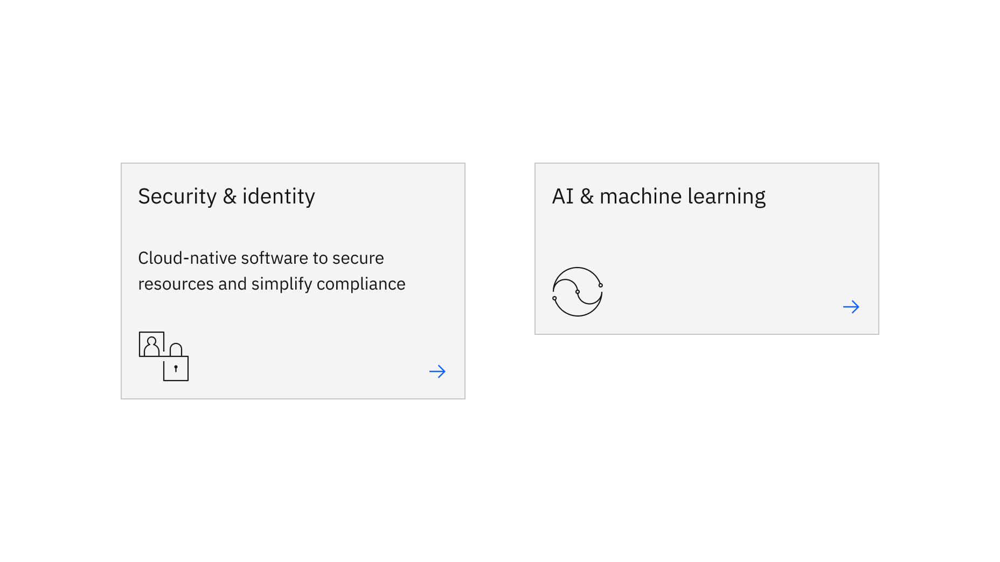

import ComponentDescription from "components/ComponentDescription";
import ComponentFooter from "components/ComponentFooter";
import ResourceLinks from "components/ResourceLinks";

<ComponentDescription name="Card" type="ui" />

<AnchorLinks>
<AnchorLink>Overview</AnchorLink>
<AnchorLink>Card</AnchorLink>
<AnchorLink>Card link</AnchorLink>
<AnchorLink>Card in card</AnchorLink>
<AnchorLink>Feature card</AnchorLink>
<AnchorLink>Feedback</AnchorLink>
</AnchorLinks>

## Overview

The Card component is one of the main building blocks of IBM.com that can often be used to help users navigate to related information. There are various usages for Card, each with their own strengths and usage. Card can be used to navigate users to information-rich articles. Card link. is presented with other content as a jumping off point for more information. Card in card can put focus on images while using the card to provide more context. Feature card can highlight a piece of content on the page, and should be used sparingly.

<Caption>From top left to bottom right: Card, Card in card, Feature Card, and Pictogram card.</Caption>

## Card

The Card component is the workhorse for many different page types. The default design includes a heading and a CTA (call-to-action), and optional extras include include an eyebrow, copy, and media. By adding and removing optional content, the card has a wide range of design possibilities.

The card can also be used to create other card-based components such as [Content group cards](https://www.ibm.com/standards/carbon/components/content-group-cards) and [Card section](https://www.ibm.com/standards/carbon/components/card-section).

<Row>
<Column colMd={8} colLg={8}>

<Caption>Example cards with varying content configurations</Caption>

</Column>
</Row>

### Anatomy of Card
<Row>
<Column colMd={8} colLg={8}>

</Column>
</Row>

1. **Heading (required):** Customizable header for the Card link.
2. **Tag:** Add categories or special callouts to each card.
3. **Body copy (optional):** Can include body copy for additional context.
4. **CTA icon:** By default, uses `ArrowRight`.
5. **Media:** Can be an image or a video.
6. **Eyebrow:** Add additional context to the body copy.
7. **CTA link:** Can be used with CTA icon to give more context.

### Modifiers

#### Pictogram card

The card can also feature a pictogram element. Pictograms provide a lot of visual interest and can improve the overall look of the page. They can also support the user experience when paired with content that has common visual associations. However, keep in mind that meanings of pictograms can differ heavily across cultures, and so they should be selected and used carefully.

Cards with pictogram offers two pictogram positions: top-aligned or bottom-aligned.

<Row>
<Column colMd={8} colLg={8}>

<Caption>Left: Card with bottom-aligned pictogram. Right: Card with top-aligned pictogram.</Caption>

</Column>
</Row>

Bottom-aligning the pictogram ensures that the card heading is the first element read. This helps when the message is not immediately decipherable from the pictogram.

An added bonus for the bottom-aligned pictogram is the feature of showing copy on hover. One thing to note with this feature is that the pictogram is hidden on mobile in order to keep the copy visible.

<Row>
<Column colMd={8} colLg={8}>

<Caption>Example of copy being shown on hover with bottom-aligned pictogram</Caption>

</Column>
</Row>

Top-aligning the pictogram should only be used when the pictogram is strongly and precisely associated with the card heading. For example, an airplane is the perfect choice for "Aerospace and defence", as shown in the above example. 

#### Logo
 
<InlineNotification>

**Note:** Additional usage guidelines are coming soon.

</InlineNotification>

#### Static

While the entire default Card is clickable, the Static modifier makes it so only the text link is clickable on the card. 

<ResourceLinks name="Card" type="ui" multiComponent/>

### Content guidance for Card

| Element                                                                 | Content type  | Required | Instances | Character count  (English / translated) | Notes                   |
| ----------------------------------------------------------------------- | ------------- | -------- | --------- | ------------------------------------------- | ----------------------- |
| Eyebrow                                                                 | Text          | No       | 1         | 20 / 32                                     |                         |
| Heading                                                                 | Text          | Yes      | 1         | 40 / 55                                     |                         |
| Media                                                                   | [Image](https://www.ibm.com/standards/carbon/components/images/) or [Video](https://www.ibm.com/standards/carbon/components/video)     | No       | 1         | –                                           | 4:3 aspect ratio in grid, file original aspect ratio in lightbox |
| Copy                                                                    | Text          | No       | 1         | 200 / 260                                   |                         |
| [CTA icon](https://www.ibm.com/standards/carbon/components/cta)         | Icon          | No       | 1         | –                                           | Required for card with CTAs, displays after text (see below)     |
| [CTA text](https://www.ibm.com/standards/carbon/components/cta)         | Link          | No       | 1         | 25 / 35                                     | URL assigned in setup   |
| Tag                                                                     | Component     | No       | 1         | 20 / 32                                     |                         |

### Content guidance for Pictogram card

| Element                                                                 | Content type  | Required | Instances | Character count  (English / translated) | Notes                   |
| ----------------------------------------------------------------------- | ------------- | -------- | --------- | ------------------------------------------- | ----------------------- |
| Heading                                                                 | Text          | Yes       | 1         | 40 / 55                                    |                         |
| Copy                                                                    | Text          | No        | 1         | 65 / 85                                    | Hover over copy on bottom-aligned pictogram only. |
| Pictogram                                                               | Element       | Yes       | 1         | –                                          | Top- or bottom-aligned |

## Card link

Unlike Card, which can stand on its own, Card link should be part of a layout or other component - it should never appear on its own. Card links contain a heading, the CTA (call-to-action), an action icon within a tile, and optional body copy. The entire card is clickable.

### Anatomy of Card link
<Row>
<Column colMd={8} colLg={8}>

</Column>
</Row>

1. **Heading:** Customizable header for the Card link.
2. **Body copy (optional):** Can include body copy for additional context.
3. **CTA icon:** By default, uses `ArrowRight`.

<ResourceLinks name="Card link" type="ui" multiComponent/>

### Content guidance for Card link

| Element                                                                 | Content type  | Required | Instances | Character count  (English / translated) | Notes                   |
| ----------------------------------------------------------------------- | ------------- | -------- | --------- | ------------------------------------------- | ----------------------- |
| Heading                                                                 | Text          | Yes       | 1         | 25 / 45                                    |                         |
| Copy                                                                    | Text          | No        | 1         | 40 / 55                                    |                         |
| [CTA icon](https://www.ibm.com/standards/carbon/components/cta)         | Icon          | Yes       | 1         | 25 / 35                                    | URL assigned in setup, required for cards with CTAs  |

## Card in card

Card in card shares the same functionality and text content requirements of a standard card, but requires a large media. Card in card is often used in a [Card group](https://www.ibm.com/standards/carbon/components/card-group) to as a featured card.

### Anatomy of Card in card
<Row>
<Column colMd={8} colLg={8}>

</Column>
</Row>

1. **Media:** Can be an image or a video.
2. **Heading:** Customizable header for the Card link.
3. **Body copy (optional):** Can include body copy for additional context.
4. **CTA icon:** By default, uses `ArrowRight`.
5. **CTA link:** Can be used with CTA icon to give more context.

<ResourceLinks name="Card in card" type="ui" multiComponent/>

### Content guidance for Card in card

| Element                                                                 | Content type  | Required | Instances | Character count  (English / translated) | Notes                   |
| ----------------------------------------------------------------------- | ------------- | -------- | --------- | ------------------------------------------- | ----------------------- |
| Eyebrow                                                                 | Text          | No       | 1         | 20 / 32                                     |                         |
| Heading                                                                 | Text          | Yes      | 1         | 75 / 100                                    |                         |
| Media                                                                   | [Image](https://www.ibm.com/standards/carbon/components/images/) or [Video](https://www.ibm.com/standards/carbon/components/video)          | Yes       | 1         | –                                     | Full width, 16:9 aspect ratio                        |
| [CTA icon](https://www.ibm.com/standards/carbon/components/cta)         | Icon          | No       | 1         | 25 / 35                                    | Required for cards with CTAs, displays after text (see below)  |
| [CTA text](https://www.ibm.com/standards/carbon/components/cta)         | Link          | No       | 1         |                                            | URL assigned in setup   |

## Feature card

Feature card is used for highlighting a piece of content on page. It should be used sparingly to be effective. Feature card has two sizes: medium and large. 

### Modifiers

#### Medium
Medium is the default size, occupying 8 columns and consisting of an image, heading, and CTA (call-to-action). 

<Row>
<Column colMd={6} colLg={8}>

<Caption>Example of a medium feature card with image, heading, and CTA</Caption>

</Column>
</Row>

#### Large
The large feature card occupies 12 columns and allows for the addition of an eyebrow as well as body copy. 

<Row>
<Column colMd={12} colLg={12}>

<Caption>Example of a large feature card with image, eyebrow, heading, body copy, and CTA</Caption>

</Column>
</Row>

<ResourceLinks name="Feature card" type="ui" multiComponent/>

### Content guidance for Feature card * PENDING REVIEW

| Element                                                                 | Content type  | Required | Instances | Character count  (English / translated) | Notes                   |
| ----------------------------------------------------------------------- | ------------- | -------- | --------- | ------------------------------------------- | ----------------------- |
| Eyebrow                                                                 | Short copy    | No       | 1         | Mini (25 / 35)                              | Feature card large only |
| Heading                                                                 | Short copy    | Yes      | 1         | XS (65 / 85)                                |                         |
| Copy                                                                    | Long copy     | No       | 1         | LL (200 / 260)                              | Feature card large only |
| Image                                                                   | Media         | Yes      | 1         | –                                           |                         |
| URL                                                                     | Link          | Yes      | 1         | –                                           |                         |
| [Type](https://www.ibm.com/standards/carbon/components/cta) (ex. Local) | Option list   | Yes      | 1         | –                                           |                         |

For more information, see the [character count standards](https://github.com/carbon-design-system/carbon-for-ibm-dotcom-website/wiki/Character-count-standards).

<ComponentFooter name="Card" type="ui" />
