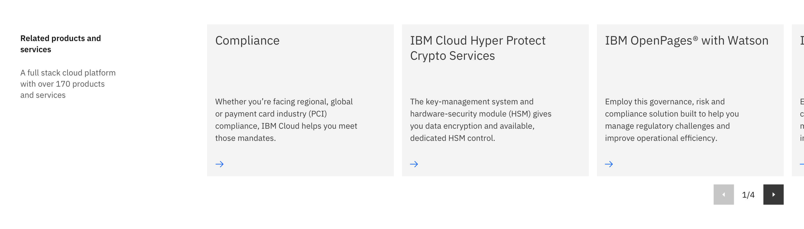

<PageDescription>

A carousel allows multiple pieces of content to occupy an allocated amount of space.

</PageDescription>

<AnchorLinks>

<AnchorLink>Carousel</AnchorLink>
<AnchorLink>Usage guidance</AnchorLink>
<AnchorLink>Design and functional specifications</AnchorLink>
<AnchorLink>Development documentation</AnchorLink>
<AnchorLink>Feedback</AnchorLink>

</AnchorLinks>

## Carousel 

The carousel is as an exploratory component, meaning it allows users to browse or explore multiple pieces of content within the same area of the page. This component is typically used when you have a large amount of similar content needed on a page but you don't want to increase the screen real estate. It includes a headline, cards, controls and optional sub copy and optional CTA text link. 

## Usage guidance

Follow the best practices in this section to create a discoverable and useable carousel on IBM.com.

### When should I use carousel?

* Use when you have multiple related content pieces but screen real estate is limited.
* Use when you have exploratory content that isn't necessary but helpful for the user.
* Use when you want to tease user with additional related content.

### When should I not use carousel?
* Do not use when content frames are not related.
* Do not use when users need to consume all carousel content because most users won't view every slide.

### Content

Adding the correct or incorrect content to a carousel can make or break a users experience. 

* Include 5 or fewer content frames in carousel
* Make sure content is related topics.
* Do not add essential content to a carousel. Essential content could include navigational or wayfinding content links . 
* Prioritize the most important content at the beginning of the carousel.
* Carousel content should be simple and concise.
* Common content used in carousels include use cases, client testimonials, and quotes. 
* Make sure carousel content can be accessed outside the carousel in a menu, footer and navigational page. 

## Design and functional specifications

The design specs and functional specs for Carousel can be viewed <a href="#" target="_blank">here</a>.

## Development documentation

<ComponentStatus name="Content block - with media" type="layout" />

## Feedback

Help us improve this component by providing feedback, asking questions, and leaving any other comments on <a href="https://github.com/carbon-design-system/carbon-for-ibm-dotcom" target="_blank">GitHub</a>.

