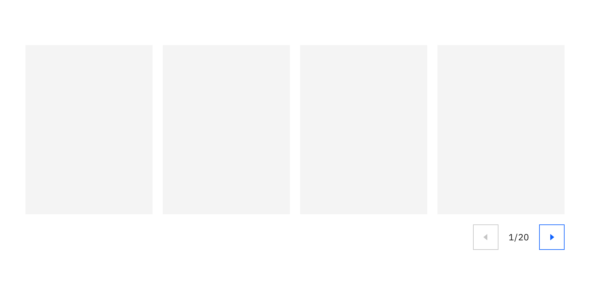

import ComponentDescription from 'components/ComponentDescription';
import ComponentFooter from 'components/ComponentFooter';
import ResourceLinks from 'components/ResourceLinks';

<ComponentDescription name="Carousel" type="ui" />

<AnchorLinks>

<AnchorLink>Resources</AnchorLink>
<AnchorLink>Overview</AnchorLink>
<AnchorLink>Anatomy</AnchorLink>
<AnchorLink>Content guidance</AnchorLink>
<AnchorLink>Feedback</AnchorLink>

</AnchorLinks>

<ResourceLinks name="Carousel" type="ui" />

## Overview

The Carousel component can be used to display multiple pieces of content in a single viewing area. The Carousel enables users to explore content at their own pace, advancing or returning to previously viewed content. Cards can be used inside the Carousel to condense bite-sized content or act as a jumping off point to explore other pages.

<Row>
<Column colMd={6} colLg={8}>

</Column>
</Row>

## Anatomy

<Row>
<Column colMd={6} colLg={8}>

</Column>
</Row>

1. **Carousel content:** Displayed items in a sequence, such as a set of cards.
2. **Previous icon button:** Returns the carousel to the previous view.
3. **Carousel counter:** Displays the current view number and the total view number in this carousel. The total number may change based on the breakpoint being viewed.
4. **Next icon button:** Advances the carousel to the next view, containing additional displayed content.

## Content guidance

| Element         | Content type | Required | Instances | Character limit  (English / translated) | Notes                                                                              |
| --------------- | ------------ | -------- | --------- | ------------------------------------------- | ---------------------------------------------------------------------------------- |
| Child container | Component    | Yes      | 1         | –                                           | A container area that child components and other content types can be passed into. |
| Pagination      | Component    | Yes      | 1         | –                                           | Includes numbering and arrow icon buttons.                                         |

## Related components

| Component name                                                                                 | Description                                                                                                                |
| ---------------------------------------------------------------------------------------------- | -------------------------------------------------------------------------------------------------------------------------- |
| [Card section carousel](https://www.ibm.com/standards/carbon/components/card-section-carousel) | Card section carousel adds a section header to a carousel featuring cards as the repeated component.                       |
| [Lightbox media viewer](https://www.ibm.com/standards/carbon/components/lightbox-media-viewer) | Lightbox media viewer can use a carousel to provide a way for users to view multiple pieces of media in a single lightbox. |

<ComponentFooter name="Carousel" type="ui" />
