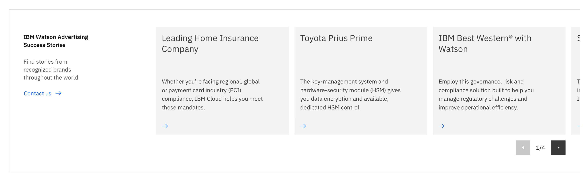
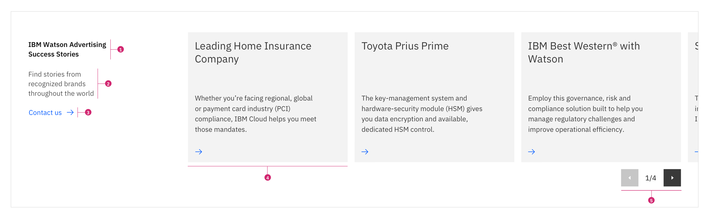
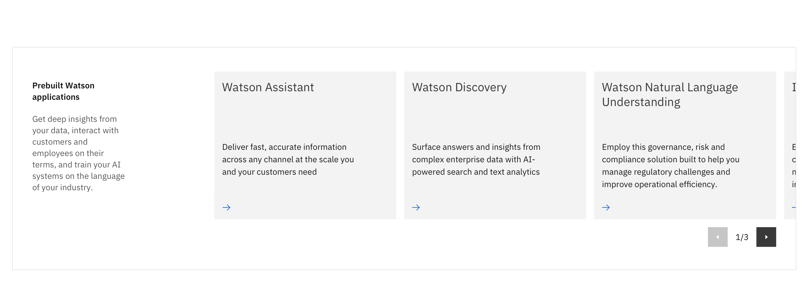

import { ComponentStatus } from 'components/ComponentList';

<PageDescription>

The carousel is an exploratory component, meaning it allows users to browse or explore multiple pieces of content within the same area of the page.

</PageDescription>

<AnchorLinks>

<AnchorLink>Design</AnchorLink>
<AnchorLink>Anatomy</AnchorLink>
<AnchorLink>Usage guidance</AnchorLink>
<AnchorLink>Design and functional specifications</AnchorLink>
<AnchorLink>Development documentation</AnchorLink>
<AnchorLink>Feedback</AnchorLink>

</AnchorLinks>

## Design 

This layout component is commonly used when you have a large amount of similar content needed on a page, but you don’t want to increase the screen real estate. It includes a headline, cards, controls, an optional sub-copy, and an optional CTA text link.  

## Anatomy

1. **Headline**: Heading copy for the carousel component and is required.
2. **Subheading**: Additional sub copy usually used to elaborates on the main headline above it and is optional.
3. **CTA text link**: Call to action text link for directing the user to an action based off the content in the carousel and is optional. 
4. **Cards**: The main content of the carousel lives in the cards. This card can be designed with any variations of the [Card](https://www.ibm.com/standards/web/carbon-for-ibm-dotcom/components/card) component.
5. **Controls**: Icon buttons and pagination provide navigational controls for browsing through the carousel. These are required in the carousel.

## Usage guidance

### When should I use the carousel?

* Use when you have multiple related content pieces but screen real estate is limited.
* Use when you have exploratory content that isn't necessary but helpful for the user.
* Use when you want to tease user with additional related content.

### When should I not use the carousel?
* Do not use when content frames are not related.
* Do not use when users need to consume all carousel content because most users won't view every slide.

### Content

*The recommended amount of content is a minimum of 5 cards and maximum of 15 cards to avoid excessive clicking for the user.
* Make sure content in the carousel is related.
* Do not add essential content to a carousel. Essential content could include navigational or wayfinding content links. 
* Prioritize the most important content at the beginning of the carousel.
* Carousel content should be simple and concise.
* Common content used in carousels includes use cases, news articles, client testimonials, and quotes. 
* Make sure carousel content can be accessed outside the carousel in a menu, footer, and navigational page. 

 

<Row>
<Column colMd={8} colLg={12} >
  <DoDontExample caption="Include 5 or fewer content frames in the carousel.">

  </DoDontExample>
</Column>  
</Row>

 

 

<Row>
<Column colMd={8} colLg={12}>
  <DoDontExample caption="Never use essential content such as navigational links in the carousel.">

  </DoDontExample>
</Column>
</Row>

## Design and functional specifications

The design specs and functional specs for Carousel can be viewed <a href="https://ibm.box.com/s/hmni7qhero9mf5rn593zij0tcay8h9dw" target="_blank">here</a>.

## Development documentation

<ComponentStatus name="Carousel" type="layout" />

## Feedback

Help us improve this component by providing feedback, asking questions, and leaving any other comments on <a href="https://github.com/carbon-design-system/carbon-for-ibm-dotcom" target="_blank">GitHub</a>.
