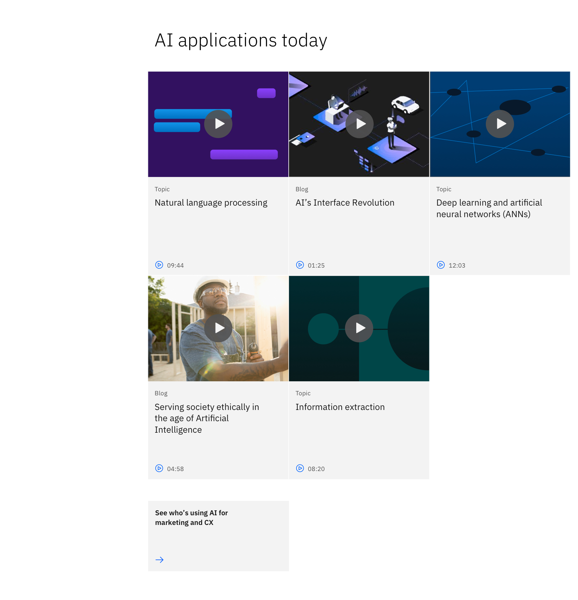

import ComponentDescription from "components/ComponentDescription";
import ComponentFooter from "components/ComponentFooter";

<ComponentDescription name="Content block cards" type="layout" />

<AnchorLinks>

<AnchorLink>Default</AnchorLink>
<AnchorLink>Variations</AnchorLink>
<AnchorLink>Content guidance</AnchorLink>
<AnchorLink>Design and functional specifications</AnchorLink>
<AnchorLink>Development documentation</AnchorLink>
<AnchorLink>Feedback</AnchorLink>

</AnchorLinks>

## Default

By default the Content block cards simply supports only text for moments needing richer content, and sets proper expectations for the user to make their next journey decision from within the page's narrative.

 

## Variations

### With images

Content block cards can use images to help tell its story to the user. This is great for breaking up dense text, adding a little visual flare, and creating instant recognition.

### With videos

Sometimes a video will support the pages' narrative, but should not be prominently featured. This variation can be used to provide those types of videos from within the page without creating a distraction that leads them out of the narrative.

 

## Content guidance

| Field                                                                                       | Field type | Required | Cardinality | Max character size  (English / translated) | Notes                                                                                           |
| ------------------------------------------------------------------------------------------- | ---------- | -------- | ----------- | ---------------------------------------------- | ----------------------------------------------------------------------------------------------- |
| Headline                                                                                    | Short copy | Yes      | 1           | XXS (40 / 55)                                  | –                                                                                               |
| [Card Group](https://www.ibm.com/standards/web/carbon-for-ibm-dotcom/components/card-group) | Component  | Yes      | 2–6 cards   | –                                              | You can use the simple card, image card, or video card, but all cards must be of the same type. |
| [CTA (card)](https://www.ibm.com/standards/web/carbon-for-ibm-dotcom/components/cta/#card)  | Component  | No       | 1           | –                                              | This is a content block CTA, not the CTA in the card group.                                     |

To see the list of all character count standards, go to this <a href="https://github.com/carbon-design-system/carbon-for-ibm-dotcom-website/wiki/Character-count-standards" target="_blank" rel="noreferrer">link</a>.

<ComponentFooter name="Content block cards" type="layout" />
