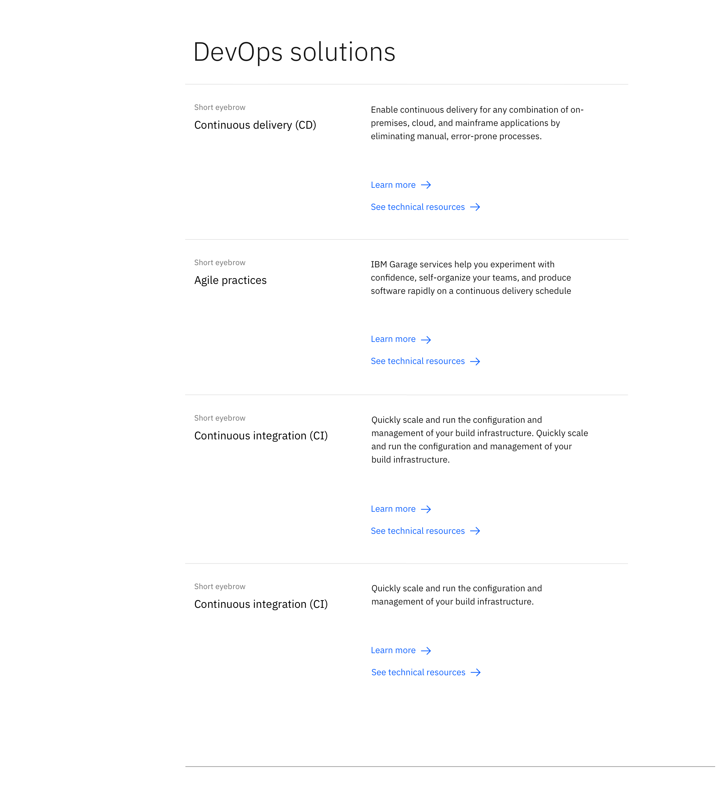

import ComponentDescription from 'components/ComponentDescription';
import ComponentFooter from 'components/ComponentFooter';
import ResourceLinks from 'components/ResourceLinks';

<ComponentDescription name="Content block horizontal" type="layout" />

<AnchorLinks>

<AnchorLink>Resources</AnchorLink>
<AnchorLink>Overview</AnchorLink>
<AnchorLink>Content guidance</AnchorLink>
<AnchorLink>Feedback</AnchorLink>

</AnchorLinks>

<ResourceLinks name="Content block horizontal" type="layout" />

## Overview

On a page with largely vertical content, Content block horizontal presents a moment to enhance vertical rhythm by
switching up the reading direction. It is also a good component for presenting a large amount of CTAs with context.
Please note that no CTA should be used within this Content block except the ones included within
[Content item horizontal](https://www.ibm.com/standards/carbon/components/content-item-horizontal) components.

<Row>
<Column colMd={6} colLg={8}>

</Column>
</Row>

## Content guidance

| Element                                                                                            | Content type | Required | Instances | Character limit (English / translated) | Notes                                                      |
| -------------------------------------------------------------------------------------------------- | ------------ | -------- | --------- | ------------------------------------------ | ---------------------------------------------------------- |
| Heading                                                                                            | Text         | Yes      | 1         | 40 / 55                                    | Heading override can be used when using table of contents. |
| [Content item horizontal](https://www.ibm.com/standards/carbon/components/content-item-horizontal) | Component    | Yes      | 1–8       | –                                          |                                                            |

For more information, see the [character count standards](https://www.ibm.com/standards/carbon/guidelines/content#character-count-standards).

<ComponentFooter name="Content block horizontal" type="layout" />
