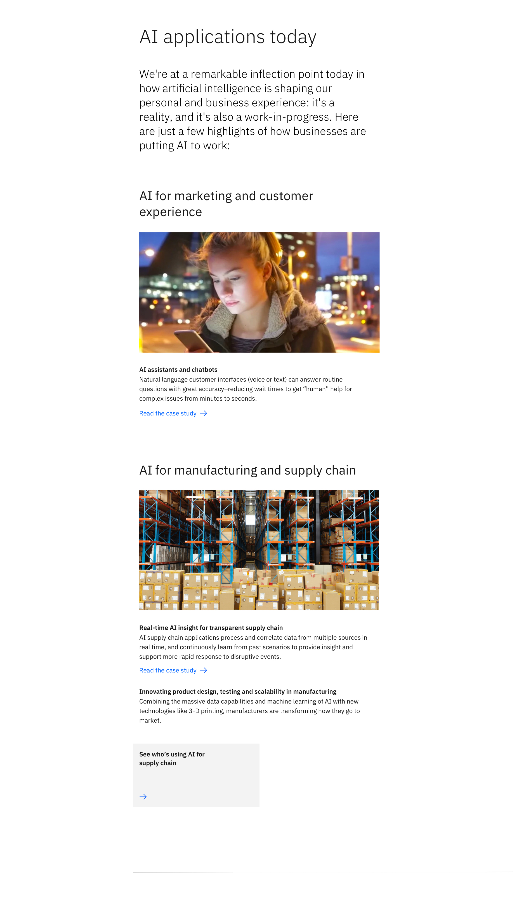

import ComponentDescription from "components/ComponentDescription";
import ComponentFooter from "components/ComponentFooter";

<ComponentDescription name="Content block media" type="layout" />

<AnchorLinks>

<AnchorLink>Default</AnchorLink>
<AnchorLink>Variations</AnchorLink>
<AnchorLink>Content guidance</AnchorLink>
<AnchorLink>Design and functional specifications</AnchorLink>
<AnchorLink>Development documentation</AnchorLink>
<AnchorLink>Feedback</AnchorLink>

</AnchorLinks>

## Default

By default the Content block media starts with a brief overview before going into one or more detailed points. At strategic points it allows for an optional piece of media to support its content.

 

## Variations

### With aside elements

This variant is the same as the default version except that it allows for a list of related navigational items off to the side.

 

## Content guidance

| Field                                                                                                                                           | Field type | Required | Cardinality | Max character size (English / translated) |
| ----------------------------------------------------------------------------------------------------------------------------------------------- | ---------- | -------- | ----------- | ----------------------------------------- |
| Headline                                                                                                                                        | Short copy | Yes      | 1           | XXS (40 / 55)                             |
| Paragraph                                                                                                                                       | Long copy  | No       | 1           | XL (250 / 325)                            |
| [Content group – simple](https://www.ibm.com/standards/web/carbon-for-ibm-dotcom/components/content-group-simple)                               | Component  | Yes      | Less than 4 | –                                         |
| [Featured card block – medium](https://www.ibm.com/standards/web/carbon-for-ibm-dotcom/components/feature-card-block#feature-card-block-medium) | Component  | No       | 1           | –                                         |
| [Link list](https://www.ibm.com/standards/web/carbon-for-ibm-dotcom/components/link-list)                                                       | Component  | No       | 1           | –                                         |

You can see the list of all character count standards <a href="https://github.com/carbon-design-system/carbon-for-ibm-dotcom-website/wiki/Character-count-standards" target="_blank" rel="noreferrer">here</a>.

<ComponentFooter name="Content block media" type="layout" />
