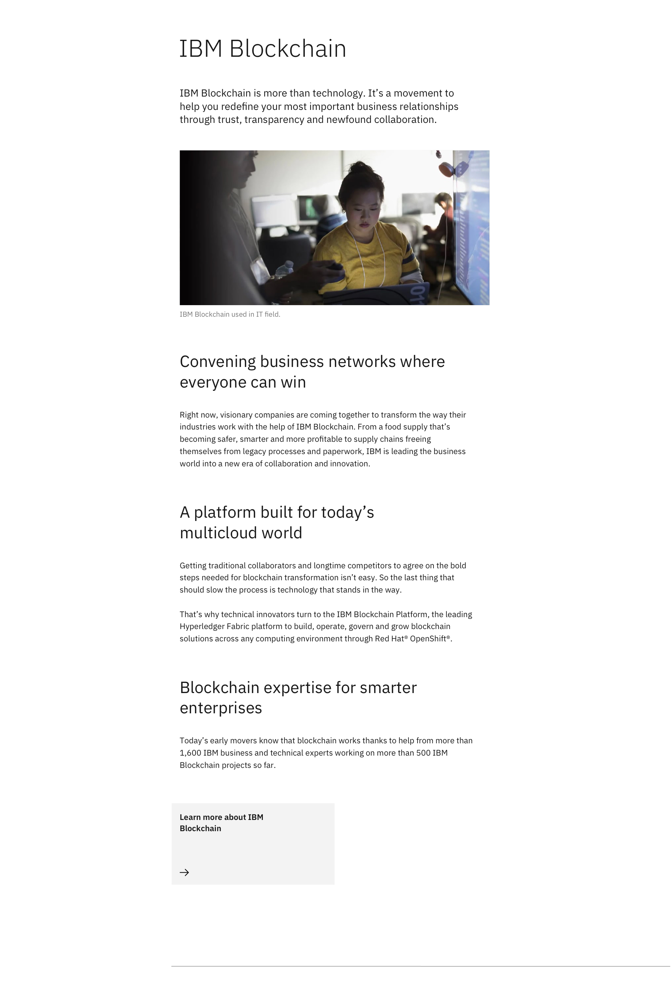
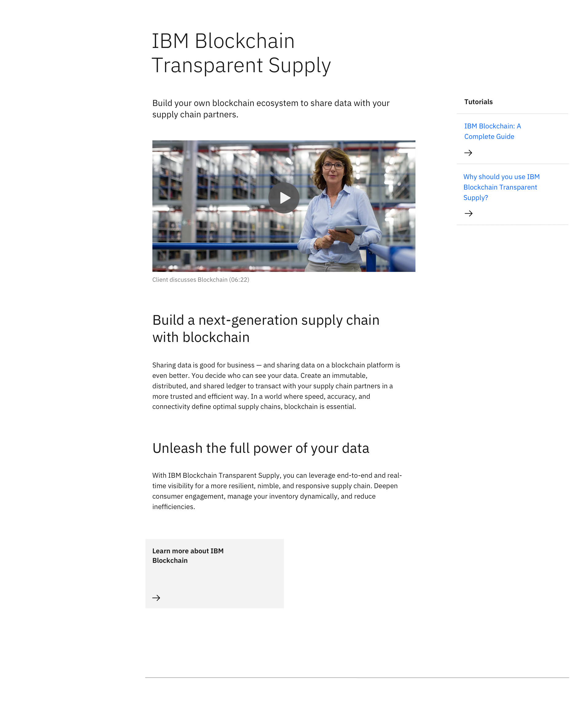

import ComponentDescription from 'components/ComponentDescription';
import ComponentFooter from 'components/ComponentFooter';
import ResourceLinks from 'components/ResourceLinks';

<ComponentDescription name="Content block segmented" type="layout" />

<AnchorLinks>

<AnchorLink>Resources</AnchorLink>
<AnchorLink>Overview</AnchorLink>
<AnchorLink>Variations</AnchorLink>
<AnchorLink>Content guidance</AnchorLink>
<AnchorLink>Feedback</AnchorLink>

</AnchorLinks>

<ResourceLinks name="Content block segmented" type="layout" />

## Overview

Default Content block segmented allows you to break up the narrative content into sections. It includes a heading,
introductory paragraph, subsections, optional CTA (call-to-action), optional media (image or video), and horizontal
rule.

 

## Variations

### With aside elements

This variation includes navigational quick links on the right side. These quick links provide an alternate route
directing users to resources related to the content in the main body.

 

## Content guidance

| Element                                                                        | Content type                                                                                                                       | Required | Instances | Character limit  (English / translated) | Notes                                                           |
| ------------------------------------------------------------------------------ | ---------------------------------------------------------------------------------------------------------------------------------- | -------- | --------- | ------------------------------------------- | --------------------------------------------------------------- | --- |
| Heading                                                                        | Text                                                                                                                               | Yes      | 1         | 65 / 85                                     | Heading override can be used when using table of contents.      |
| Copy                                                                           | Text                                                                                                                               | Yes      | 1         | 350 / 450                                   |                                                                 |
| Media                                                                          | [Image](https://www.ibm.com/standards/carbon/components/images/) or [Video](https://www.ibm.com/standards/carbon/components/video) | No       | 1         | –                                           | Image with caption may also be used.                            |     |
| Image alt text                                                                 | Text                                                                                                                               | No       | 1         | 75 / 100                                    | Image description for accessibility.                            |
| [Content group](https://www.ibm.com/standards/carbon/components/content-group) | Component                                                                                                                          | Yes      | 2–3       | –                                           |                                                                 |
| [CTA](https://www.ibm.com/standards/carbon/components/cta/)                    | Component                                                                                                                          | No       | 1         | –                                           | Text and card styles only; jump, local, or external types only. |
| Aside container                                                                | Component                                                                                                                          | No       | 1         | –                                           |                                                                 |

For more information, see the
[character count standards](https://www.ibm.com/standards/carbon/guidelines/content#character-count-standards).

<ComponentFooter name="Content block segmented" type="layout" />
