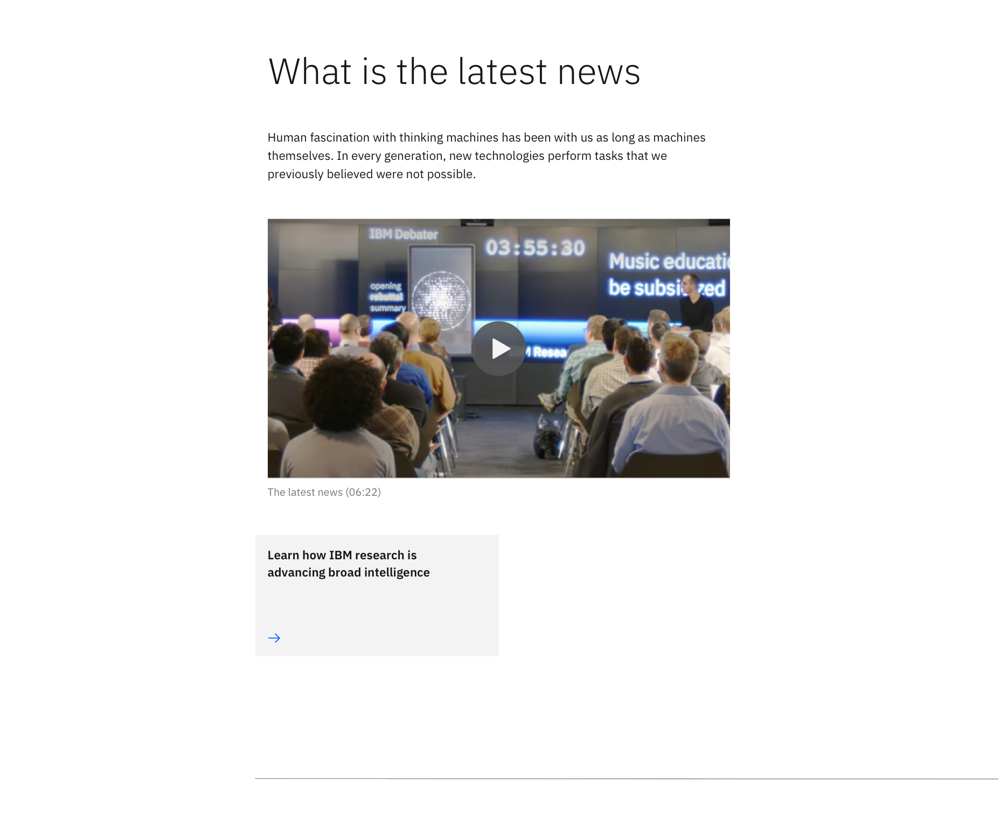
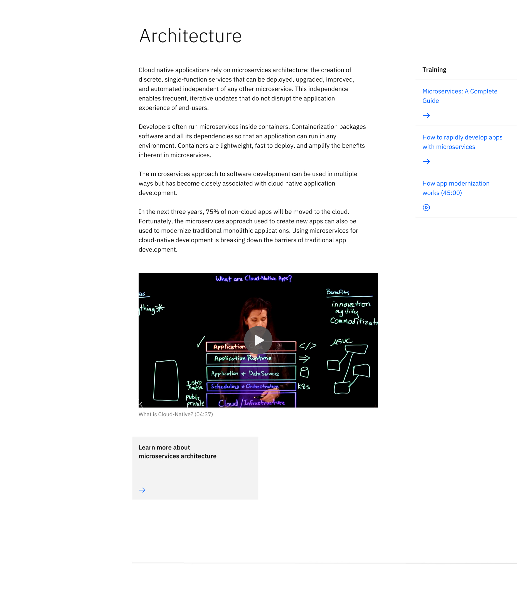

import ComponentDescription from 'components/ComponentDescription';
import ComponentFooter from 'components/ComponentFooter';
import ResourceLinks from 'components/ResourceLinks';

<ComponentDescription name="Content block simple" type="layout" />

<AnchorLinks>

<AnchorLink>Resources</AnchorLink>
<AnchorLink>Overview</AnchorLink>
<AnchorLink>Variations</AnchorLink>
<AnchorLink>Content guidance</AnchorLink>
<AnchorLink>Feedback</AnchorLink>

</AnchorLinks>

<ResourceLinks name="Content block simple" type="layout" />

## Overview

Content block simple is a top-level pattern meaning it ideally lives at the top of a page for introducing page content.
It includes a heading, introductory paragraph, optional media (image or video), optional CTA (call-to-action), and
horizontal rule.

 

## Variations

### With aside elements

Content block simple with aside elements is also used for introducing page content but includes navigational quick links
on the right side. These quick links provide an alternate route directing users to resources related to the content in
the main body.

 

## Content guidance

| Element                                                    | Content type                                                                                                                       | Required | Instances | Character limit  (English / translated) | Notes                                                      |
| ---------------------------------------------------------- | ---------------------------------------------------------------------------------------------------------------------------------- | -------- | --------- | ------------------------------------------- | ---------------------------------------------------------- |
| Heading                                                    | Text                                                                                                                               | Yes      | 1         | 40 / 55                                     | Heading override can be used when using table of contents. |
| Copy                                                       | Text                                                                                                                               | Yes      | 1         | 1600 / 2400                                 |                                                            |
| Media                                                      | [Image](https://www.ibm.com/standards/carbon/components/images/) or [Video](https://www.ibm.com/standards/carbon/components/video) | No       | 1         | –                                           |                                                            |
| Image alt text                                             | Text                                                                                                                               | No       | 1         | 75 / 100                                    | Image description for accessibility.                       |
| [CTA](https://www.ibm.com/standards/carbon/components/cta) | Component                                                                                                                          | No       | 1         | –                                           | All styles except for card.                                |
| Aside container                                            | Component                                                                                                                          | No       | 1         | –                                           |                                                            |

For more information, see the [character count standards](https://www.ibm.com/standards/carbon/guidelines/content#character-count-standards).

<ComponentFooter name="Content block simple" type="layout" />
