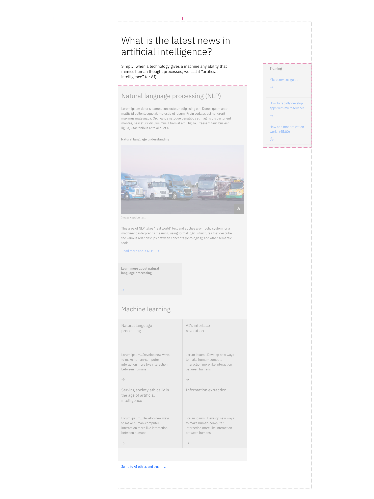

import ComponentDescription from 'components/ComponentDescription';
import ComponentFooter from 'components/ComponentFooter';
import ResourceLinks from 'components/ResourceLinks';

<ComponentDescription name="Content block" type="layout" />

<AnchorLinks>

<AnchorLink>Resources</AnchorLink>
<AnchorLink>Overview</AnchorLink>
<AnchorLink>Behaviors</AnchorLink>
<AnchorLink>Tips and techniques</AnchorLink>
<AnchorLink>Content guidance</AnchorLink>
<AnchorLink>Ready-to-use custom block components</AnchorLink>
<AnchorLink>Feedback</AnchorLink>

</AnchorLinks>

<ResourceLinks name="Content block" type="layout" />

## Overview

The content block component can be used and customized for different types of web experiences. It can be used multiple
times inside a content section component, acting as a main content unit for it.

<Caption>Anatomy of the content block component</Caption>

 

1. **Heading:** Customizable heading for the content block component.
2. **Description:** A short description of the content block.
3. **Children container 1:** Use this to insert other high-level content units, like content groups.
4. **CTA text link or CTA card link:** Use this component as a general call to action at content block level.
5. **Children container 2:** This container is only used to insert aside elements, or a link list to the content block.

#### When to use

Use content block when you need to organise a web page experience into high-level content units inside of a content
section. One of the advantages of the block is that it is visually very prominent on the page through its big heading
type token and its’ accompanying description. Use it inside of a complex content section to hierarchically separate
different content units for an easier read and understanding.

#### When not to use

Do not look at content blocks as a replacement for content sections. A page is separated into sections, which, in turn,
are separated into blocks. Do not use a content block to only separate content items, or other related basic content
units like paragraphs inside of a web page. Use a content group instead.

## Behaviors

The content block elements are persistent throughout the online experience. It is fully responsive and changes how
elements are displayed based on the browser size.

#### Desktop breakpoints (max, xlg, and lg)

If the browser is wider than the max breakpoint of 1584px, the content block and all other page content will center and
extra margin will appear on either side of the page layout. The content block is recommended to take the last 12 columns
of the grid (12 of 16). From this 12 columns, the block heading, description, children container 1 and the CTA will take
the first 8 grid columns (of the last 12), and the children container 2 will take the last 4 grid columns.

In more particular editorial experiences, when there is no children container 2, it is possible to layout a content
block on 4 columns, making the reading experience in certain situations more delightful and more story-like.

<Row>

<Column colMd={4} colLg={12}>

<Caption>Content block at xlg 1312px breakpoint encapsulating two content groups and a link list</Caption>

</Column>

</Row>

#### Md and sm breakpoints

At medium and small breakpoints, the content block will add a significant change: the children container 1 will move
above the content block CTA and the children container 2 will move at the bottom of the content block. See below.

<Caption>Content block at md 672px and sm 320px breakpoints</Caption>

### Showcase

This is a showcase of a content block that encapsulates a content group with aside elements, alternating with a content
block which encapsulates a card group of four cards.

<Caption>
  A few content block options: with content group and aside elements (first), or with a card group (second).
</Caption>

## Tips and techniques

The content block elements are persistent throughout the online experience. It is fully responsive and changes how
elements are displayed based on the browser size.

- Important: keep in mind that on medium and small breakpoints, the children container 1 is positioned between the
  content block description and the CTA text link.
- Avoid CTA stacking at the end of a content block. If possible, use different types.

## Content guidance

| Element                                                    | Content type | Required | Instances | Character count  (English / translated) | Notes                                                                                |
| ---------------------------------------------------------- | ------------ | -------- | --------- | ------------------------------------------- | ------------------------------------------------------------------------------------ |
| Heading                                                    | Text         | Yes      | 1         | 40 / 55                                     |                                                                                      |
| Copy                                                       | Text         | No       | 1         | 120 / 150                                   |                                                                                      |
| Child container 1                                          | Component    | No       | 1         | –                                           | A container area that other content components and content types can be passed into. |
| [CTA](https://www.ibm.com/standards/carbon/components/cta) | Component    | No       | 1         | –                                           |                                                                                      |
| Child container 2                                          | Component    | No       | 1         | –                                           | A container area where only aside elements can be passed into.                       |

For more information, see the
[character count standards](https://github.com/carbon-design-system/carbon-for-ibm-dotcom-website/wiki/Character-count-standards).

## Ready-to-use custom block components

| Component name                                                                                     | Relationship                                                                                                                                                                                |
| -------------------------------------------------------------------------------------------------- | ------------------------------------------------------------------------------------------------------------------------------------------------------------------------------------------- |
| [Content block cards](https://www.ibm.com/standards/carbon/components/card-group)                  | Content block cards is a content block that includes a content block heading, and that, in the children container, it encapsulates a card group component.                                  |
| [Content block horizontal](https://www.ibm.com/standards/carbon/components/content-group-cards)    | Content block horizontal is a content block that includes a content block heading and group of content item horizontal elements.                                                            |
| [Content block media](https://www.ibm.com/standards/carbon/components/content-group-pictograms)    | Content block media is a content block that includes a content section heading, an expressive paragraph and two content groups with content items.                                          |
| [Content block mixed groups](https://www.ibm.com/standards/carbon/components/content-group-simple) | Content block mixed groups is a content block that includes a heading, an expressive paragraph and 3 content groups: a card group, a content group pictograms and a content group simple.   |
| [Content block segmented](https://www.ibm.com/standards/carbon/components/content-group-simple)    | Content block segmented is a content block that includes a heading, a subheading, 3 content groups in the children container 1 and also an optional link list in children container 2.      |
| [Content block simple](https://www.ibm.com/standards/carbon/components/content-group-simple)       | Content block simple is a custom content block that includes a heading, a description, a link list in children container 2, and optional media and CTA (text link with icon, or card link). |

<ComponentFooter name="Content block" type="layout" />
