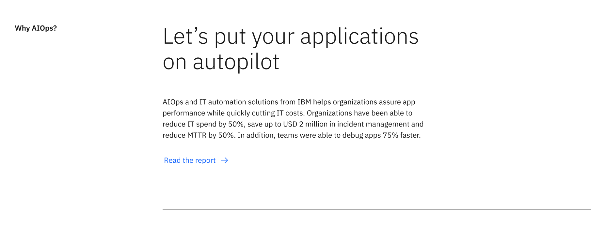
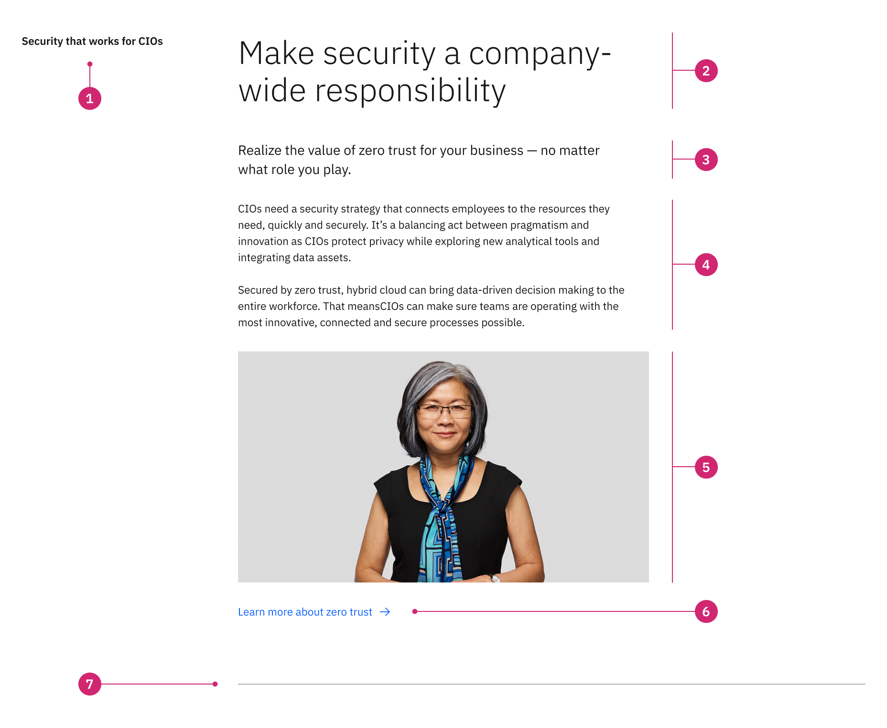
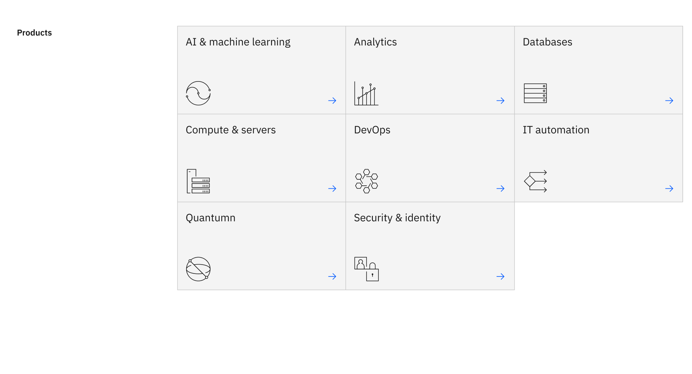
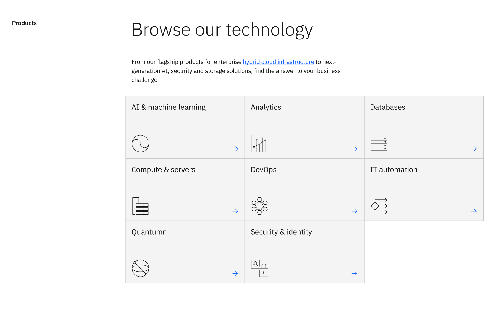

import ComponentDescription from 'components/ComponentDescription';
import ComponentFooter from 'components/ComponentFooter';
import ResourceLinks from 'components/ResourceLinks';

<ComponentDescription name="Content block" type="layout" />

<AnchorLinks>

<AnchorLink>Overview</AnchorLink>
<AnchorLink>Modifiers</AnchorLink>
<AnchorLink>Behaviors</AnchorLink>
<AnchorLink>Gallery</AnchorLink>
<AnchorLink>Resources</AnchorLink>
<AnchorLink>Content guidance</AnchorLink>
<AnchorLink>Feedback</AnchorLink>

</AnchorLinks>

## Overview

The content block acts as the heading level two on pages after the lead space component and spans 12 columns of the 16 column grid. The content block is commonly used to divide the main categories or sections of the page to help guide the user through the content or narrative.

<Caption>Example of the content section.</Caption>

### Anatomy

1. **Content block heading:** An optional, customizable heading for the Content section.
2. **Sub heading:** An optional, customizable sub heading for the Content section.
3. **Copy:** An optional short description.
4. **Child container:** Insert additional components to enhance the narrative, such as content group, content item or card group.
5. **CTA:** Use this as a general call to action, typically used to encompass the entire content section.
6. **Border:** An optional bottom border.

### Usage

Content block is often paired with the content section or the vertical table of contents to guide the user through the narrative and activate the first four columns of the 16 column grid.

## Modifiers

Content block is often paired with the content section or the vertical table of contents to guide the user through the narrative and activate the first four columns of the 16 column grid.

### Children

Similar to the content section, the content block can accept child components which allows designers and authors maximum flexibility when creating page layouts. The most common layouts on IBM.com are 8 column and 12 column components.

#### 8 column child

_Add description text here_

<Caption>
  Example of the content section with a child component that spans 8 columns.
</Caption>

#### 12 column child

_Add description text here_

<Caption>
  Example of the content section with a child component that spans 12 columns.
</Caption>

There is no limit to how many child components the content section can accept - consider the story you are trying to tell, the overall hierarchy of the page and how many content sections should be used to break up the content. View the [gallery](#gallery) to see examples of content section with various child components.

## Behaviors

The content section elements are persistent throughout the experience. It is fully responsive and changes how
elements are displayed based on the browser size, at tablet and mobile breakpoints the content section heading stacks on top of the content block heading.

<Row>

<Column colMd={8} colLg={8}>

<Caption>Example of content section at medium breakpoint</Caption>

</Column>

<Column colMd={8} colLg={4}>

<Caption>Example of content section at mobile breakpoint</Caption>

</Column>

</Row>

## Gallery

The content block is one of the main layout components for designing pages of the IBM.com platform. Here are some examples of various layouts you can create by utilizing the extreme flexibility the content section provides by utilizing the varying heading options and adding custom children.

<ResourceLinks name="Content block" type="layout" />

## Content guidance

| Element                                                    | Content type | Required | Instances | Character limit  (English / translated) | Notes                                                                                        |
| ---------------------------------------------------------- | ------------ | -------- | --------- | ------------------------------------------- | -------------------------------------------------------------------------------------------- |
| Heading                                                    | Text         | No       | 1         | 40 / 55                                     |                                                                                              |
| Sub heading                                                | Text         | No       | 1         | 120 / 150                                   |                                                                                              |
| Copy                                                       | Text         | No       | 1         | 1600 / 2400                                 |                                                                                              |
| Child container                                            | Component    | No       | 1+        | –                                           | An optional container area that child components and other content types can be passed into. |
| [CTA](https://www.ibm.com/standards/carbon/components/cta) | Component    | No       | 1         | 25 / 35                                     |                                                                                              |
| Border                                                     | Component    | No       | 1         | –                                           |                                                                                              |

For more information, see the [character count standards](https://www.ibm.com/standards/carbon/guidelines/content#character-count-standards).

<ComponentFooter name="Content section" type="layout" />
