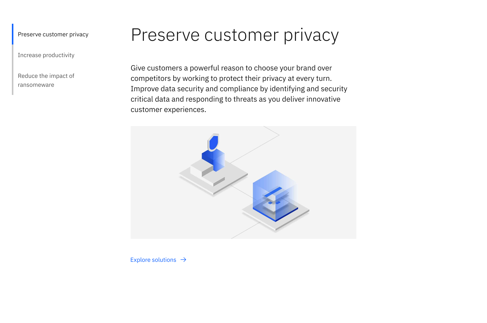
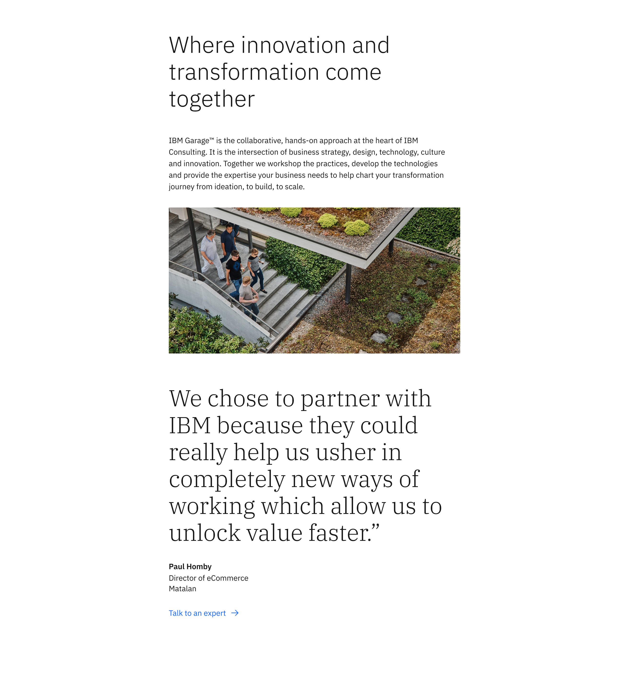

import ComponentDescription from 'components/ComponentDescription';
import ComponentFooter from 'components/ComponentFooter';
import ResourceLinks from 'components/ResourceLinks';

<ComponentDescription name="Content block" type="layout" />

<AnchorLinks>

<AnchorLink>Overview</AnchorLink>
<AnchorLink>Modifiers</AnchorLink>
<AnchorLink>Behaviors</AnchorLink>
<AnchorLink>Gallery</AnchorLink>
<AnchorLink>Resources</AnchorLink>
<AnchorLink>Content guidance</AnchorLink>
<AnchorLink>Related components</AnchorLink>
<AnchorLink>Feedback</AnchorLink>

</AnchorLinks>

## Overview

The content block acts as the heading level two on pages after the lead space component and spans 12 columns of the 16 column grid. The content block is commonly used to divide the main categories or sections of the page to help guide the user through the content or narrative.

<Caption>Example of the content block.</Caption>

### Anatomy

1. **Content block heading:** An optional, customizable heading for the Content section.
2. **Sub heading:** An optional, customizable sub heading for the Content section.
3. **Copy:** An optional short description.
4. **Child container:** Insert additional components to enhance the narrative, such as content group, content item or card group.
5. **CTA:** Use this as a general call to action, typically used to encompass the entire content section.
6. **Border:** An optional bottom border.

### Usage

Content block is often paired with the [content section](../components/content-section) or the [vertical table of contents](../components/table-of-contents#vertical) to guide the user through the narrative and activate the first four columns of the 16 column grid.

<Row>

<Column colMd={8} colLg={6}>

<Caption>
  Content block with a header and content group containing content items
  featuring pictograms
</Caption>

</Column>

<Column colMd={8} colLg={6}>

<Caption>
  Content block with a header and card group child spanning 12 columns
</Caption>

</Column>

</Row>

## Modifiers

### Children

Similar to the content section, the content block can accept child components which allows designers and authors maximum flexibility when creating page layouts. The most common layouts on IBM.com are 8 column and 12 column components.

There is no limit to how many child components the content block can accept - consider the story you are trying to tell, the overall hierarchy of the page and how many content blocks should be used to break up the content. View the [gallery](#gallery) to see examples of content block with various child components.

#### 8 column child

In this example the content block is paired with a group of [content item pictograms](./content-item) that span the center 8 columns of the grid.

<Caption>
  Content block with a heading and content group containing content items
  featuring pictograms
</Caption>

#### 12 column child

In this example the content block is paired with a [card group](./card-group) that spans 12 columns of the grid.

<Caption>
  Content block with a heading and card group child spanning 12 columns
</Caption>

#### Mixing children widths

The content block can support mixing of various children and how many columns of the grid the children can span. Most of the Carbon for IBM.com components have been carefully designed with line length and column usage in mind, and therefore should fit within the columns without alteration.

In this example the content block spans 8 columns, but has a group of content items that span 12 columns of the grid.

<Caption>
  Example of the content block with a heading and subheading spanning 8 columns,
  and a set of content items spanning 12 columns.
</Caption>

## Behaviors

At smaller breakpoints, if content block is paired with a content section, the content section heading stacks on top of the content block heading.

<Row>

<Column colMd={8} colLg={8}>

<Caption>
  Example of content block with a content section heading at medium breakpoint
</Caption>

</Column>

<Column colMd={8} colLg={4}>

<Caption>
  Example of content block with a content section heading at mobile breakpoint
</Caption>

</Column>

</Row>

## Gallery

The content block is one of the main layout components for designing pages of the IBM.com platform. Here are some examples of various layouts you can create by utilizing the extreme flexibility the content block provides by utilizing the varying heading options and adding custom children.

<ImageGallery>
<ImageGalleryImage alt="A content block with a vertical table of contents, heading, subheading, image, and link with icon" title="A content block with a vertical table of contents, heading, subheading, image, and link with icon" col={8}>

</ImageGalleryImage>
<ImageGalleryImage alt="A content block with heading, subheading, and group of content items in a grid" title="A content block with heading, subheading, and group of content items in a grid" col={4}>

</ImageGalleryImage>
<ImageGalleryImage alt="A content block with with heading, subheading, image, and quote" title="A content block with with heading, subheading, image, and quote" col={4}>

</ImageGalleryImage>
<ImageGalleryImage alt="A content block with a heading, subheading, button, and the bottom border enabled" title="A content block with a heading, subheading, button, and the bottom border enabled" col={8}>

</ImageGalleryImage>
</ImageGallery>

<ResourceLinks name="Content block" type="layout" />

## Content guidance

| Element                                                    | Content type | Required | Instances | Character limit  (English / translated) | Notes                                                                                        |
| ---------------------------------------------------------- | ------------ | -------- | --------- | ------------------------------------------- | -------------------------------------------------------------------------------------------- |
| Heading                                                    | Text         | No       | 1         | 40 / 55                                     |                                                                                              |
| Sub heading                                                | Text         | No       | 1         | 120 / 150                                   |                                                                                              |
| Copy                                                       | Text         | No       | 1         | 1600 / 2400                                 |                                                                                              |
| Child container                                            | Component    | No       | 1+        | –                                           | An optional container area that child components and other content types can be passed into. |
| [CTA](https://www.ibm.com/standards/carbon/components/cta) | Component    | No       | 1         | 25 / 35                                     |                                                                                              |
| Border                                                     | Component    | No       | 1         | –                                           |                                                                                              |

For more information, see the [character count standards](https://www.ibm.com/standards/carbon/guidelines/content#character-count-standards).

## Related components

| Component name                                   | Description                                                                        |
| ------------------------------------------------ | ---------------------------------------------------------------------------------- |
| [Content section](../components/content-section) | Content section is one of the main content components used to structure pages.     |
| [Content group](../components/content-group)     | Content group is one of the main content components used to display content items. |
| [Content item](../components/content-item)       | Content item is the lowest level hierarchically of the content components.         |

<ComponentFooter name="Content block" type="layout" />
