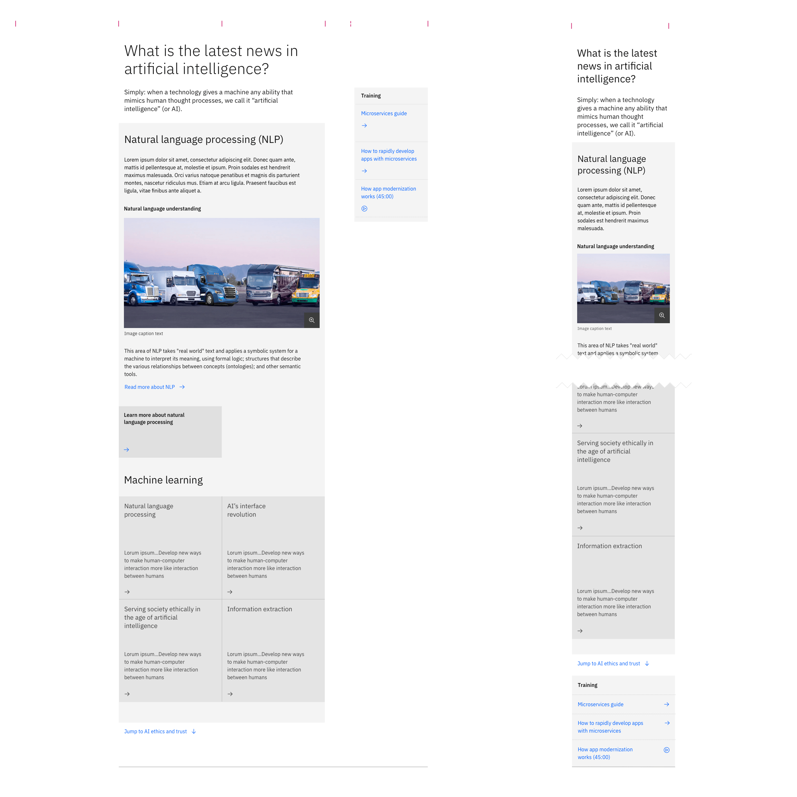

import ComponentDescription from 'components/ComponentDescription';
import ComponentFooter from 'components/ComponentFooter';
import ResourceLinks from 'components/ResourceLinks';

<ComponentDescription name="Content block" type="layout" />

<AnchorLinks>

<AnchorLink>Resources</AnchorLink>
<AnchorLink>Overview</AnchorLink>
<AnchorLink>Behaviors</AnchorLink>
<AnchorLink>Tips and techniques</AnchorLink>
<AnchorLink>Content guidance</AnchorLink>
<AnchorLink>Related components</AnchorLink>
<AnchorLink>Feedback</AnchorLink>

</AnchorLinks>

<ResourceLinks name="Content block" type="layout" />

## Overview

The Content block component can be used and customized for different types of web experiences. It can be used multiple
times inside a Content section component, acting as a main content unit for it.

<Row>

<Column colMd={8} colLg={8}>

</Column>

</Row>

<Caption>Anatomy of the Content block</Caption>

 

1. **Heading:** Customizable heading for the Content block component.
2. **Description:** A short optional description.
3. **Primary child container:** Use this to insert other high-level content units, such as Content groups.
4. **CTA:** Use this component as a general call to action at block level.
5. **Aside container:** This container is used only to insert aside elements, or a link list, for the Content block.

#### When to use

Use Content block when you need to organize a web page experience into high-level content units inside of a Content
section. One of the advantages of the block is that it is visually very prominent on the page, thanks to its large
heading and accompanying description. Use it inside a complex Content section to hierarchically separate different
content units for easier reading and comprehension.

#### When not to use

Do not look to Content blocks as a replacement for Content sections. A page is separated into sections, and then within
the sections there is further separation into blocks. Do not use a Content block to only separate content items, or
other related basic content units like paragraphs inside of a web page. Use a Content group instead.

## Behaviors

The Content block elements are persistent throughout the online experience. The component is fully responsive and the
display adjusts with different browser sizes.

#### Desktop breakpoints

If the browser is wider than the max breakpoint of 1584px, the Content block and all other page content will center and
the margins on either side of the page layout will increase. The Content block is recommended to take the last 12
columns of the 16-column grid. Within these 12 columns, the block heading, description, primary child container, and the
CTA will take the first 8 grid columns, and the aside will take the last 4 grid columns.

For particular editorial experiences where there is no aside, it is possible to lay out a Content block on 4 columns,
making the reading experience more story-like and engaging.

#### Mobile breakpoints

At medium and small breakpoints, the Content block will add a significant change: the primary child container will move
above the Content block CTA and the aside will move to the bottom of the Content block. See below.

<Row>

<Column colMd={8} colLg={12}>

<Caption>Content block at desktop and mobile breakpoints</Caption>

</Column>

</Row>

### Examples

These examples showcase the versatility of Content block, showing first how it can include a Content group with aside
elements, alternating with a Content block containing a Card group of four cards.

<Row>

<Column colMd={8} colLg={10}>

</Column>

</Row>

<Caption>
  A few Content block options: with Content group and aside elements (first), or
  with a Card group (second).
</Caption>

## Tips and techniques

Content block elements are persistent throughout the online experience. It is fully responsive and changes how elements
are displayed based on the browser size.

Keep in mind that on medium and small breakpoints, the primary container is positioned between the Content block
description and the CTA text link.

Avoid CTA stacking at the end of a Content block. If possible, use different types.

## Content guidance

| Element                                                    | Content type | Required | Instances | Character limit  (English / translated) | Notes                                                                                |
| ---------------------------------------------------------- | ------------ | -------- | --------- | ------------------------------------------- | ------------------------------------------------------------------------------------ |
| Heading                                                    | Text         | No       | 1         | 40 / 55                                     |                                                                                      |
| Copy                                                       | Text         | No       | 1         | 120 / 150                                   |                                                                                      |
| Primary child container                                    | Component    | No       | 1         | –                                           | A container area that other content components and content types can be passed into. |
| [CTA](https://www.ibm.com/standards/carbon/components/cta) | Component    | No       | 1         | –                                           | All styles except for card.                                                          |
| Aside container                                            | Component    | No       | 1         | –                                           | A container area where only aside elements can be passed into.                       |

For more information, see the [character count standards](https://www.ibm.com/standards/carbon/guidelines/content#character-count-standards).

## Related components

| Component name                                                                                     | Description                                                                                                                                                                                     |
| -------------------------------------------------------------------------------------------------- | ----------------------------------------------------------------------------------------------------------------------------------------------------------------------------------------------- |
| [Content block cards](https://www.ibm.com/standards/carbon/components/card-group)                  | Content block cards is a Content block that includes a content block heading and in the child container, it contains a Card group component.                                                    |
| [Content block horizontal](https://www.ibm.com/standards/carbon/components/content-group-cards)    | Content block horizontal is a Content block that includes a content block heading and group of Content item horizontal elements.                                                                |
| [Content block media](https://www.ibm.com/standards/carbon/components/content-group-pictograms)    | Content block media is a Content block that includes a content section heading, an expressive paragraph, and two Content groups with Content items.                                             |
| [Content block mixed groups](https://www.ibm.com/standards/carbon/components/content-group-simple) | Content block mixed groups is a Content block that includes a heading, an expressive paragraph, and three content groups: a Card group, a Content group pictograms, and a Content group simple. |
| [Content block segmented](https://www.ibm.com/standards/carbon/components/content-group-simple)    | Content block segmented is a Content block that includes a heading, a subheading, three content groups in the primary child container and also an optional link list in the aside container.    |
| [Content block simple](https://www.ibm.com/standards/carbon/components/content-group-simple)       | Content block simple is a custom Content block that includes a heading, a description, a link list in the aside container, and optional media and CTA (text link with icon, or card link).      |

<ComponentFooter name="Content block" type="layout" />
