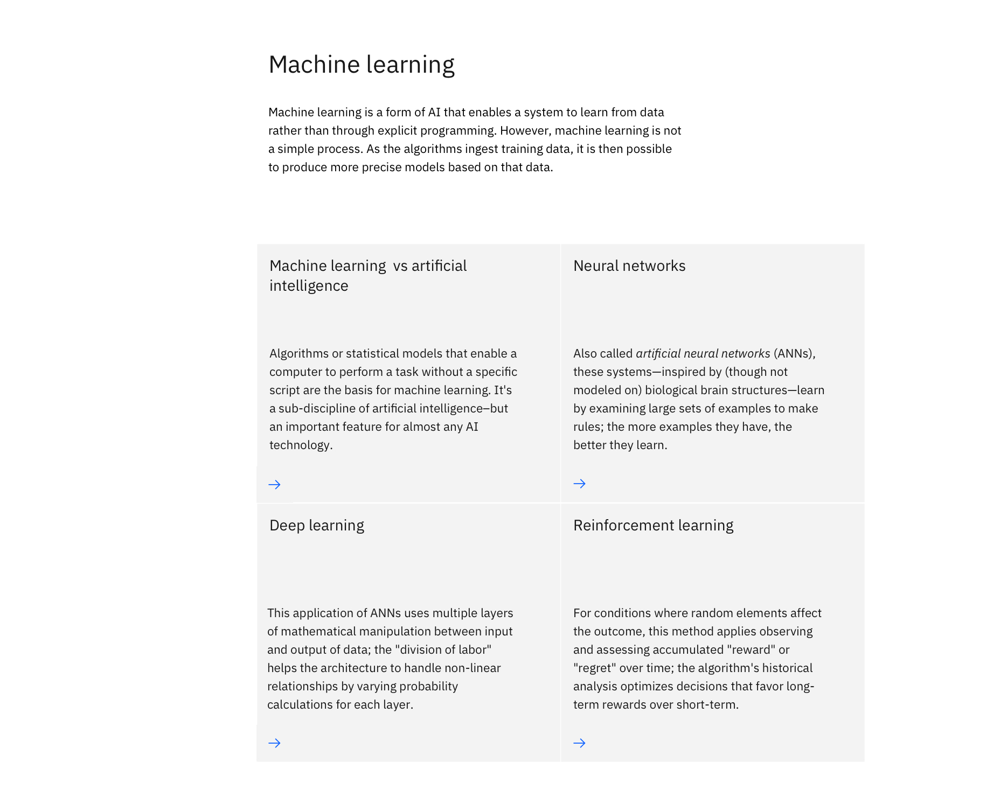

import ComponentDescription from "components/ComponentDescription";
import ComponentFooter from "components/ComponentFooter";

<ComponentDescription name="Content group cards" type="layout" />

<AnchorLinks>

<AnchorLink>Default</AnchorLink>
<AnchorLink>Design and functional specifications</AnchorLink>
<AnchorLink>Development documentation</AnchorLink>
<AnchorLink>Feedback</AnchorLink>

</AnchorLinks>

## Default

Content group cards includes a section heading, body copy, and any number of card components listed below. This pattern can be used multiple times within a content block.

<ComponentFooter name="Content group cards" type="layout" />
