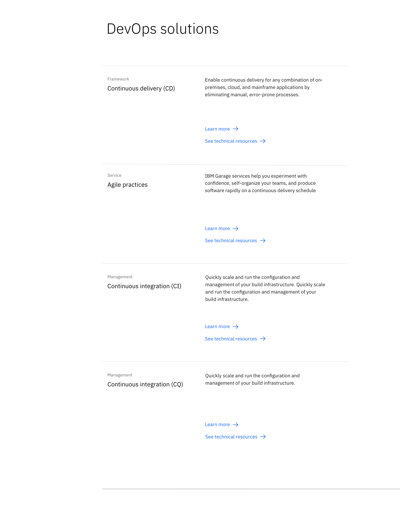

import { ComponentStatus } from 'components/ComponentList';

<PageDescription>

Content group — horizontal can be used to present important areas of interest relating to your topic, such as products or solutions. 

</PageDescription>

<AnchorLinks>

<AnchorLink>Default</AnchorLink>
<AnchorLink>Design and functional specifications</AnchorLink>
<AnchorLink>Development documentation</AnchorLink>
<AnchorLink>Feedback</AnchorLink>

</AnchorLinks>

## Default
Content group — horizontal consists of a heading followed by a series of content pieces each with their own eyebrow, heading, paragraph and CTA's. Horizontal rules are used to divide each content piece.

## Design and functional specifications

The design specs and functional specs for Content group  &mdash; horizontal can be viewed [here](https://ibm.box.com/s/rv5kmm0a4d9ded74v6yfk8ad5id5ghmx).

## Development documentation

<ComponentStatus name="Content group - horizontal" type="layout" />

## Feedback

Help us improve this component by providing feedback, asking questions, and leaving any other comments on [GitHub](https://github.com/carbon-design-system/ibm-dotcom-library).
