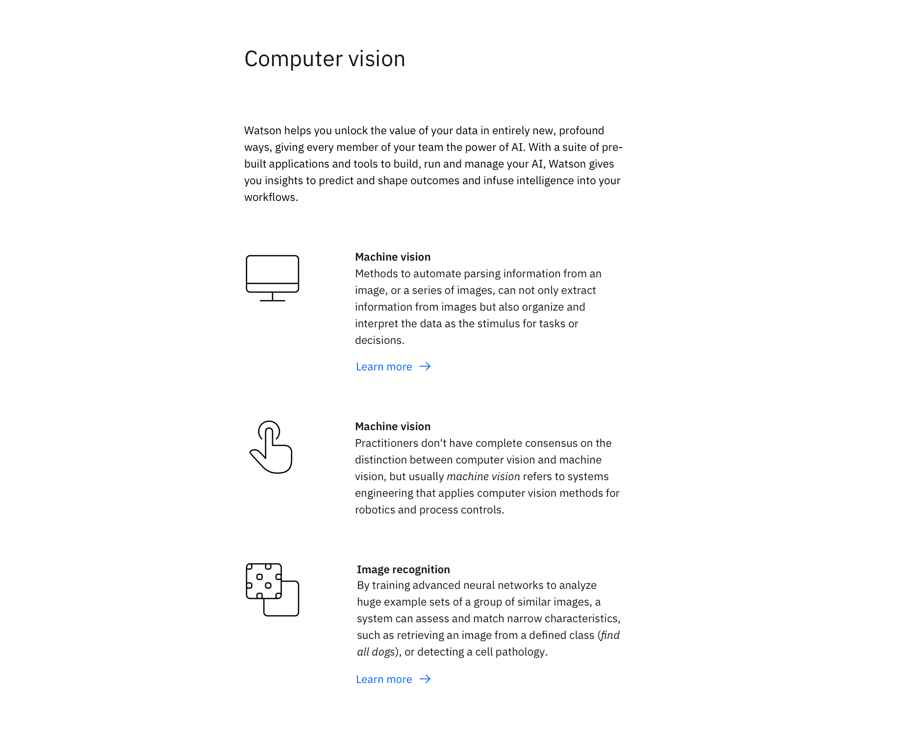

import ComponentDescription from 'components/ComponentDescription';
import ComponentFooter from 'components/ComponentFooter';
import ResourceLinks from 'components/ResourceLinks';

<ComponentDescription name="Content group pictograms" type="layout" />

<AnchorLinks>

<AnchorLink>Resources</AnchorLink>
<AnchorLink>Overview</AnchorLink>
<AnchorLink>Content guidance</AnchorLink>
<AnchorLink>Feedback</AnchorLink>

</AnchorLinks>

<ResourceLinks name="Content group pictograms" type="layout" />

## Overview

Content group pictograms consists of a heading, introduction, and a series of concise content each with their own pictogram. The pictograms are useful for visually engaging users and conveying important information through illustration. The pictogram can be viewed and download the IBM Design Language pictogram library.

## Content guidance

| Element        | Content type | Required | Instances | Character limit  (English / translated) | Notes                                                                                                         |
| -------------- | ------------ | -------- | --------- | ------------------------------------------- | ------------------------------------------------------------------------------------------------------------- |
| Heading        | Text         | Yes      | 1         | 40 / 55                                     |                                                                                                               |
| Copy           | Text         | No       | 1         | 450 / 590                                   | Recommended character count may vary based on the intent of the page and may be uncapped for some page types. |
| Pictogram item | Component    | Yes      | 2–6       | –                                           |                                                                                                               |

For more information, see the [character count standards](https://www.ibm.com/standards/carbon/guidelines/content#character-count-standards).

<ComponentFooter name="Content group pictograms" type="layout" />
