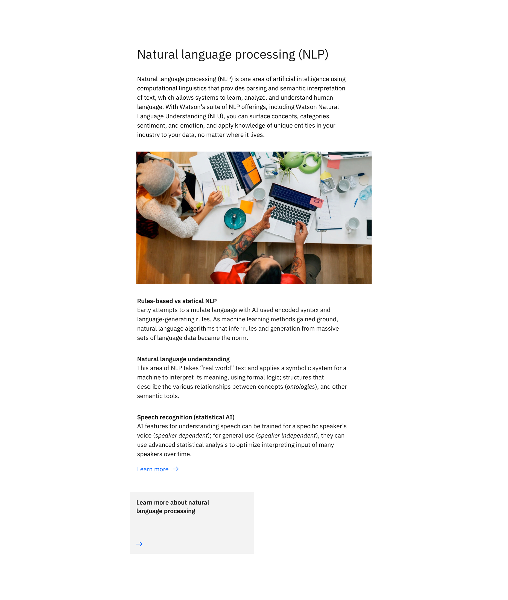

import ComponentDescription from 'components/ComponentDescription';
import ComponentFooter from 'components/ComponentFooter';
import ResourceLinks from 'components/ResourceLinks';

<ComponentDescription name="Content group simple" type="layout" />

<AnchorLinks>

<AnchorLink>Resources</AnchorLink>
<AnchorLink>Overview</AnchorLink>
<AnchorLink>Content guidance</AnchorLink>
<AnchorLink>Feedback</AnchorLink>

</AnchorLinks>

<ResourceLinks name="Content group simple" type="layout" />

## Overview

Content group simple is ideal for grouping content within sections with smaller headlines. It includes an optional
introductory paragraph, CTA (call-to-action), and media (image or video).

 

## Content guidance

| Element                                                                      | Content type                                                                                                                       | Required | Instances | Character limit  (English / translated) | Notes                                        |
| ---------------------------------------------------------------------------- | ---------------------------------------------------------------------------------------------------------------------------------- | -------- | --------- | ------------------------------------------- | -------------------------------------------- |
| Heading                                                                      | Text                                                                                                                               | Yes      | 1         | 65 / 85                                     |                                              |
| Copy                                                                         | Text                                                                                                                               | No       | 1         | 350 / 450                                   |                                              |
| Media                                                                        | [Image](https://www.ibm.com/standards/carbon/components/images/) or [Video](https://www.ibm.com/standards/carbon/components/video) | No       | 1         | –                                           |                                              |
| Image alt text                                                               | Text                                                                                                                               | No       | 1         | 75 / 100                                    | Image description for accessibility.         |
| [Content item](https://www.ibm.com/standards/carbon/components/content-item) | Component                                                                                                                          | Yes      | 2–6       | –                                           |                                              |
| [CTA](https://www.ibm.com/standards/carbon/components/cta)                   | Component                                                                                                                          | No       | 1         | –                                           | Only card link style and local type allowed. |

For more information, see the [character count standards](https://www.ibm.com/standards/carbon/guidelines/content#character-count-standards).

<ComponentFooter name="Content group simple" type="layout" />
