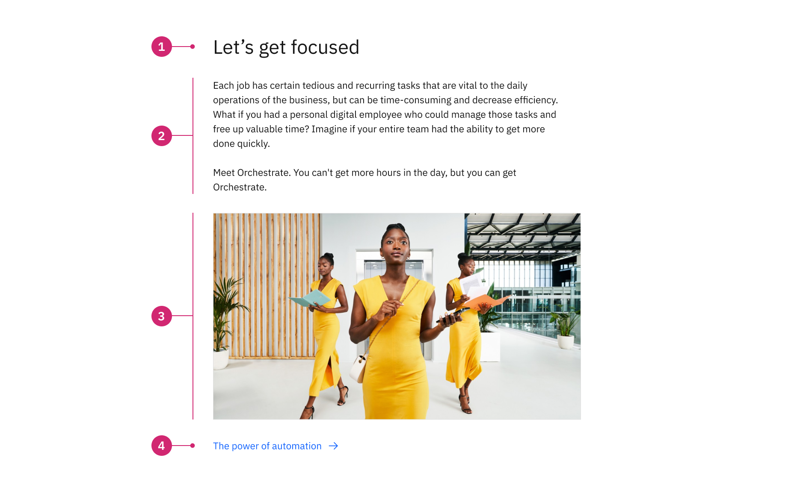

import ComponentDescription from 'components/ComponentDescription';
import ComponentFooter from 'components/ComponentFooter';
import ResourceLinks from 'components/ResourceLinks';

<ComponentDescription name="Content group" type="layout" />

<AnchorLinks>

<AnchorLink>Overview</AnchorLink>
<AnchorLink>Behaviors</AnchorLink>
<AnchorLink>Tips and techniques</AnchorLink>
<AnchorLink>Resources</AnchorLink>
<AnchorLink>Content guidance</AnchorLink>
<AnchorLink>Related components</AnchorLink>
<AnchorLink>Feedback</AnchorLink>

</AnchorLinks>

## Overview

The content group component can be customized for different types of web experiences. It can be used multiple times
inside a content block or a content section component, to establish additional hierarchy within an experience.

<Caption>Example of the content section.</Caption>

### Anatomy

<Caption>Anatomy of the Content group component</Caption>

 

1. **Heading:** Customizable heading for the content group.
2. **Description:** A short description.
3. **Child container:** Insert additional components to enhance the narrative, such as content item, card group, or an image.
4. **CTA:** Use this as a general call to action at group level.

#### When to use

Content group is often used to to establish additional hierarchy within longform content, it can be nested inside a [content section](../components/content-section) or a [content block](../components/content-block). 

#### When not to use

Do not look at content group as a replacement for content section. A page is separated into sections, which, in turn, is
separated into blocks. Do not use content group to separate high-level complex content units inside of a web page.

## Behaviors

The content group elements are persistent throughout the online experience. The component is fully responsive and the
display adjusts with different browser sizes.

#### Desktop breakpoints

If the browser is wider than the max breakpoint of 1584px, the content group and all other page content will center and
the margins on either side of the page layout will increase. The content group is typically placed on the center 8
columns of the 16 column grid.

#### Mobile breakpoints

At medium and small breakpoints, the content group will left align and span the full width of the grid.

## Tips and techniques

Keep in mind that the content group children container is positioned between the description and the CTA.

Avoid CTA stacking at the end of a content group. If possible, use different types.

If you need to add different types of [content items](../components/content-item), use a content group component for each type. It’s okay to have a
content group with only one content item.

<ResourceLinks name="Content group" type="layout" />

## Content guidance

| Element                                                    | Content type | Required | Instances | Character limit  (English / translated) | Notes                                                                               |
| ---------------------------------------------------------- | ------------ | -------- | --------- | ------------------------------------------- | ----------------------------------------------------------------------------------- |
| Heading                                                    | Text         | Yes      | 1         | 40 / 55                                     |                                                                                     |
| Copy                                                       | Text         | No       | 1         | 350 / 450                                   |                                                                                     |
| Child container                                            | Component    | No       | 1         | –                                           | A container area that child components, and other content types can be passed into. |
| [CTA](https://www.ibm.com/standards/carbon/components/cta) | Component    | No       | 1         | –                                           | Only card link and local type allowed.                                              |

For more information, see the [character count standards](https://www.ibm.com/standards/carbon/guidelines/content#character-count-standards).

## Related components

| Component name                                                               | Description                                                                                                                                                                           |
| ---------------------------------------------------------------------------- | ------------------------------------------------------------------------------------------------------------------------------------------------------------------------------------- |
| [Content section](../components/content-section)                             | Content section is one of the main content components used to structure pages.                                            |
| [Content block](../components/content-block)                                 | Content block is one of the main content components used to structure pages.                                        |
| [Content item](../components/content-item)                                   | Content item is the lowest level hierarchically of the content components.                                          |

<ComponentFooter name="Content group" type="layout" />
