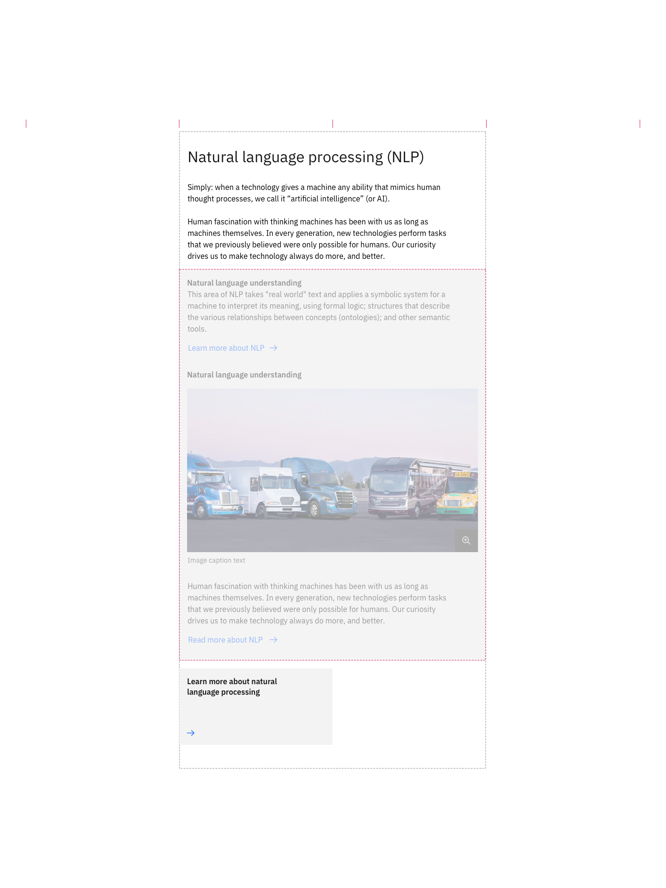
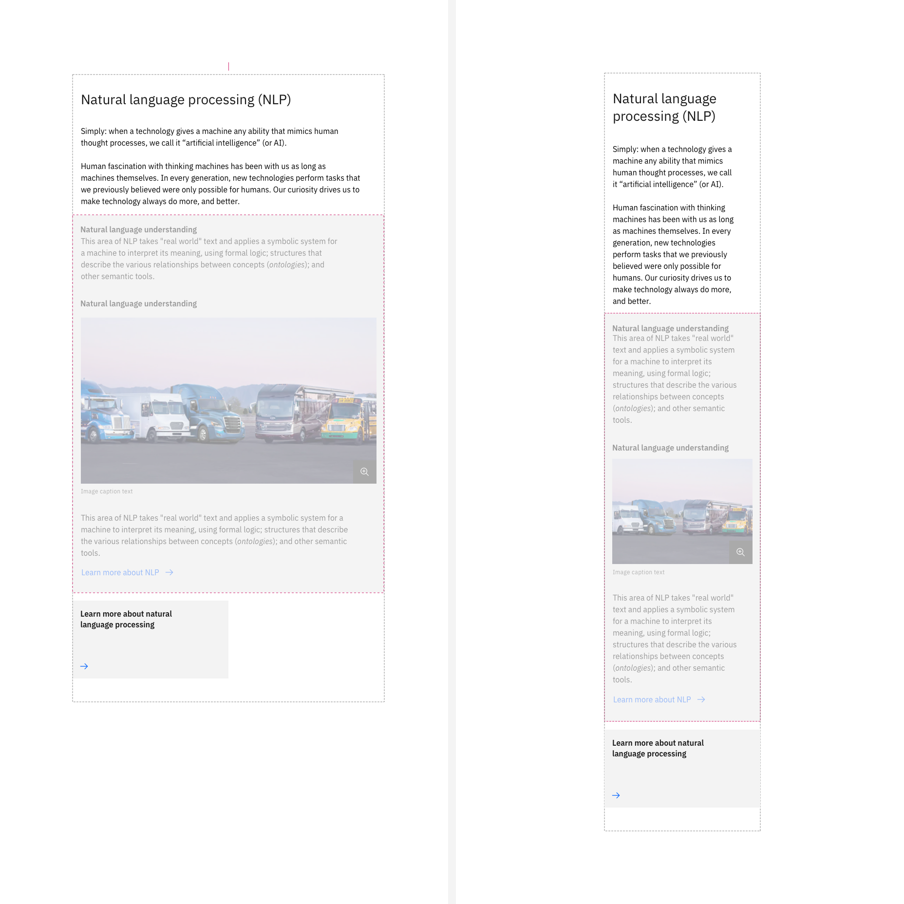

import ComponentDescription from 'components/ComponentDescription';
import ComponentFooter from 'components/ComponentFooter';
import ResourceLinks from 'components/ResourceLinks';

<ComponentDescription name="Content group" type="layout" />

<AnchorLinks>

<AnchorLink>Resources</AnchorLink>
<AnchorLink>Overview</AnchorLink>
<AnchorLink>Behaviors</AnchorLink>
<AnchorLink>Tips and techniques</AnchorLink>
<AnchorLink>Content guidance</AnchorLink>
<AnchorLink>Ready-to-use custom group components</AnchorLink>
<AnchorLink>Feedback</AnchorLink>

</AnchorLinks>

<ResourceLinks name="Content group" type="layout" />

## Overview

The content group component can be customized for different types of web experiences. It can be used multiple times
inside of a content block or a content section component, acting as a content unit for it.

<Caption>Anatomy of the content group component</Caption>

 

1. **Heading:** Customizable heading for the content group component.
2. **Description:** A short description of the content group.
3. **Children container:** Use this to insert basic-level content components, like content items.
4. **CTA card link:** Use this as a general call to action at content group level.

#### When to use

Use content group when you need to organise a group of content items of the same kind into a high-level content unit. It
can live inside of a content section or a content block. One of the advantages of the content group is that it is
visually very distinctive on the page because it encapsulates a list of similar items. It is recommended to be use
inside of a complex content block to hierarchically separate different content units for an easier read and
understanding.

#### When not to use

Do not look at content group as a replacement for content sections. A page is separated into sections, which, in turn,
is separated into blocks. Do not use a content group to separate high-level complex content units inside of a web page.
Use a content block or a content section instead.

## Behaviors

The content group elements are persistent throughout the online experience. It is fully responsive and changes how
elements are displayed based on the browser size.

#### Desktop breakpoints (max, xlg, and lg)

If the browser is wider than the max breakpoint of 1584px, the content group and all other page content will center and
extra margin will appear on either side of the page layout. The content group is recommended to take the centered 8
columns of the grid. In more particular editorial experiences, it is possible to layout a content group on 4 columns,
making the reading experience in certain situations more delightful and more story-like.

<Row>

<Column colMd={4} colLg={8}>

<Caption>Content group at max 1584px breakpoint encapsulating two content items</Caption>

</Column>

</Row>

#### Md and sm breakpoints

At medium and small breakpoints, the content group will add no significant change: the children container will remain
above the content group CTA card. See below.

<Caption>Content group at md 672px and sm 320px breakpoints</Caption>

### Showcase

This is a showcase of a content group with two content items, alternating with a content group accepting 4 cards in
children container (a card group).

## Tips and techniques

The content group elements are persistent throughout the online experience. It is fully responsive and changes how
elements are displayed based on the browser size.

- Important: keep in mind that the content group children container is positioned between the content group description
  and the card link.
- Avoid CTA stacking at the end of a content block. If possible, use different types.
- If you need to add different types of content items, use a content group component for each type. It’s ok to have a
  content group with only one content item.

## Content guidance

| Element                                                    | Content type | Required | Instances | Character count  (English / translated) | Notes                                                                               |
| ---------------------------------------------------------- | ------------ | -------- | --------- | ------------------------------------------- | ----------------------------------------------------------------------------------- |
| Heading                                                    | Text         | Yes      | 1         | 40 / 55                                     |                                                                                     |
| Copy                                                       | Text         | No       | 1         | 350 / 450                                   |                                                                                     |
| Child container                                            | Component    | No       | 1         | –                                           | A container area that child components, and other content types can be passed into. |
| [CTA](https://www.ibm.com/standards/carbon/components/cta) | Component    | No       | 1         | –                                           | Only card link and local type allowed                                               |

For more information, see the
[character count standards](https://github.com/carbon-design-system/carbon-for-ibm-dotcom-website/wiki/Character-count-standards).

## Ready-to-use custom group components

| Component name                                                                                       | Relationship                                                                                                                                                                          |
| ---------------------------------------------------------------------------------------------------- | ------------------------------------------------------------------------------------------------------------------------------------------------------------------------------------- |
| [Card group](https://www.ibm.com/standards/carbon/components/card-group)                             | Card group is a content group that includes a group of cards in the children container. A special derivative is card group with card in card.                                         |
| [Content group cards](https://www.ibm.com/standards/carbon/components/content-group-cards)           | Content group cards is a content group that includes a group heading and description, along with a group of cards inside the children container.                                      |
| [Content group pictograms](https://www.ibm.com/standards/carbon/components/content-group-pictograms) | Content group pictograms is a content group with pictogram items inside the children container 1. It does not include a group level CTA.                                              |
| [Content group simple](https://www.ibm.com/standards/carbon/components/content-group-simple)         | Content group simple includes two content items, first one with media and no CTA, and the second one without media but with a text link CTA. It also has a group level card link CTA. |

<ComponentFooter name="Content group" type="layout" />
