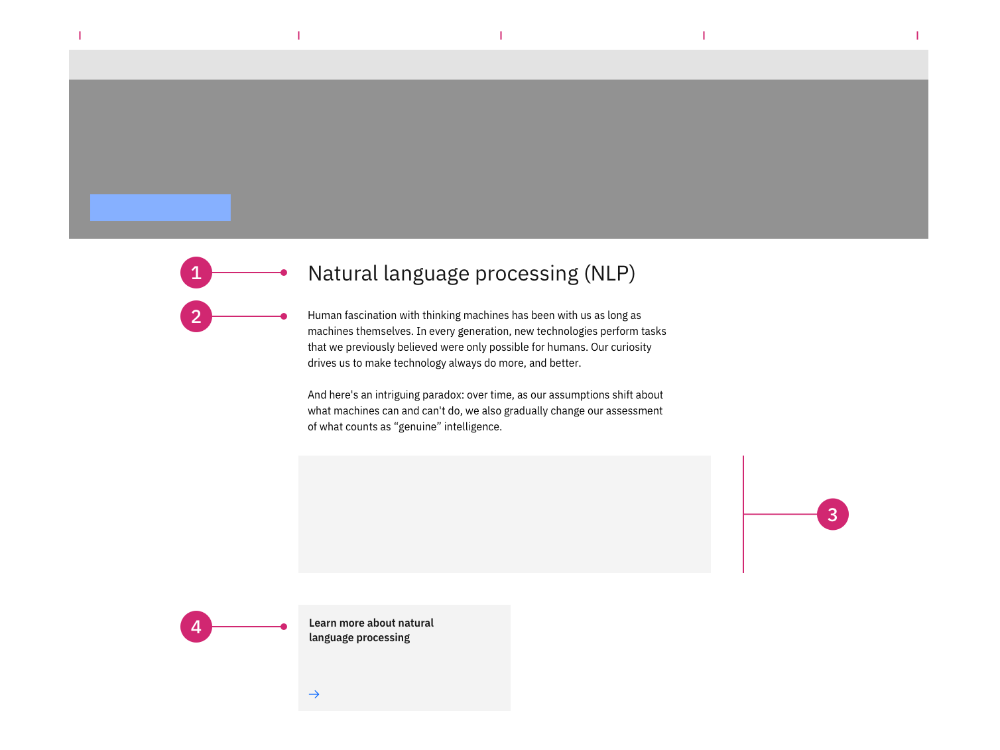

import ComponentDescription from 'components/ComponentDescription';
import ComponentFooter from 'components/ComponentFooter';
import ResourceLinks from 'components/ResourceLinks';

<ComponentDescription name="Content group" type="layout" />

<AnchorLinks>

<AnchorLink>Resources</AnchorLink>
<AnchorLink>Overview</AnchorLink>
<AnchorLink>Behaviors</AnchorLink>
<AnchorLink>Tips and techniques</AnchorLink>
<AnchorLink>Content guidance</AnchorLink>
<AnchorLink>Related components</AnchorLink>
<AnchorLink>Feedback</AnchorLink>

</AnchorLinks>

<ResourceLinks name="Content group" type="layout" />

## Overview

The Content group component can be customized for different types of web experiences. It can be used multiple times
inside a Content block or a Content section component, acting as a content unit for it.

<Row>

<Column colMd={8} colLg={8}>

</Column>

</Row>

<Caption>Anatomy of the Content group component</Caption>

 

1. **Heading:** Customizable heading for the Content group.
2. **Description:** A short description.
3. **Child container:** Use this to insert basic-level content components, like Content items.
4. **CTA:** Use this as a general call to action at group level.

#### When to use

Use Content group when you need to organize a group of Content items of the same kind into a high-level content unit. It
can live inside a Content section or a Content block. One of its advantages is that it is visually very distinctive on
the page because it contains a list of similar items. Use it inside a complex Content block to hierarchically separate
different content units for easy reading and comprehension.

#### When not to use

Do not look at Content group as a replacement for Content section. A page is separated into sections, which, in turn, is
separated into blocks. Do not use Content group to separate high-level complex content units inside of a web page.

## Behaviors

The Content group elements are persistent throughout the online experience. The component is fully responsive and the
display adjusts with different browser sizes.

#### Desktop breakpoints

If the browser is wider than the max breakpoint of 1584px, the Content group and all other page content will center and
the margins on either side of the page layout will increase. The Content group is recommended to take the centered 8
columns of the grid. For particular editorial experiences, it is possible to lay out a Content group on 4 columns,
making the reading experience more story-like and engaging.

#### Mobile breakpoints

At medium and small breakpoints, the Content group will add no significant change: the children container will remain
above the Content group CTA card. See below.

### Examples

These examples showcase different ways to use Content group—first, a content group with two, one, or no content items,
alternating with a content group accepting 4 cards in a children container (a Card group).

<Row>

<Column colMd={8} colLg={6}>

<Caption>
  Examples of Content group usage: with Content items, or with four Cards.
</Caption>

</Column>

</Row>

## Tips and techniques

Content group elements are persistent throughout the online experience.

Keep in mind that the Content group children container is positioned between the Content group description and the card
link.

Avoid CTA stacking at the end of a Content group. If possible, use different types.

If you need to add different types of Content items, use a Content group component for each type. It’s okay to have a
Content group with only one Content item.

## Content guidance

| Element                                                    | Content type | Required | Instances | Character limit  (English / translated) | Notes                                                                               |
| ---------------------------------------------------------- | ------------ | -------- | --------- | ------------------------------------------- | ----------------------------------------------------------------------------------- |
| Heading                                                    | Text         | Yes      | 1         | 40 / 55                                     |                                                                                     |
| Copy                                                       | Text         | No       | 1         | 350 / 450                                   |                                                                                     |
| Child container                                            | Component    | No       | 1         | –                                           | A container area that child components, and other content types can be passed into. |
| [CTA](https://www.ibm.com/standards/carbon/components/cta) | Component    | No       | 1         | –                                           | Only card link and local type allowed.                                              |

For more information, see the [character count standards](https://www.ibm.com/standards/carbon/guidelines/content#character-count-standards).

## Related components

| Component name                                                                                       | Description                                                                                                                                                                           |
| ---------------------------------------------------------------------------------------------------- | ------------------------------------------------------------------------------------------------------------------------------------------------------------------------------------- |
| [Card group](https://www.ibm.com/standards/carbon/components/card-group)                             | Card group is a content group that includes a group of cards in the child container. A special derivative is Card group with Card in card.                                            |
| [Content group cards](https://www.ibm.com/standards/carbon/components/content-group-cards)           | Content group cards is a content group that includes a group heading and description, along with a group of cards inside the child container.                                         |
| [Content group pictograms](https://www.ibm.com/standards/carbon/components/content-group-pictograms) | Content group pictograms is a content group with pictogram items inside the primary child container. It does not include a group level CTA.                                           |
| [Content group simple](https://www.ibm.com/standards/carbon/components/content-group-simple)         | Content group simple includes two content items, first one with media and no CTA, and the second one without media but with a text link CTA. It also has a group level card link CTA. |

<ComponentFooter name="Content group" type="layout" />
