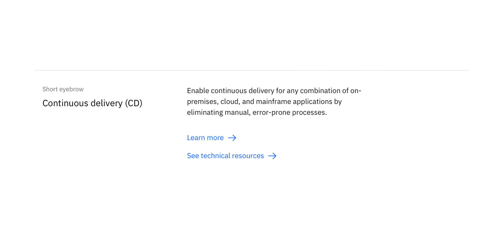
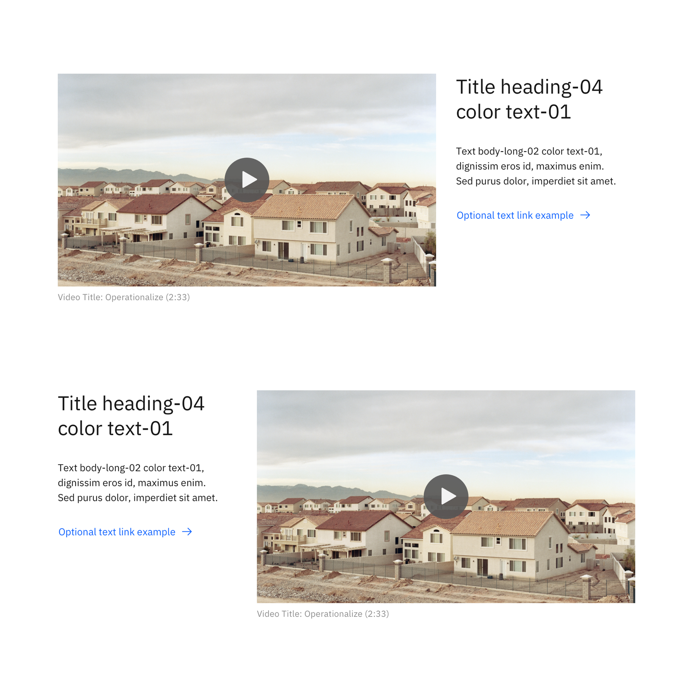
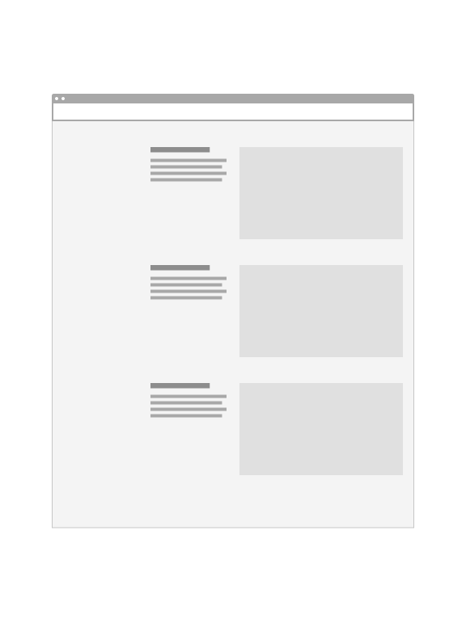
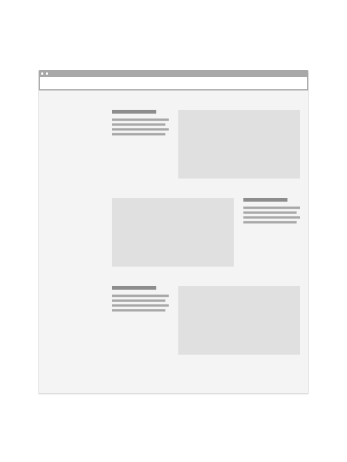
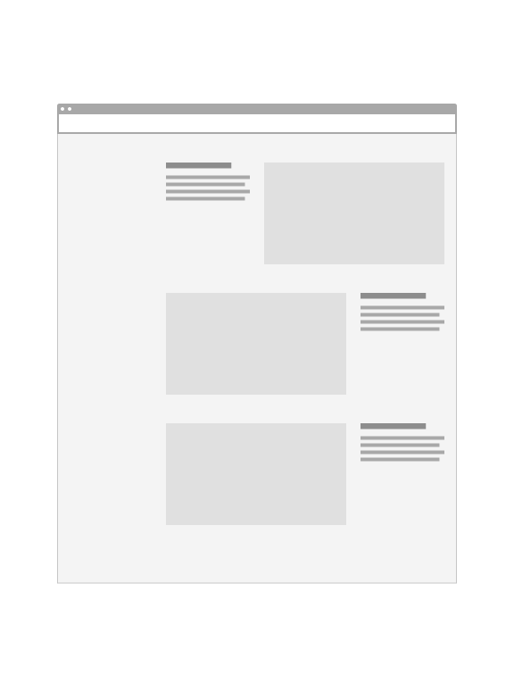
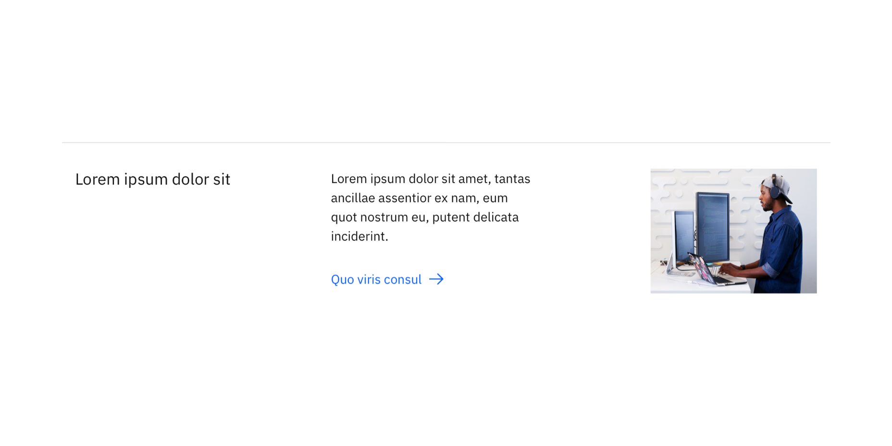
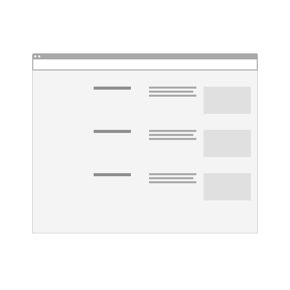
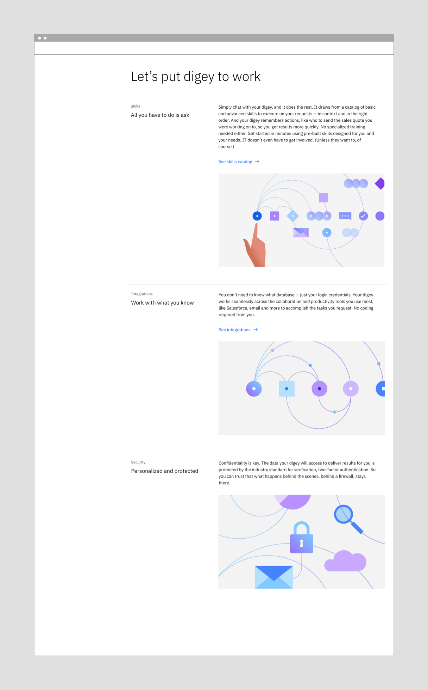
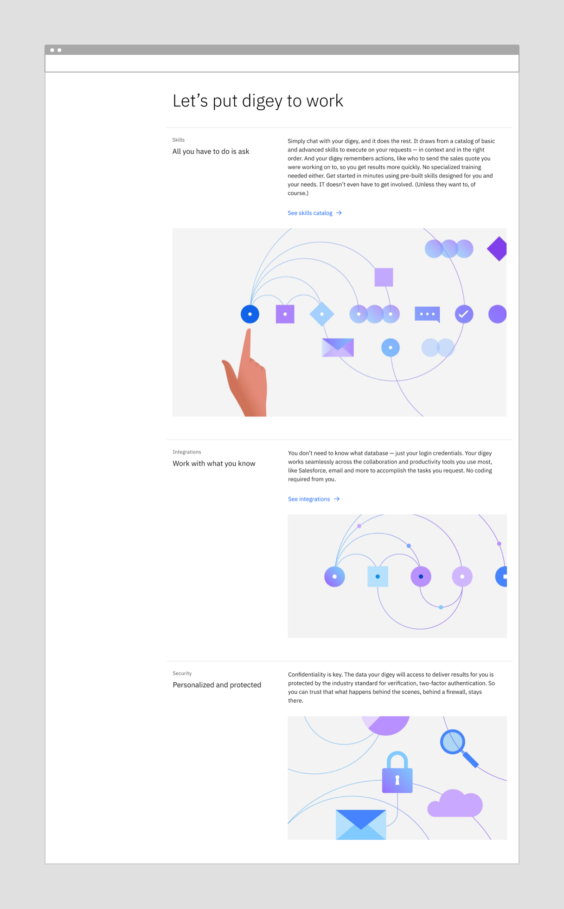

import ComponentDescription from 'components/ComponentDescription';
import ComponentFooter from 'components/ComponentFooter';
import ResourceLinks from 'components/ResourceLinks';

<ComponentDescription name="Content item horizontal" type="layout" />

<AnchorLinks>

<AnchorLink>Resources</AnchorLink>
<AnchorLink>Overview</AnchorLink>
<AnchorLink>Variations</AnchorLink>
<AnchorLink>tips and techniques</AnchorLink>
<AnchorLink>Content guidance</AnchorLink>
<AnchorLink>Feedback</AnchorLink>

</AnchorLinks>

<ResourceLinks name="Content item horizontal" type="layout" />

## Overview

Content item horizontal can be used to make content easily scannable, especially when multiples of these components are stacked vertically. 

By default, this component is best suited for shorter lengths of copy, though each variation can support different amounts of content.

1. **Eyebrow:** Optional eyebrow provides additional context for the heading in short form.
2. **Heading:** Heading has the highest information hierarchy, and should be succinct and descriptive.
3. **Body copy:** Description that supports the heading.
4. **CTA:** Optional call to action.
5. **Media:** Image or video.

## Variations

### Content item horizontal with media

Content item horizontal with media arranges the eyebrow, heading and body copy into four columns and the image is positioned to the side of the content. This variant works best when there is limited body copy that does not exceed beyond the image height. If you need additional body copy, use the default variant or content item horizontal with featured media variant.

Content item horizontal with media allows for the media to be positioned to the left or the right of the content.
_Note: Nielsen Norman recommends users scan content more effeciently when text and images are aligned rather than alternating._

<Caption>
  Examples of content item horizontal with media.
</Caption>

<DoDontRow>
<DoDont type="do" caption="Do use multiple instances in the same orientation to create scannable list." >

</DoDont>
<DoDont type="do" caption="Do use the alternating orientations to create a dynamic layout.">

</DoDont>
<DoDont type="dont" caption="Don’t use the alternating image in a non-sequential way ie: right, left, left.">

</DoDont>
</DoDontRow>

### Content item horizontal with featured media

Content item horizontal with featured media enlarges the media to 12 columns to emphasize the chosen media. This variant is best suited for highlighting a piece of content or key product feature. Use this variation sparingly: if all content items on the page are “featured” then all items are visually the same or none are emphasized.

<Caption>
  Examples of content item horizontal with featured media.
</Caption>

### Content item horizontal with thumbnail

Content item with thumbnail is ideal for smaller, supporting content where an image is a nice-to-have but not essential to the message, such as third party logos, pictograms, listing blogs or events.

<Caption>Example of content item horizontal with thumbnail.</Caption>

<DoDontRow>
  <DoDont type="do" caption="Do use multiple instances of the content item horizontal with thumbnail to create a scannable list.">

  </DoDont>
  <DoDont type="dont" caption="Don’t combine the content item horizontal with thumbnail with another content item horizontal variant.">

  </DoDont>
</DoDontRow>

## Tips and techniques

### Groups

Content item horizontal is most successful when presented as a group of two or more to create a scannable list for the user. We recommend limiting the groups to five conent items.

### Combining variants

The different variations of content item horizontal can be combined to create a dynamic layout.

<Row>

<Column colMd={4} colLg={6}>

<Caption>
  Example of using the same content item horizontal variant in a group.
</Caption>

</Column>

<Column colMd={4} colLg={6}>

<Caption>
  Example of using different content item horizontal variants in a group to emphasize the first item.
</Caption>

</Column>

</Row>

## Content guidance

### Content item horizontal and content item horizontal with featured media

| Element                                                                | Content type                                                                                                                       | Required | Instances | Character limit  (English / translated) | Notes                                                                                                                                           |
| ---------------------------------------------------------------------- | ---------------------------------------------------------------------------------------------------------------------------------- | -------- | --------- | ------------------------------------------- | ----------------------------------------------------------------------------------------------------------------------------------------------- |
| Eyebrow                                                                | Text                                                                                                                               | No       | 1         | 25 / 35                                     |                                                                                                                                                 |
| Heading                                                                | Text                                                                                                                               | Yes      | 1         | 40 / 55                                     |                                                                                                                                                 |
| Copy                                                                   | Text                                                                                                                               | Yes      | 1         | 200 / 260                                   |                                                                                                                                                 |
| [Link list](https://www.ibm.com/standards/carbon/components/link-list) | Component                                                                                                                          | No       | 1–2     | –                                           | CTA is optional. Text style only.                                                                    |
| Media                                                                  | [Image](https://www.ibm.com/standards/carbon/components/images/) or [Video](https://www.ibm.com/standards/carbon/components/video) | No       | 1         | –                                           | Default variation does not require media. Featured media variation supports image, image with caption, and video.|
| Image alt text                                                         | Text                                                                                                                               | No       | 1         | 75 / 100                                    | Image description for accessibility.                                                                                                            |

### Content item horizontal with media and content item horizontal with thumbnail

| Element                                                                | Content type                                                                                                                       | Required | Instances | Character limit  (English / translated) | Notes                                                                                                                                           |
| ---------------------------------------------------------------------- | ---------------------------------------------------------------------------------------------------------------------------------- | -------- | --------- | ------------------------------------------- | ----------------------------------------------------------------------------------------------------------------------------------------------- |
| Eyebrow                                                                | Text                                                                                                                               | No       | 1         | 25 / 35                                     |                                                                                                                                                 |
| Heading                                                                | Text                                                                                                                               | Yes      | 1         | 40 / 55                                     |                                                                                                                                                 |
| Copy                                                                   | Text                                                                                                                               | Yes      | 1         | 75 / 100                                   |                                                                                                                                                 |
| [Link list](https://www.ibm.com/standards/carbon/components/link-list) | Component                                                                                                                          | No       | 1–2     | –                                           | CTA is optional. Text style only.                                                                    |
| Media                                                                  | [Image](https://www.ibm.com/standards/carbon/components/images/) or [Video](https://www.ibm.com/standards/carbon/components/video) | Yes       | 1         | –                                           | Media variation supports image, image with caption, and video. Thumbnail variation only supports image. |
| Image alt text                                                         | Text                                                                                                                               | No       | 1         | 75 / 100                                    | Image description for accessibility.                                                                                                            |

For more information, see the [character count standards](https://www.ibm.com/standards/carbon/guidelines/content#character-count-standards).

<ComponentFooter name="Content item horizontal" type="layout" />
