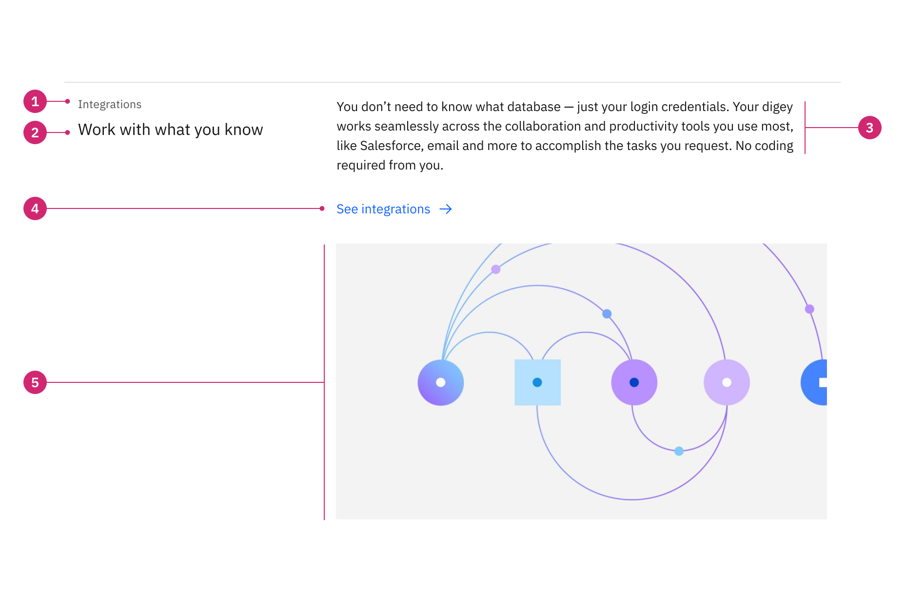
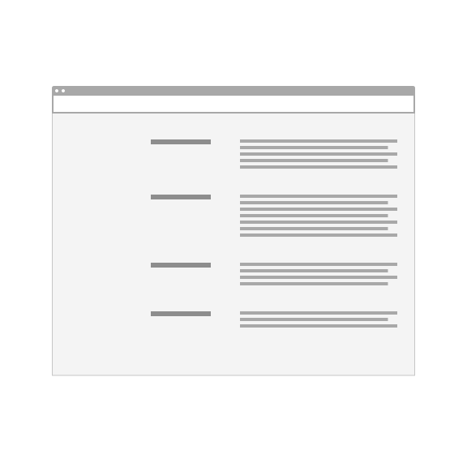
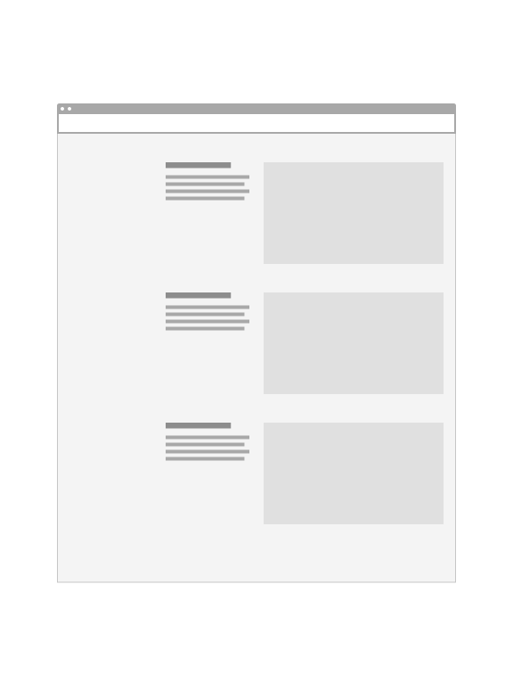
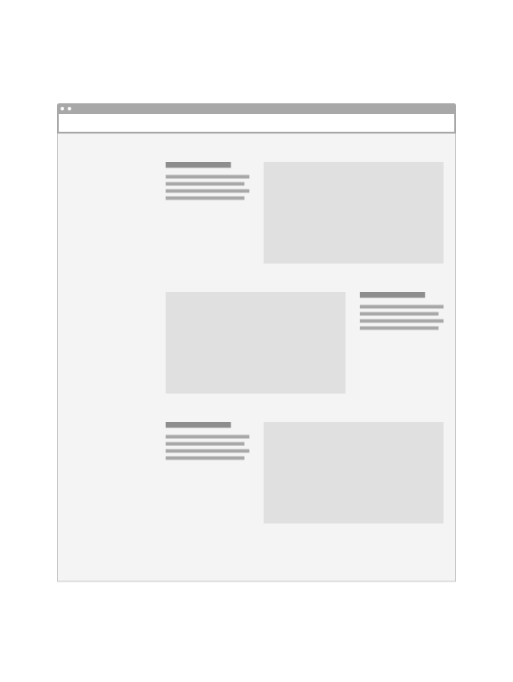
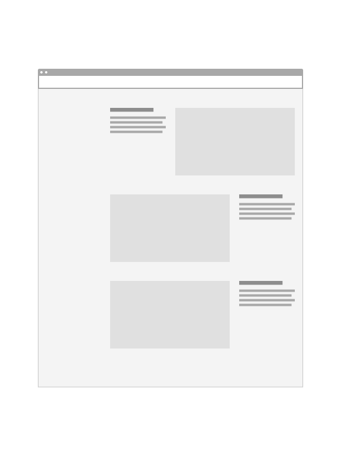
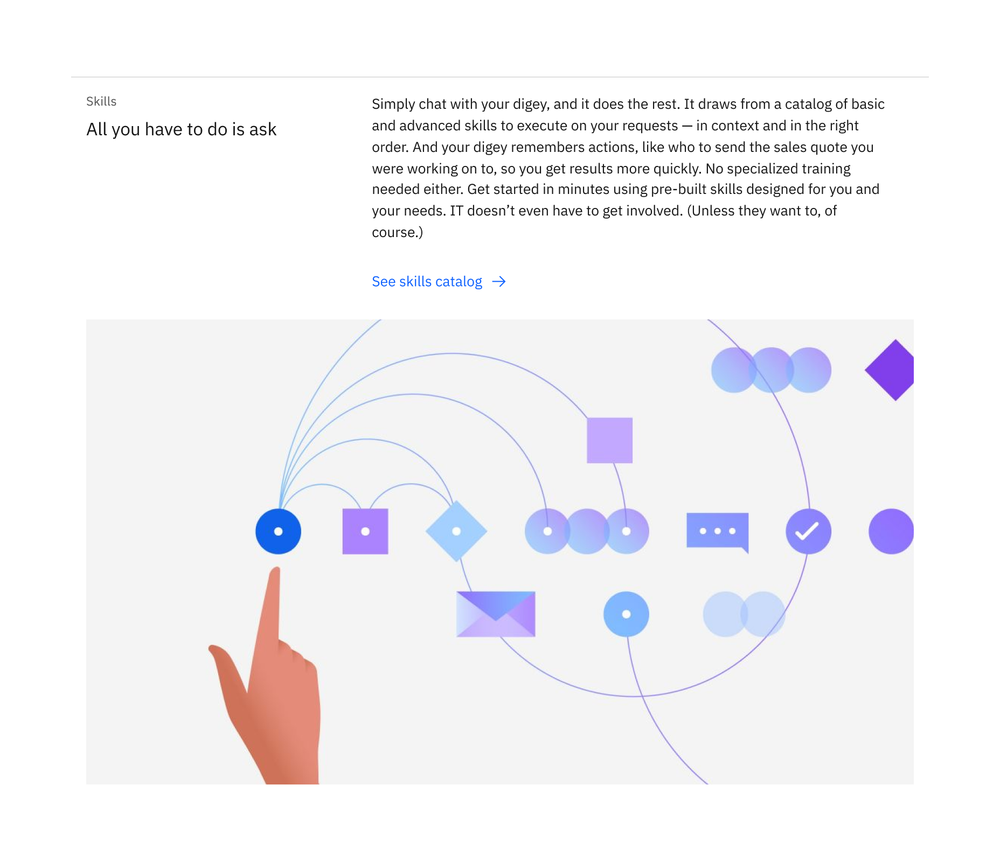
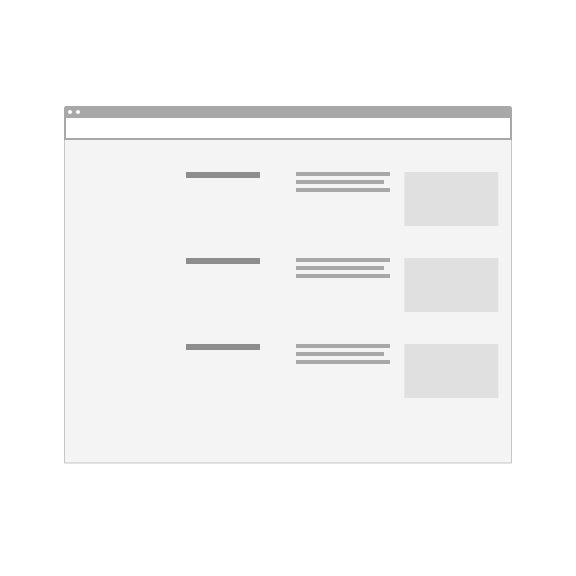
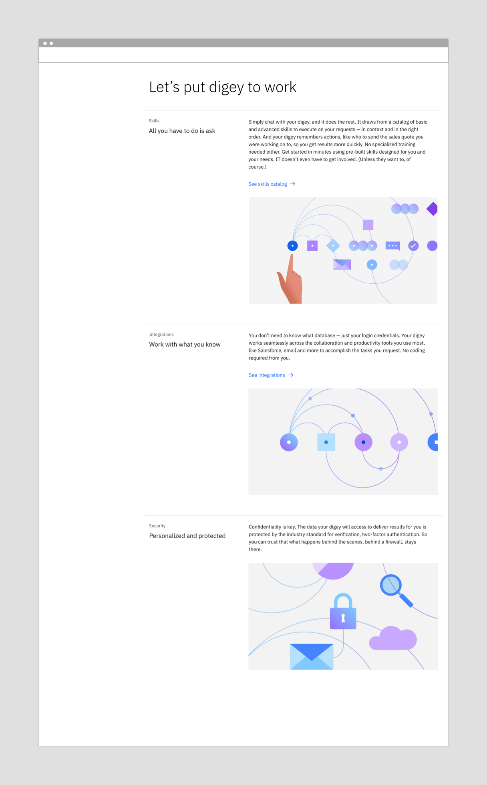
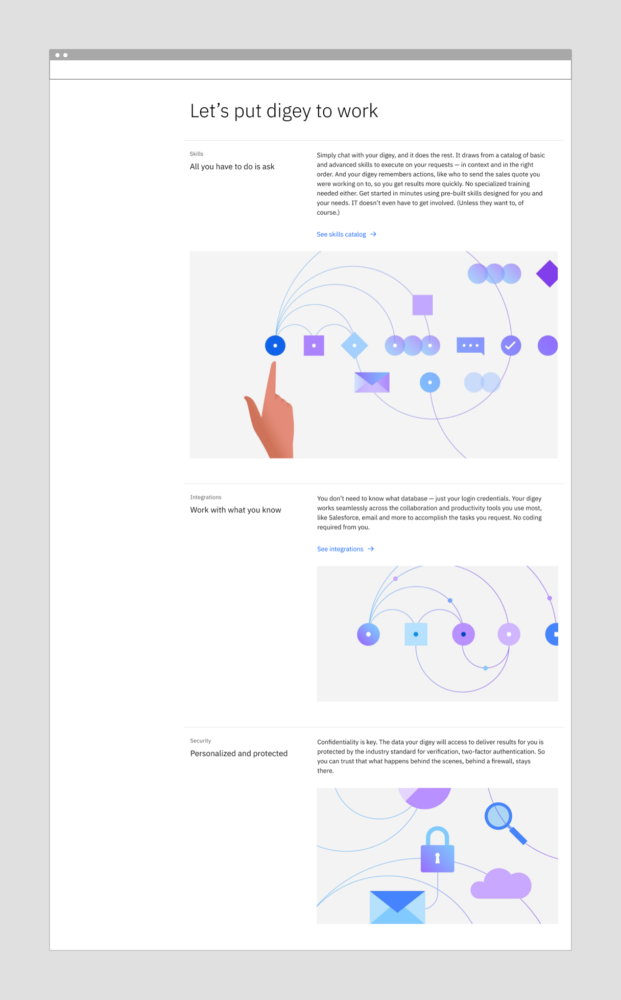

import ComponentDescription from 'components/ComponentDescription';
import ComponentFooter from 'components/ComponentFooter';
import ResourceLinks from 'components/ResourceLinks';

<ComponentDescription name="Content item row" type="layout" />

<AnchorLinks>

<AnchorLink>Overview</AnchorLink>
<AnchorLink>Variations</AnchorLink>
<AnchorLink>Tips and techniques</AnchorLink>
<AnchorLink>Resources</AnchorLink>
<AnchorLink>Feedback</AnchorLink>

</AnchorLinks>

## Overview

Content item row can be used to make content easily scannable, especially when multiples of these components are stacked vertically.

By default, this component is best suited for shorter lengths of copy, though each variation can support different amounts of content.

1. **Eyebrow:** Optional eyebrow provides additional context for the heading in short form.
2. **Heading:** Heading has the highest information hierarchy, and should be succinct and descriptive.
3. **Body copy:** Description that supports the heading.
4. **CTA:** Optional call to action.
5. **Media:** Image or video.

## Variations

### Content item row

The default version of content item row is the only variation that does not require an image. This variant is ideal for supporting text-only lists or using multiple instances, some with an image and some text only images.

<Caption>Example of content item row.</Caption>

<Row>

<Column colMd={4} colLg={4}>

<Caption>
  Example of using the text only content item row variant in a group.
</Caption>

</Column>

<Column colMd={4} colLg={4}>

<Caption>
  Example of using content item row with an image, followed by two text-only
  instances.
</Caption>

</Column>

</Row>

**Content guidance for content item row**

| Element                                                    | Content type                                                                                                                       | Required | Instances | Character limit  (English / translated) | Notes                                          |
| ---------------------------------------------------------- | ---------------------------------------------------------------------------------------------------------------------------------- | -------- | --------- | ------------------------------------------- | ---------------------------------------------- |
| Eyebrow                                                    | Text                                                                                                                               | No       | 1         | 25 / 35                                     |                                                |
| Heading                                                    | Text                                                                                                                               | Yes      | 1         | 40 / 55                                     |                                                |
| Copy                                                       | Text                                                                                                                               | Yes      | 1         | 200 / 260                                   |                                                |
| [CTA](https://www.ibm.com/standards/carbon/components/CTA) | Component                                                                                                                          | No       | 1–2       | –                                           | CTA is optional. Text style only.              |
| Media                                                      | [Image](https://www.ibm.com/standards/carbon/components/images/) or [Video](https://www.ibm.com/standards/carbon/components/video) | No       | 1         | –                                           | Supports image, image with caption, and video. |
| Image alt text                                             | Text                                                                                                                               | No       | 1         | 75 / 100                                    | Image description for accessibility.           |

For more information, see the [character count standards](https://www.ibm.com/standards/carbon/guidelines/content#character-count-standards).

### Content item row with media

Content item row with media arranges the eyebrow, heading and body copy into four columns and the image is positioned to the side of the content. This variant works best when there is limited body copy that does not exceed beyond the image height. If you need additional body copy, use the default variant or content item row with featured media variant.

Content item row with media allows for the media to be positioned to the left or the right of the content.
_Note: Nielsen Norman recommends users scan content more effeciently when text and images are aligned rather than alternating._

<Caption>Example of content item row with media.</Caption>

<DoDontRow>
<DoDont type="do" caption="Do use multiple instances in the same orientation to create scannable list." >

</DoDont>
<DoDont type="do" caption="Do use the alternating orientations to create a dynamic layout.">

</DoDont>
<DoDont type="dont" caption="Don’t use the alternating image in a non-sequential way ie: right, left, left.">

</DoDont>
</DoDontRow>

**Content guidance for content item row with media**

| Element                                                    | Content type                                                                                                                       | Required | Instances | Character limit  (English / translated) | Notes                                                          |
| ---------------------------------------------------------- | ---------------------------------------------------------------------------------------------------------------------------------- | -------- | --------- | ------------------------------------------- | -------------------------------------------------------------- |
| Eyebrow                                                    | Text                                                                                                                               | No       | 1         | 25 / 35                                     |                                                                |
| Heading                                                    | Text                                                                                                                               | Yes      | 1         | 40 / 55                                     |                                                                |
| Copy                                                       | Text                                                                                                                               | Yes      | 1         | 75 / 100                                    |                                                                |
| [CTA](https://www.ibm.com/standards/carbon/components/cta) | Component                                                                                                                          | No       | 1–2       | –                                           | CTA is optional. Text style only.                              |
| Media                                                      | [Image](https://www.ibm.com/standards/carbon/components/images/) or [Video](https://www.ibm.com/standards/carbon/components/video) | Yes      | 1         | –                                           | Media variation supports image, image with caption, and video. |
| Image alt text                                             | Text                                                                                                                               | No       | 1         | 75 / 100                                    | Image description for accessibility.                           |

For more information, see the [character count standards](https://www.ibm.com/standards/carbon/guidelines/content#character-count-standards).

### Content item row with featured media

Content item row with featured media enlarges the media to 12 columns to emphasize the chosen media. This variant is best suited for highlighting a piece of content or key product feature. Use this variation sparingly: if all content items on the page are “featured” then all items are visually the same or none are emphasized.

<Caption>Example of content item row with featured media.</Caption>

**Content guidance for content item row with featured media**

| Element                                                    | Content type                                                                                                                       | Required | Instances | Character limit  (English / translated) | Notes                                                                   |
| ---------------------------------------------------------- | ---------------------------------------------------------------------------------------------------------------------------------- | -------- | --------- | ------------------------------------------- | ----------------------------------------------------------------------- |
| Eyebrow                                                    | Text                                                                                                                               | No       | 1         | 25 / 35                                     |                                                                         |
| Heading                                                    | Text                                                                                                                               | Yes      | 1         | 40 / 55                                     |                                                                         |
| Copy                                                       | Text                                                                                                                               | Yes      | 1         | 200 / 260                                   |                                                                         |
| [CTA](https://www.ibm.com/standards/carbon/components/CTA) | Component                                                                                                                          | No       | 1–2       | –                                           | CTA is optional. Text style only.                                       |
| Media                                                      | [Image](https://www.ibm.com/standards/carbon/components/images/) or [Video](https://www.ibm.com/standards/carbon/components/video) | Yes      | 1         | –                                           | Featured media variation supports image, image with caption, and video. |
| Image alt text                                             | Text                                                                                                                               | No       | 1         | 75 / 100                                    | Image description for accessibility.                                    |

For more information, see the [character count standards](https://www.ibm.com/standards/carbon/guidelines/content#character-count-standards).

### Content item row with thumbnail

Content item with thumbnail is ideal for smaller, supporting content where an image is a nice-to-have but not essential to the message, such as third party logos, pictograms, listing blogs or events.

<Caption>Example of content item row with thumbnail.</Caption>

<DoDontRow>
  <DoDont type="do" caption="Do use multiple instances of the content item row with thumbnail to create a scannable list.">

  </DoDont>
  <DoDont type="dont" caption="Don’t combine the content item row with thumbnail with another content item row variant.">

  </DoDont>
</DoDontRow>

**Content guidance for content item row with thumbnail**

| Element                                                    | Content type                                                     | Required | Instances | Character limit  (English / translated) | Notes                                    |
| ---------------------------------------------------------- | ---------------------------------------------------------------- | -------- | --------- | ------------------------------------------- | ---------------------------------------- |
| Eyebrow                                                    | Text                                                             | No       | 1         | 25 / 35                                     |                                          |
| Heading                                                    | Text                                                             | Yes      | 1         | 40 / 55                                     |                                          |
| Copy                                                       | Text                                                             | Yes      | 1         | 75 / 100                                    |                                          |
| [CTA](https://www.ibm.com/standards/carbon/components/cta) | Component                                                        | No       | 1–2       | –                                           | CTA is optional. Text style only.        |
| Media                                                      | [Image](https://www.ibm.com/standards/carbon/components/images/) | Yes      | 1         | –                                           | Thumbnail variation only supports image. |
| Image alt text                                             | Text                                                             | No       | 1         | 75 / 100                                    | Image description for accessibility.     |

For more information, see the [character count standards](https://www.ibm.com/standards/carbon/guidelines/content#character-count-standards).

## Tips and techniques

### Groups

Content item row is most successful when presented as a group of two or more to create a scannable list for the user. We recommend limiting the groups to five conent items.

### Combining variants

The different variations of content item row can be combined to create a dynamic layout.

<Row>

<Column colMd={4} colLg={6}>

<Caption>
  Example of using the same content item row variant in a group.
</Caption>

</Column>

<Column colMd={4} colLg={6}>

<Caption>
  Example of using different content item row variants in a group to emphasize
  the first item.
</Caption>

</Column>

</Row>

<ResourceLinks name="Content item row" type="layout" />

<ComponentFooter name="Content item row" type="layout" />
