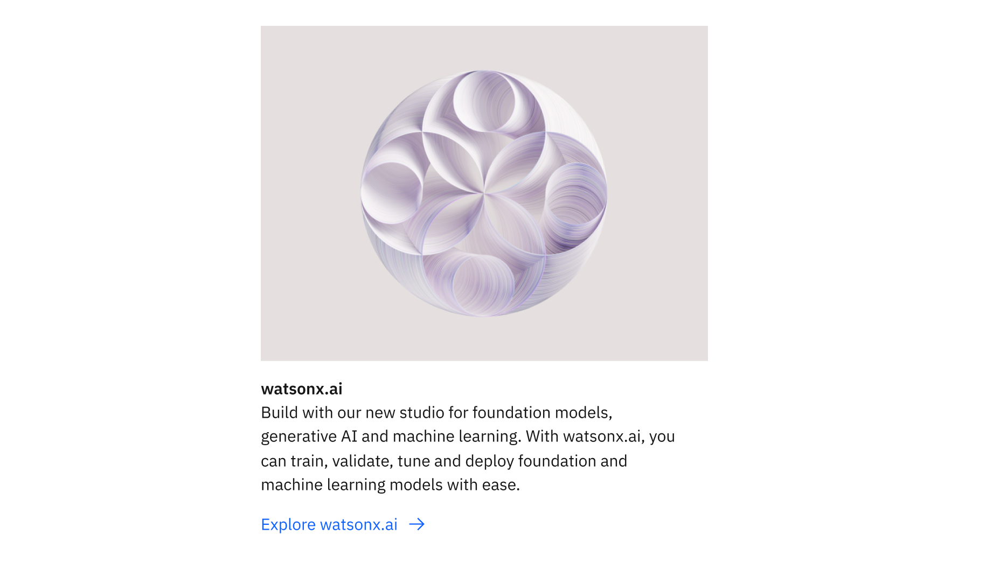
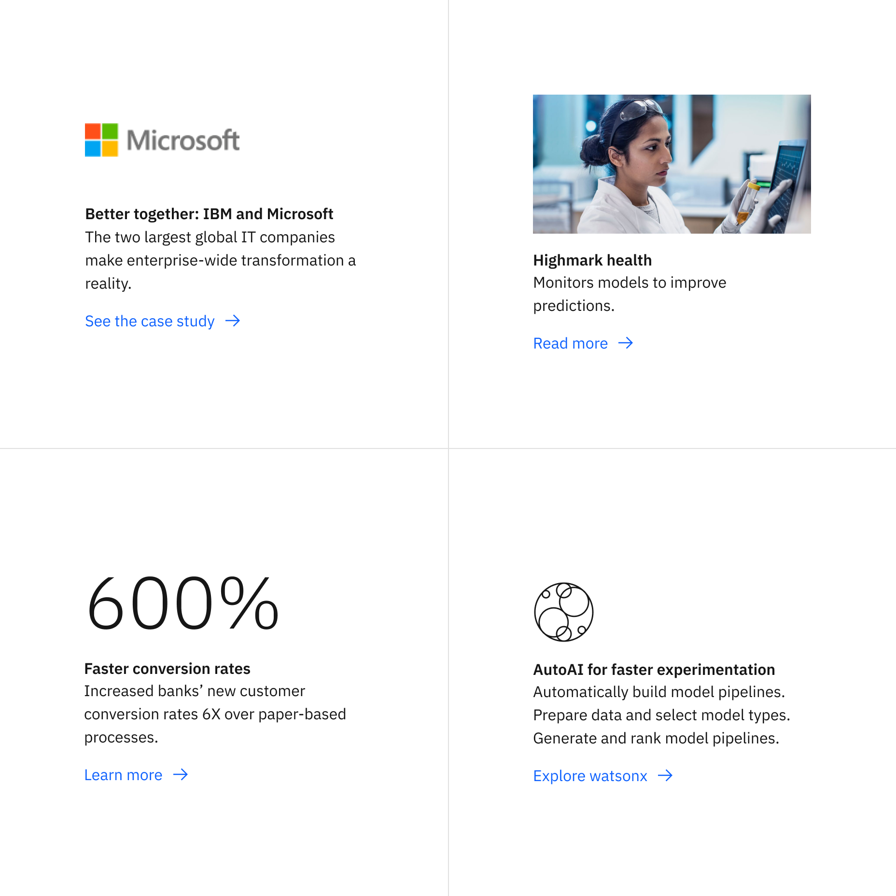
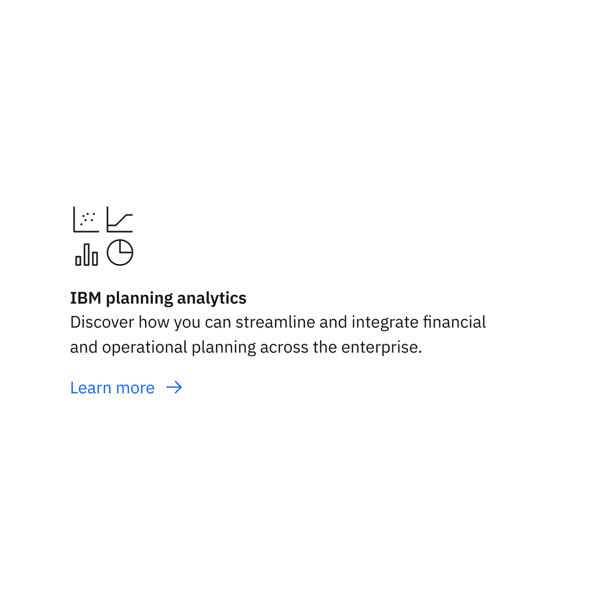

import ComponentDescription from 'components/ComponentDescription';
import ComponentFooter from 'components/ComponentFooter';
import ResourceLinks from 'components/ResourceLinks';

<ComponentDescription name="Content item" type="layout" />

<AnchorLinks>

<AnchorLink>Overview</AnchorLink>
<AnchorLink>Modifiers</AnchorLink>
<AnchorLink>Behaviors</AnchorLink>
<AnchorLink>Resources</AnchorLink>
<AnchorLink>Content guidance</AnchorLink>
<AnchorLink>Feedback</AnchorLink>

</AnchorLinks>

## Overview

The content item component can be customized for different types of web experiences. It can be used on its own or in a collection of items of the same type. It is recommended to maintain a consistent, hierarchical approach when adding content to a web page.

<Row>

<Column colMd={8} colLg={8}>

</Column>

</Row>

<Caption>A content item featuring a vertical orientation and an image</Caption>

#### When to use

Use content item when you need to organize a group of content elements into a content unit. It can live inside of
larger content components such as [content section](../components/content-section) or [content group](../components/content-group) . One of the advantages of the content item is that it is consistent throughout the IBM.com pages. Consider using content item with an image when there is no need for a link.

#### When not to use

Do not look to content item as a replacement for a content section or a content group.

## Modifiers

### Media

Content item can be displayed with a relevant Pictogram, Logo, Image, or Statistic to visually enhance the messaging. Only one media element can be added to each content item. Certain media elements allow for vertical or horizontal orientation.

<Row>

<Column colMd={8} colLg={8}>

</Column>

</Row>

<Caption>
  Examples of content item featuring different media. From top left to bottom
  right: Logo, Image, Statistic, Pictogram
</Caption>

| Variant      | Purpose                                                                                                                                                                                                                                                                                                                                                                                                                              |
| ------------ | ------------------------------------------------------------------------------------------------------------------------------------------------------------------------------------------------------------------------------------------------------------------------------------------------------------------------------------------------------------------------------------------------------------------------------------ |
| _Logo_       | A logo added to a content item can draw attention to key IBM partners and clients. Logo uses a set aspect ratio for the image container to ensure all logos maintain a similar hierarchy within a group. IBM teams should utilize the centralized logo assets from the [Digital Asset Management system](https://w3.ibm.com/w3publisher/digital-asset-management). _Logo can only appear in vertically-aligned content item_.        |
| _Image_      | Adding a relevant image can capture attention as the user scrolls the page content. High resolution photography and illustration can vary page content and provide visual interest. _Image can appear in a horizontally or vertically-aligned content item_.                                                                                                                                                                         |
| _Statistics_ | Adding a statistic to content item can highlight key data points, outcomes, and trends. These make it easier to focus attention around a product or case study. _Statistic can only be displayed in a vertically-aligned content item_.                                                                                                                                                                                              |
| _Pictogram_  | Pictograms add visual interest to content items that help reinforce understanding about a particular topic. Pictograms excel at representing abstract ideas such as industries, technology, and functions. The Pictogram option can also display an [IBM app icon](https://www.ibm.com/design/language/iconography/app-icons/library) at the same size. _Pictogram can appear in a horizontally or vertically-aligned content item_. |

### Orientation

Once a media element is added to a content item, you can select its orientation for certain media elements: either vertical or horizontal. Note that when used in a group, each content item should have the same orientation.

<Row>

<Column colMd={4} colLg={4}>

<Caption>Content item with vertical alignment</Caption>

</Column>

<Column colMd={4} colLg={4}>

<Caption>Content item with horizontal alignment</Caption>

</Column>

</Row>

| Variant      | Purpose                                                                                                                                                                                                                                                                                                                                                                                                                                        |
| ------------ | ---------------------------------------------------------------------------------------------------------------------------------------------------------------------------------------------------------------------------------------------------------------------------------------------------------------------------------------------------------------------------------------------------------------------------------------------- |
| _Vertical_   | The vertical orientation places the media addition above the heading and body copy content across all breakpoints. Vertical orientation supports all media additions for content item: Image, Pictogram, Statistic, and Logos.                                                                                                                                                                                                                 |
| _Horizontal_ | The horizontal orientation places the media side-by-side with the heading and body copy content across larger breakpoints. Note that on the mobile breakpoint, content items that are horizontally aligned will swap to a vertical alignment for better visibility. Horizontal orientation supports the following media for content item: Image, Pictogram, and App icon. _Statistic and Logo are only available in the vertical orientation._ |

## Behaviors

Content item has multiple options that are fully responsive.

#### Desktop breakpoints

If the browser is wider than the max breakpoint of 1584px, the content item and all other page content will center and the margins on either side of the page layout will increase.

The vertically oriented content items span 8 columns of the 16 column grid, while the horizontally oriented content items span 4 columns of the grid. Depending on the content of the page, one orientation may work better for your design than the other.
and the margins on either side of the page layout will increase. The content item usually takes the centered 8 columns
of the grid. It is possible to lay out a content item on 4 columns, making the reading experience in certain situations
more efficient.

<ResourceLinks name="Content item" type="layout" />

## Content guidance

| Element                                                    | Content type                                                                                                                                   | Required | Instances | Character limit  (English / translated) | Notes                                |
| ---------------------------------------------------------- | ---------------------------------------------------------------------------------------------------------------------------------------------- | -------- | --------- | ------------------------------------------- | ------------------------------------ |
| Heading                                                    | Text                                                                                                                                           | No       | 1         | 40 / 55                                     |                                      |
| Copy                                                       | Text                                                                                                                                           | No       | 1         | 150 / 200                                   |                                      |
| Media                                                      | [Image](https://www.ibm.com/standards/carbon/components/images/), [Video](https://www.ibm.com/standards/carbon/components/video), or Pictogram | No       | 1         | –                                           | Image with caption may also be used. |
| Image alt text                                             | Text                                                                                                                                           | No       | 1         | 75 / 100                                    | Image description for accessibility. |
| Statistic heading                                          | Text                                                                                                                                           | Yes      | 1         | 5 / 5                                       | Statistic variant only               |
| [CTA](https://www.ibm.com/standards/carbon/components/cta) | Component                                                                                                                                      | No       | 1         | 25 / 35                                     | Text or button style only.           |

For more information, see the [character count standards](https://www.ibm.com/standards/carbon/guidelines/content#character-count-standards).

<ComponentFooter name="Content item" type="layout" />
