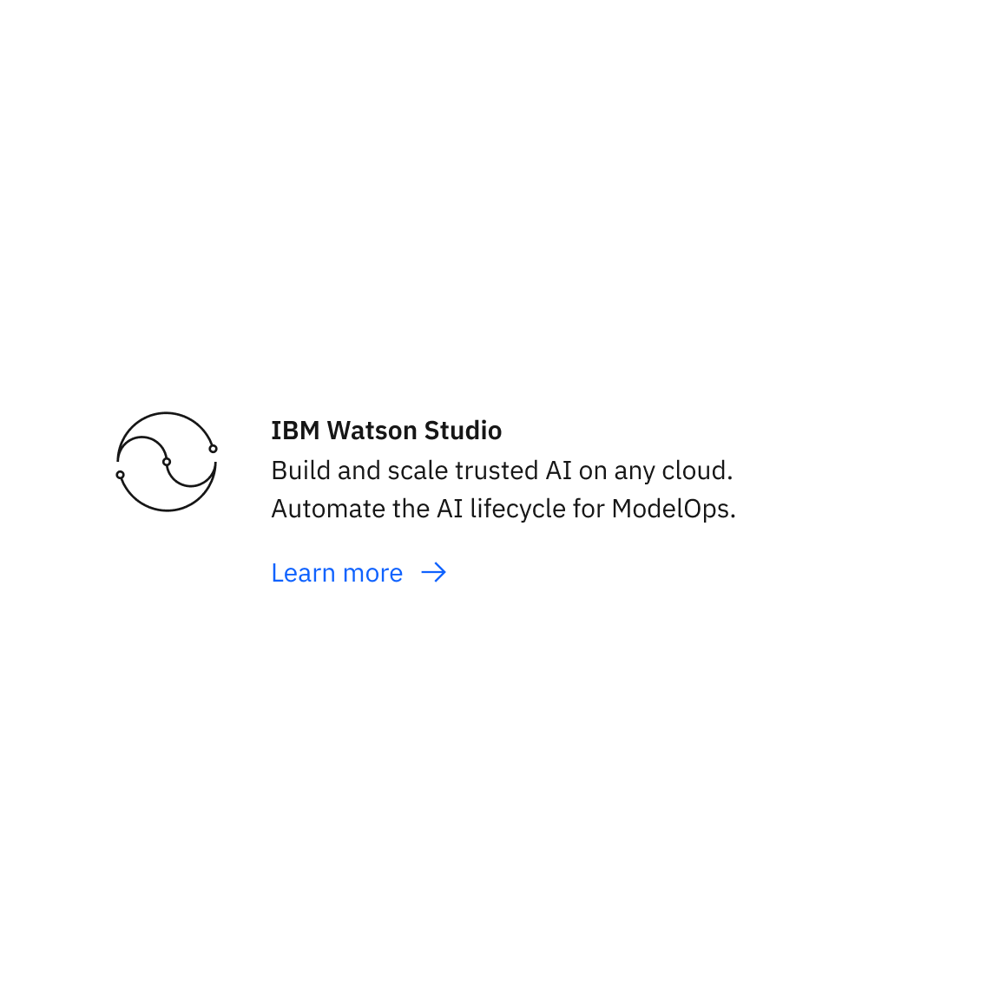

import ComponentDescription from 'components/ComponentDescription';
import ComponentFooter from 'components/ComponentFooter';
import ResourceLinks from 'components/ResourceLinks';

<ComponentDescription name="Content item" type="layout" />

<AnchorLinks>

<AnchorLink>Overview</AnchorLink>
<AnchorLink>Modifiers</AnchorLink>
<AnchorLink>Behaviors</AnchorLink>
<AnchorLink>Tips and techniques</AnchorLink>
<AnchorLink>Resources</AnchorLink>
<AnchorLink>Content guidance</AnchorLink>
<AnchorLink>Feedback</AnchorLink>

</AnchorLinks>

## Overview

The Content item component can be customized for different types of web experiences. It can be used multiple times
inside of a Content group as a list of items of the same type.

<Row>

<Column colMd={8} colLg={8}>

</Column>

</Row>

<Caption>Anatomy of Content item component</Caption>

#### When to use

Use Content item when you need to organize a group of content elements into a content unit. It can live inside of a
Content group component. One of the advantages of the content item is that it is consistent throughout the IBM.com
pages.

#### When not to use

Do not look to Content item as a replacement for a Content block or a Content group. Do not add it inside a Content
section’s children container. A Content item should not live directly inside a Content section due to conflicts of
hierarchy.

## Modifiers

### Media

Content item can be displayed with a relevant Pictogram, Logo, Image, or Percentage to visually enhance the messaging. Only one media element can be added to each content item. Certain media elements allow for vertical or horizontal orientation.

#### Pictogram

Pictograms add visual interest to content items that help reinforce understanding about a particular topic. Pictograms excel at representing abstract ideas such as industries, technology, and functions.

Pictogram can appear in a horizontally or vertically-aligned content item.

#### Logo

A logo added to a content item can draw attention to key IBM partners and clients. Consider using content item with an image when there is no need for a link (i.e. instead of a [card – logo](../cards)).

Logo can only appear in vertically-aligned content item.

#### Image

Adding a relevant image can capture attention as the user scrolls the page content. High resolution photography and illustration can vary page content and provide visual interest. Consider using content item with an image when there is no need for a link (i.e. instead of a [card](../cards)).

Image can appear in a horizontally or vertically-aligned content item.

#### Percentage

Adding a percentage to content item can highlight key data points, outcomes, and trends. These make it easier to focus attention around a product or case study.

Percentage can only be displayed in a vertically-aligned content item.

### Orientation

Once a media element is added to a Content item, you can select its orientation for certain media elements: either vertical or horizontal. Note that when appearing a group, each content item should have the same orientation.

<Row>

<Column colMd={4} colLg={4}>

<Caption>Content item with vertically alignment</Caption>

</Column>

<Column colMd={4} colLg={4}>

<Caption>Content item with horizontal alignment</Caption>

</Column>

</Row>

#### Vertical

The vertical orientation places the media addition above the heading and body copy content across all breakpoints.

Vertical orientation supports all media additions for content item: Image, Pictogram, App icon, Percentage, and Logos.

#### Horizontal

The horizontal orientation places the media side-by-side with the heading and body copy content across larger breakpoints. Note that on the mobile breakpoint, content items that are horizontally aligned will swap to a vertical alignment for better visibility.

Horizontal orientation supports the following media for content item: Image, Pictogram, and App icon. Percentage and Logo are only available in the vertical orientation.

## Behaviors

Content item has multiple options that are fully responsive.

#### Desktop breakpoints

If the browser is wider than the max breakpoint of 1584px, the Content item and all other page content will center and
and the margins on either side of the page layout will increase. The Content item usually takes the centered 8 columns
of the grid. It is possible to lay out a Content item on 4 columns, making the reading experience in certain situations
more efficient. If you need item groupings, it is recommended to use the Content group component.

#### Mobile breakpoints

For the medium breakpoint, the Content item may take all 8 or, as seen below, just 4 grid columns. For the small
breakpoint, the Content item will always take all 4 grid columns.

<Row>

<Column colMd={4} colLg={6}>

<Caption>Content item on 8 columns</Caption>

</Column>

<Column colMd={4} colLg={4}>

<Caption>Content item on 4 columns</Caption>

</Column>

</Row>

## Tips and techniques

Content items are flexible components that can appear throughout the online experience. They can appear with additional media or percentage data to display takeaways alone or in a group.

It is recommended to maintain a consistent, hierarchical approach when adding content to a web page. Start with a
Content section, add Content blocks to it, then add Content groups inside the Content blocks and, in the end, add your
Content items inside of the Content groups.

For consistency reasons, it's important to always keep multiple related Content items in a Content group.

If you need to add different types of Content items, use a Content group component for each type. It’s okay (but not
recommended) to have a Content group with only one Content item.

<ResourceLinks name="Content item" type="layout" />

## Content guidance

| Element                                                    | Content type                                                                                                                       | Required | Instances | Character limit  (English / translated) | Notes                                |
| ---------------------------------------------------------- | ---------------------------------------------------------------------------------------------------------------------------------- | -------- | --------- | ------------------------------------------- | ------------------------------------ |
| Heading                                                    | Text                                                                                                                               | No       | 1         | 40 / 55                                     |                                      |
| Copy                                                       | Text                                                                                                                               | No       | 1         | 150 / 200                                   |                                      |
| Media                                                      | [Image](https://www.ibm.com/standards/carbon/components/images/) or [Video](https://www.ibm.com/standards/carbon/components/video) | No       | 1         | –                                           | Image with caption may also be used. |
| [CTA](https://www.ibm.com/standards/carbon/components/cta) | Component                                                                                                                          | No       | 1         | 25 / 35                                     | Text or button style only.           |
| Image alt text                                             | Text                                                                                                                               | No       | 1         | 75 / 100                                    | Image description for accessibility. |

For more information, see the [character count standards](https://www.ibm.com/standards/carbon/guidelines/content#character-count-standards).

<ComponentFooter name="Content item" type="layout" />
