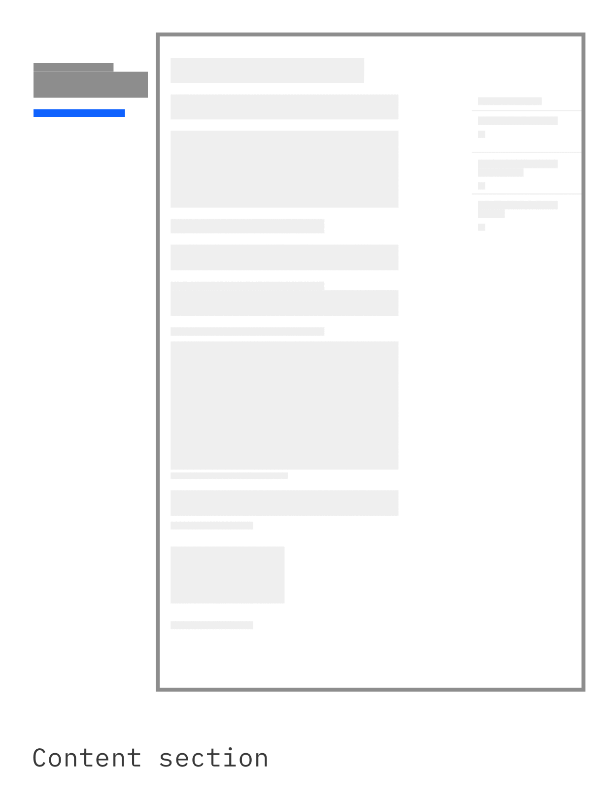
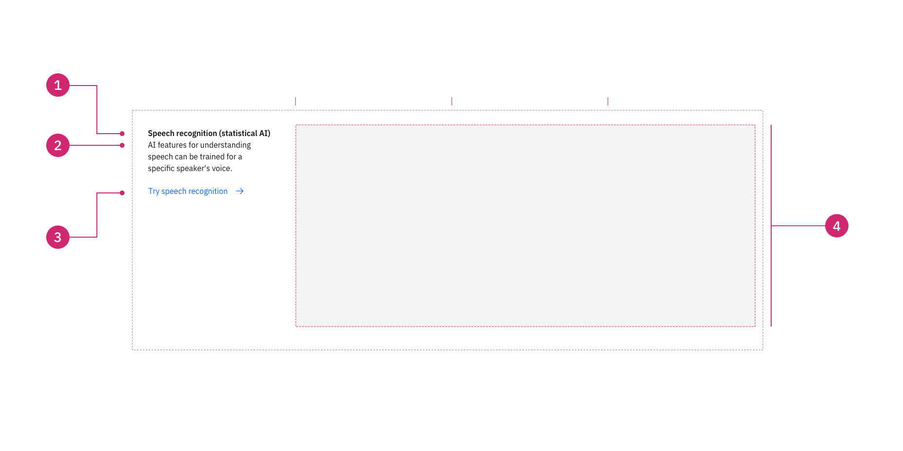
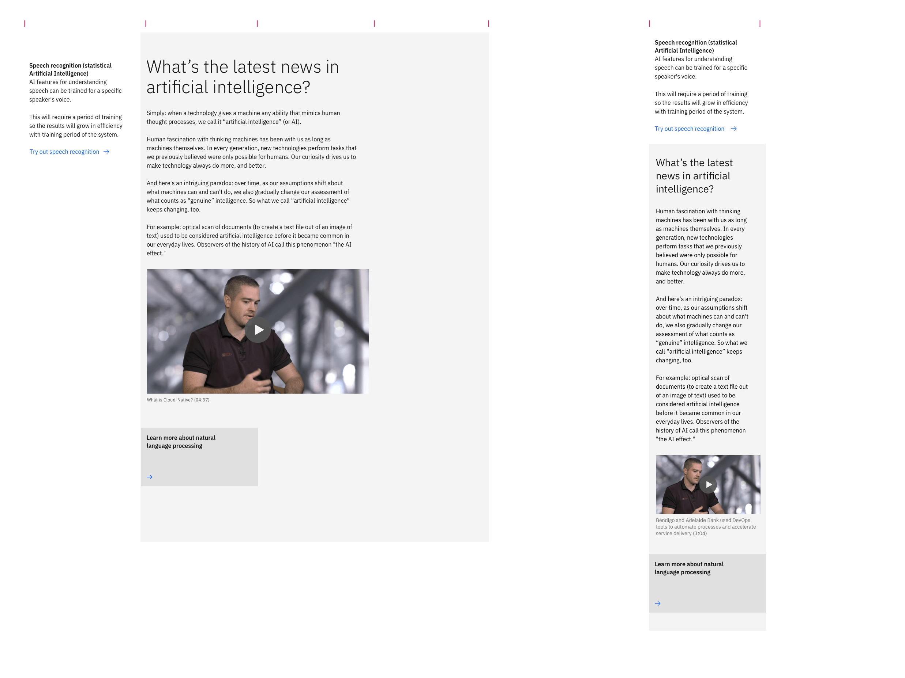

import ComponentDescription from 'components/ComponentDescription';
import ComponentFooter from 'components/ComponentFooter';
import ResourceLinks from 'components/ResourceLinks';

<ComponentDescription name="Content section" type="layout" />

<AnchorLinks>

<AnchorLink>Overview</AnchorLink>
<AnchorLink>Modifiers</AnchorLink>
<AnchorLink>Behaviors</AnchorLink>
<AnchorLink>Gallery</AnchorLink>
<AnchorLink>Resources</AnchorLink>
<AnchorLink>Content guidance</AnchorLink>
<AnchorLink>Feedback</AnchorLink>

</AnchorLinks>

## Overview

The content section acts as the heading level two on all pages after the lead space component. The content section is used to divide the main categories or sections of the page to help guide the user through the content or narrative.

<Row>

<Column colMd={8} colLg={4}>

<Caption>
  See how Content section, Content block, Content group and Content item act as
  hierarchical content containers for each other.
</Caption>

</Column>

<Column colMd={8} colLg={8}>

<Caption>Anatomy of the Content section component</Caption>

</Column>

</Row>

### Anatomy

1. **Content section heading:** A customizable heading for the Content section.
2. **Content block heading:** A customizable heading for the Content section.
3. **Sub heading:** A customizable heading for the Content section.
4. **Copy:** A short description.
5. **Child container:** Use this to insert other high-level content units, like content blocks and content groups.
6. **CTA text link or CTA card link:** Use this as a general call to action at the Content section level.
7. **Border:** Use this as a general call to action at the Content section level.

## Modifiers

### Headings

The content section has two types of optional headings that can be turned on and off to fit the layout needs. 

#### Content section heading

Toggle off the content section heading to utilize the vertical table of contents component for long form reading experiences that allow the user to quickly navigate through the content.

#### Content block heading

Toggle off the content block heading for concise layout samples, this layout works well with the horizontal table of contents component.

### Children

The content section can accept child components which allows designers and authors maximum flexibility when creating page layouts. The most common layouts on IBM.com are 8 column and 12 column components.

#### 8 column child

#### 12 column child

There is no limit to how many child components the content section can accept, consider the story you are trying to tell, the overall hierarchy of the page and how many content sections should be used to break up the content. View the [gallery](#gallery) to see examples of content section with various child components.

## Behaviors

The Content section elements are persistent throughout the online experience. It is fully responsive and changes how
elements are displayed based on the browser size.

#### Desktop breakpoints

If the browser is wider than the max breakpoint of 1584px, the Content section and all other page content will center
and extra margin will appear on either side of the page layout. The Content section heading, description and link CTA
will take the first four (out of 16) columns of the grid, while the children container will take the other 12 columns.

#### Mobile breakpoints

At medium and small breakpoints, the Content section will add a significant change: the child container will move above
the CTA text link. See the image below.

<Row>

<Column colMd={8} colLg={12}>

</Column>

</Row>

<Caption>
  Content section with a Content block simple, at desktop and mobile breakpoints
</Caption>

### Examples

These examples showcase the adaptability of Content section, encapsulating a
[Content block simple](https://www.ibm.com/standards/carbon/components/content-block-simple), or a
[Content block cards](https://www.ibm.com/standards/carbon/components/content-block-cards), both ready-to-use
components.

<Row>

<Column colMd={8} colLg={8}>

</Column>

</Row>

<Caption>
  Showcasing the versatility and adaptability of the Content section component
</Caption>

## Gallery

The content section is the main building block for establishing sections throughout pages of the IBM.com platform. Here are some examples of various layouts you can create by utilizing the extreme flexibility the content section provides by utilizing the  varying heading options and adding custom children.

<ResourceLinks name="Content section" type="layout" />

## Content guidance

| Element                                                    | Content type | Required | Instances | Character limit  (English / translated) | Notes                                                                                        |
| ---------------------------------------------------------- | ------------ | -------- | --------- | ------------------------------------------- | -------------------------------------------------------------------------------------------- |
| Content section heading                                    | Text         | No       | 1         | 25 / 35                                     |                                                                                              |
| Content block heading                                      | Text         | No       | 1         | 25 / 35                                     |                                                                                              |
| Sub heading                                                | Text         | No       | 1         | 25 / 35                                     |                                                                                              |
| Copy                                                       | Text         | No       | 1         | 65 / 85                                     |                                                                                              |
| Child container                                            | Component    | No       | 1+        | –                                           | An optional container area that child components and other content types can be passed into. |
| [CTA](https://www.ibm.com/standards/carbon/components/cta) | Component    | No       | 1         | 25 / 35                                     |                                                                                              |
| Border                                                     | Component    | No       | 1         | –                                           |                                                                                              |

For more information, see the [character count standards](https://www.ibm.com/standards/carbon/guidelines/content#character-count-standards).

<ComponentFooter name="Content section" type="layout" />
