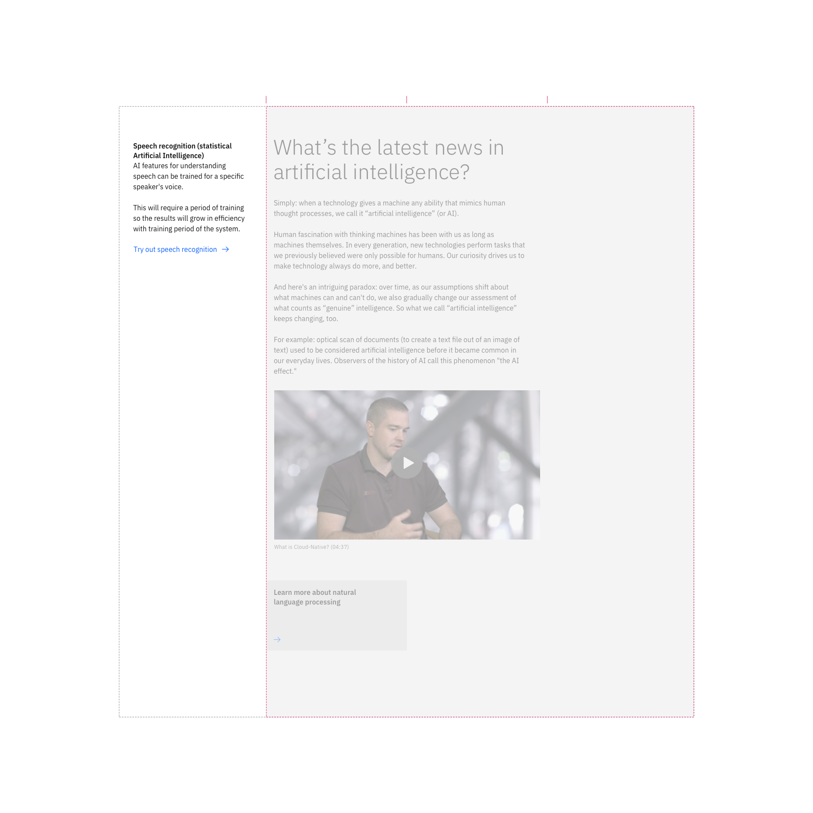
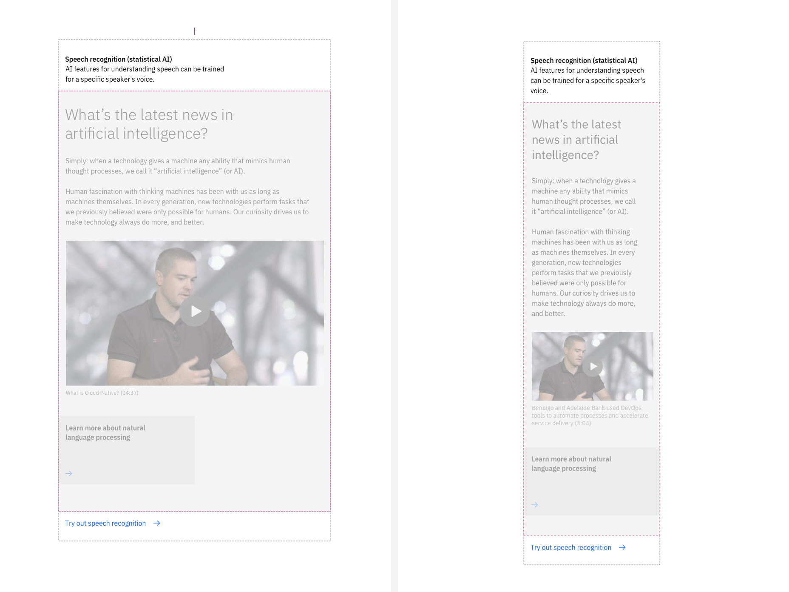

import ComponentDescription from 'components/ComponentDescription';
import ComponentFooter from 'components/ComponentFooter';
import ResourceLinks from 'components/ResourceLinks';

<ComponentDescription name="Content section" type="layout" />

<AnchorLinks>

<AnchorLink>Resources</AnchorLink>
<AnchorLink>Overview</AnchorLink>
<AnchorLink>Behaviors</AnchorLink>
<AnchorLink>Tips and techniques</AnchorLink>
<AnchorLink>Content guidance</AnchorLink>
<AnchorLink>Ready-to-use custom block components</AnchorLink>
<AnchorLink>Feedback</AnchorLink>

</AnchorLinks>

<ResourceLinks name="Content block" type="layout" />

## Overview

The content section component can be used and customized for different types of web page experiences, boosting
productivity by not having to recreate it every single time. Because it is naturally decoupled from the dotcom shell, it
can be used multiple times on a web page, acting as the main structural content unit.

<Caption>Anatomy of the content section component</Caption>

 

1. **Heading:** Customizable heading for the content section component.
2. **Description:** A short description of the content section.
3. **CTA text link or CTA card link:** Use this component as a general call to action at content section level.
4. **Children container:** Use this to insert other high-level content units, like content blocks and content groups.

#### When to use

Use content section when you need to organise a web page experience into main content units. One of the advantages of
the section is that it can take a different color theme from the page theme. Use this option carefuly to avoid an
unwanted page banding experience (page banding means that constrasting full-width backgrounds are alternating in a web
page, interrupting the reading experience for the user).

#### When not to use

Do not use a content section to only separate content items, or other related basic content items (like paragraphs)
inside of a web page. Use a content group instead.

## Behaviors

The content section elements are persistent throughout the online experience. It is fully responsive and changes how
elements are displayed based on the browser size.

#### Desktop breakpoints (max, xlg, and lg)

If the browser is wider than the max breakpoint of 1584px, the content section and all other page content will center
and extra margin will appear on either side of the page layout. The content section heading, description and link CTA
will take the first four (out of 16) columns of the grid, while the children container will take the other 12 columns.

<Row>

<Column colMd={4} colLg={12}>

<Caption>Content section at xlg 1312px breakpoint encapsulating a content block simple</Caption>

</Column>

</Row>

#### Md and sm breakpoints

At medium and small breakpoints, the content section will add a significant change: the children container will move
above the link CTA text link. See the image below.

<Caption>Content section at md 672px and sm 320px breakpoints encapsulating a content block simple</Caption>

### Showcase

This is a showcase of a content section that encapsulates a content block simple, or, in turn, a card block with four
cards.

<Caption>Showcase of a content section component</Caption>

## Tips and techniques

The content block elements are persistent throughout the online experience. It is fully responsive and changes how
elements are displayed based on the browser size.

- Important: keep in mind that on medium and small breakpoints, the children container is positioned between the content
  section description and the CTA text link.
- Each type of content unit (content section, content block, content group or content item, and their many options)
  usually will have a certain type of CTA as the last element in the component architecture.
- Try to avoid CTA stacking at the end of a content section. If multiple CTAs are present, use different types. Example:
  a card link from a content block and a CTA text link as the final element of the content section.

## Content guidance

| Element                                                         | Content type | Required | Instances | Character count  (English / translated) | Notes                                                                                         |
| --------------------------------------------------------------- | ------------ | -------- | --------- | ------------------------------------------- | --------------------------------------------------------------------------------------------- |
| Heading                                                         | Text         | Yes      | 1         | 25 / 35                                     |                                                                                               |
| Copy                                                            | Text         | No       | 1         | 65 / 85                                     |                                                                                               |
| Child container                                                 | Component    | No       | 1         | –                                           | An optional container area that child components, and other content types can be passed into. |
| [CTA type](https://www.ibm.com/standards/carbon/components/cta) | Option list  | Yes      | 1         | –                                           |                                                                                               |
| [CTA text](https://www.ibm.com/standards/carbon/components/cta) | Link         | No       | 1         | 25 / 35                                     | URL assigned in setup                                                                         |

For more information, see the
[character count standards](https://github.com/carbon-design-system/carbon-for-ibm-dotcom-website/wiki/Character-count-standards).

## Ready-to-use custom section components

| Component name                                                                                               | Relationship                                                                                                                                                        |
| ------------------------------------------------------------------------------------------------------------ | ------------------------------------------------------------------------------------------------------------------------------------------------------------------- |
| [Card section](https://www.ibm.com/standards/carbon/components/card-section)                                 | Card section is a content section that includes a content section heading, and that, in the children container, it encapsulates a card group component.             |
| [Card section carousel](https://www.ibm.com/standards/carbon/components/card-section-carousel)               | Card section carousel is a content section that includes a content section heading and a carousel component for navigation throughout a group of CTA cards.         |
| [Card section images](https://www.ibm.com/standards/carbon/components/card-section#card-section-with-images) | Card section images is a content section that includes a content section heading, and a card group component encapsulated in the content section children container |

<ComponentFooter name="Content section" type="layout" />
