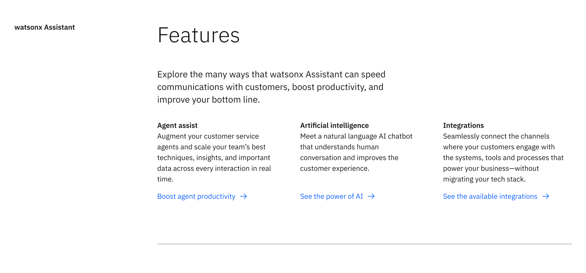
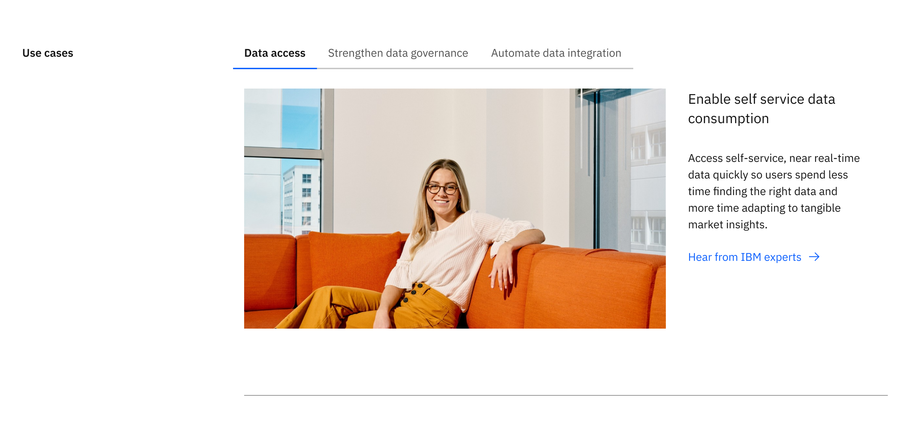
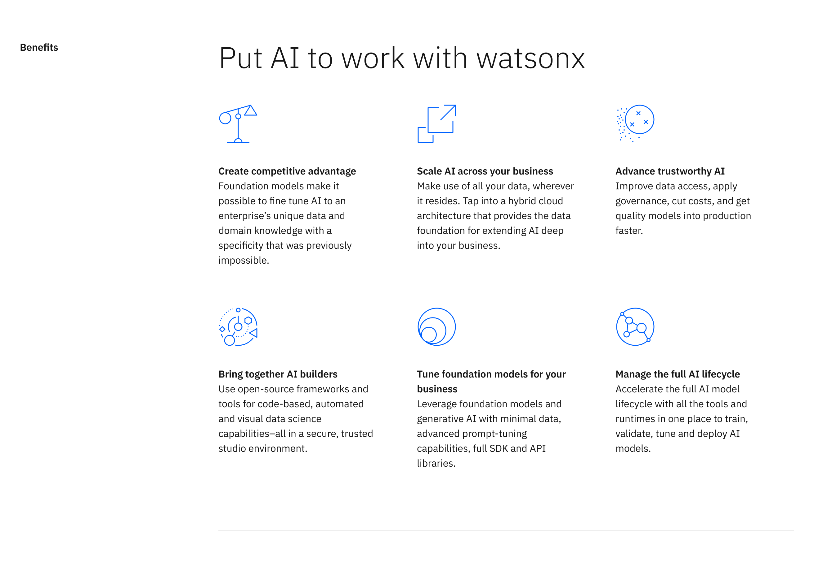
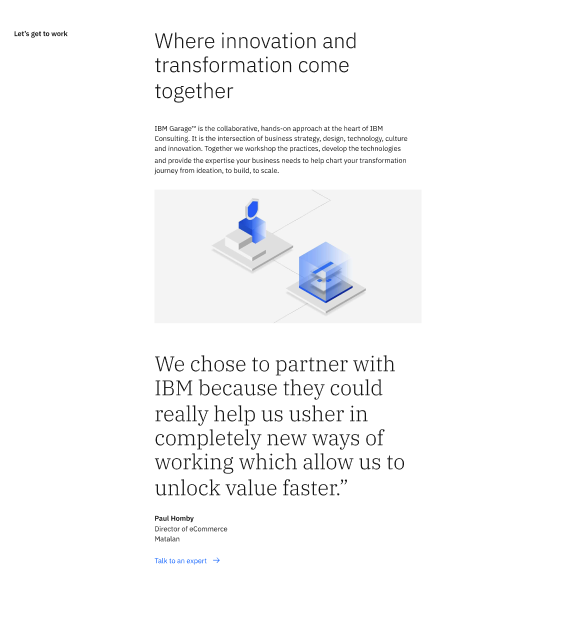
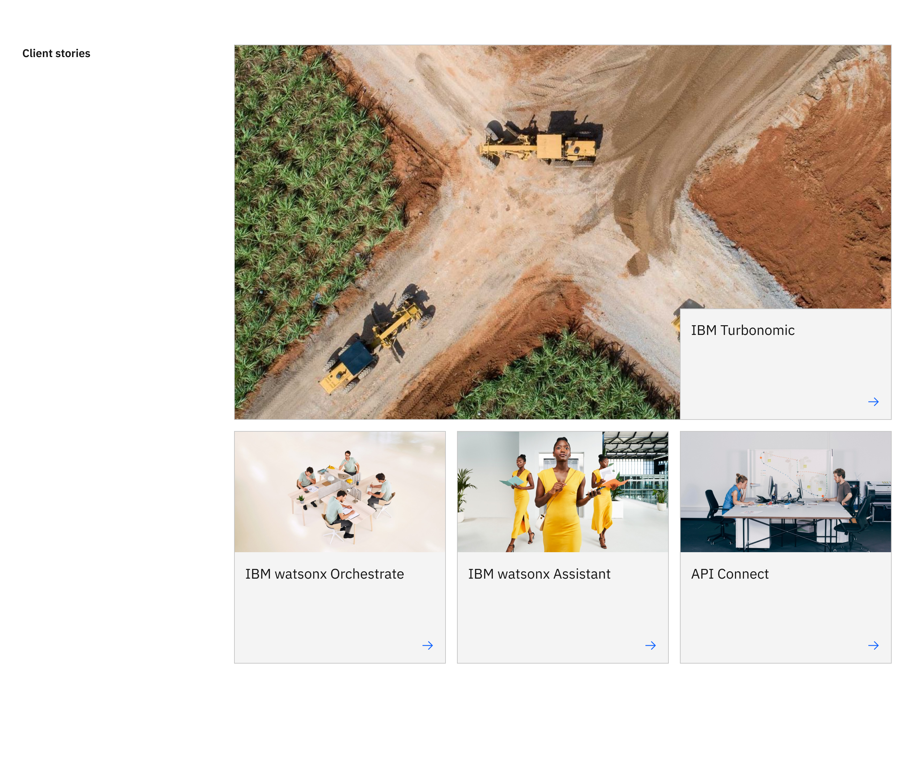

import ComponentDescription from 'components/ComponentDescription';
import ComponentFooter from 'components/ComponentFooter';
import ResourceLinks from 'components/ResourceLinks';

<ComponentDescription name="Content section" type="layout" />

<AnchorLinks>

<AnchorLink>Overview</AnchorLink>
<AnchorLink>Modifiers</AnchorLink>
<AnchorLink>Behaviors</AnchorLink>
<AnchorLink>Gallery</AnchorLink>
<AnchorLink>Resources</AnchorLink>
<AnchorLink>Content guidance</AnchorLink>
<AnchorLink>Feedback</AnchorLink>

</AnchorLinks>

## Overview

The content section acts as the heading level two on pages after the lead space component and spans the full 16 column grid. The content section is used to divide the main categories or sections of the page to help guide the user through the content or narrative. 

<Caption>Example of the content section.</Caption>

### Anatomy

1. **Content section heading:** A customizable heading for the Content section.
2. **Child container:** Insert additional components to enhance the narrative, such as content block, content group, content item or card group, etc.
3. **Border:** An optional bottom border.

## Modifiers

### Children

The content section can accept many different types of child components, which allows designers and authors maximum flexibility when creating page layouts. The most common layouts on IBM.com are 8 column and 12 column components.

There is no limit to how many child components the content section can accept - consider the story you are trying to tell, the overall hierarchy of the page and how many content sections should be used to break up the content. View the [gallery](#gallery) to see examples of content section with various child components.

#### 8 column child

_Add description text here_

<Caption>
  Example of the content section with a child component that spans 8 columns.
</Caption>

#### 12 column child

_Add description text here_

<Caption>
  Example of the content section with a child component that spans 12 columns.
</Caption>

#### Mixing children widths

<Caption>
  Example of the content section with a child component that spans 8 columns, followed by another child that spans 12 columns.
</Caption>

## Behaviors

The content section elements are persistent throughout the experience. It is fully responsive and changes how elements are displayed based on the browser size, at tablet and mobile breakpoints the content section heading stacks on top of the child container.

<Row>

<Column colMd={8} colLg={8}>

<Caption>Example of content section at medium breakpoint</Caption>

</Column>

<Column colMd={8} colLg={4}>

<Caption>Example of content section at mobile breakpoint</Caption>

</Column>

</Row>

## Gallery

The content section is the main building block for establishing sections throughout pages of the IBM.com platform. Here are some examples of various layouts you can create by utilizing the extreme flexibility the content section provides by utilizing the varying heading options and adding custom children.

<ImageGallery>
<ImageGalleryImage alt="Content section with tabs extended" title="Content section with tabs extended and content item row" col={8}>

</ImageGalleryImage>
<ImageGalleryImage alt="Content section with content block and a group of content item pictograms" title="Content section with content block and a group of content item pictograms" col={4}>

</ImageGalleryImage>
<ImageGalleryImage alt="Content section with three children" title="Content section with three children: content block, image, and quote" col={4}>

</ImageGalleryImage>
<ImageGalleryImage alt="Content section with card group" title="Content section with card group" col={8}>

</ImageGalleryImage>
</ImageGallery>

<ResourceLinks name="Content section" type="layout" />

## Content guidance

| Element                                                    | Content type | Required | Instances | Character limit  (English / translated) | Notes                                                                                        |
| ---------------------------------------------------------- | ------------ | -------- | --------- | ------------------------------------------- | -------------------------------------------------------------------------------------------- |
| Content section heading                                    | Text         | Yes      | 1         | 25 / 35                                     |                                                                                              |
| Child container                                            | Component    | Yes      | 1+        | –                                           | An optional container area that child components and other content types can be passed into. |
| Border                                                     | Component    | No       | 1         | –                                           |                                                                                              |

For more information, see the [character count standards](https://www.ibm.com/standards/carbon/guidelines/content#character-count-standards).

<ComponentFooter name="Content section" type="layout" />
