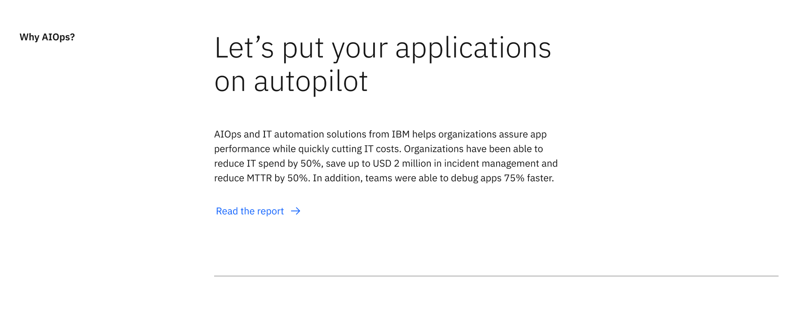
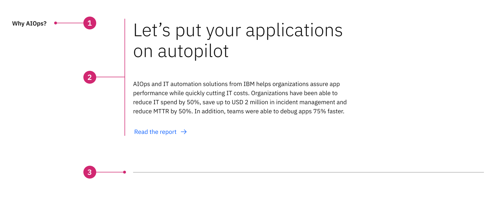
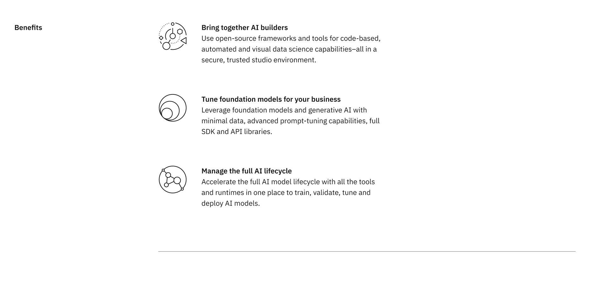
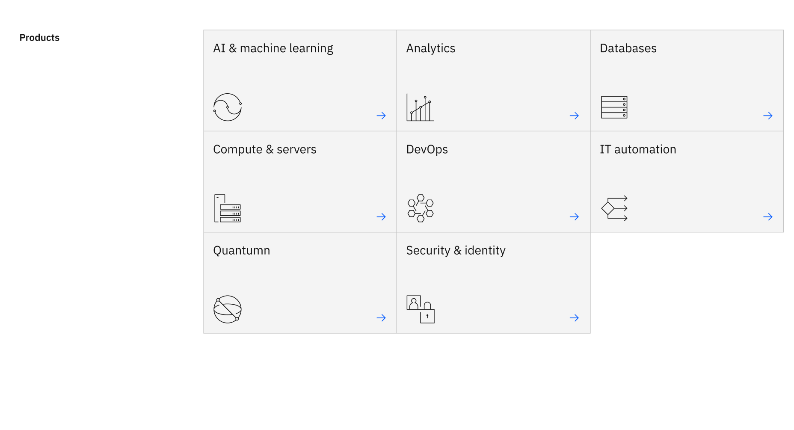
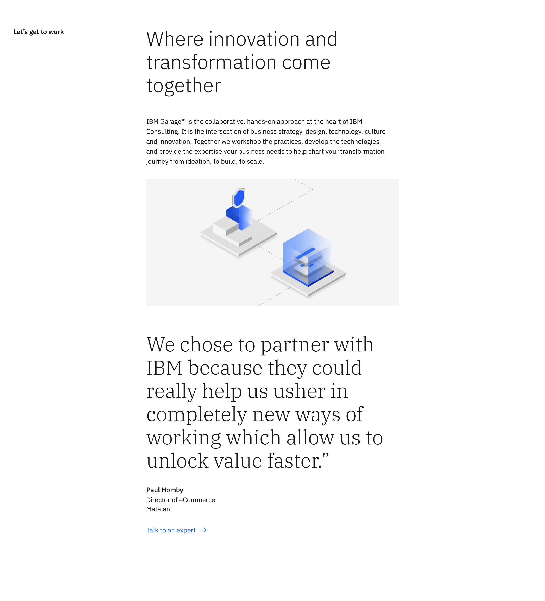

import ComponentDescription from 'components/ComponentDescription';
import ComponentFooter from 'components/ComponentFooter';
import ResourceLinks from 'components/ResourceLinks';

<ComponentDescription name="Content section" type="layout" />

<AnchorLinks>

<AnchorLink>Overview</AnchorLink>
<AnchorLink>Modifiers</AnchorLink>
<AnchorLink>Behaviors</AnchorLink>
<AnchorLink>Gallery</AnchorLink>
<AnchorLink>Resources</AnchorLink>
<AnchorLink>Content guidance</AnchorLink>
<AnchorLink>Feedback</AnchorLink>

</AnchorLinks>

## Overview

<<<<<<< HEAD
The content section acts as the heading level two on pages after the lead space component and spans the full 16 column grid. The content section is used to divide the main categories or sections of the page to help guide the user through the content or narrative.
=======
The content section acts as the heading level two on all pages after the lead space component. The content section is used to divide the main categories or sections of the page to help guide the user through the content or narrative.

<Caption>Example of the content section.</Caption>

### Anatomy

1. **Content section heading:** An optional, customizable heading for the Content section.
2. **Content block heading:** An optional, customizable heading for the Content section.
3. **Sub heading:** An opptional, customizable sub heading for the Content section.
4. **Copy:** An optional short description.
5. **Child container:** Insert additional components to enhance the narrative, such as content group, content item or card group.
6. **CTA:** Use this as a general call to action, typically used to encompass the entire content section.
7. **Border:** An optional bottom border.

## Modifiers

### Headings

The content section has two types of optional headings – **content section** and **content block** – that can be turned on and off to fit the layout needs.

<Caption>Example of the content section.</Caption>

#### Content section heading

Turn off the content section heading to utilize the vertical [table of contents](../components/table-of-contents) component for long form reading experiences that allow the user to quickly navigate through the content.

> > > > > > > feat/dotcom-v2

<<<<<<< HEAD

<Caption>Example of the content section.</Caption>

### Anatomy

1. **Content section heading:** A customizable heading for the Content section.
2. **Child container:** Insert additional components to enhance the narrative, such as content block, content group, content item or card group, etc.
3. **Border:** An optional bottom border.

## Modifiers

### Children

The content section can accept many different types of child components, which allows designers and authors maximum flexibility when creating page layouts. The most common layouts on IBM.com are 8 column and 12 column components.

There is no limit to how many child components the content section can accept - consider the story you are trying to tell, the overall hierarchy of the page and how many content sections should be used to break up the content. View the [gallery](#gallery) to see examples of content section with various child components.

#### 8 column child

In this example the content section is paired with a group of [content item pictograms](../components/content-item) that span the center 8 columns of the grid.

<Caption>
  Example of the content section with a child component that spans 8 columns.
=======
<Column colMd={4} colLg={6}>

<Caption>
  Example of the content section component, where the content section heading is
  highlighted. >>>>>>> feat/dotcom-v2
</Caption>

#### 12 column child

<<<<<<< HEAD
In this example the content section is paired with a [card group](../components/card-group) that spans 12 columns of the grid.

<Caption>
  Example of the content section with a child component that spans 12 columns.
</Caption>

#### Mixing children widths

=======

<Column colMd={4} colLg={6}>

<Caption>
  Example of replacing the content section heading with the vertical table of
  contents.
</Caption>
>>>>>>> feat/dotcom-v2

The content section can support mixing of various children and how many columns of the grid the children can span. Most of the Carbon for IBM.com components have been carefully designed with line length and column usage in mind, and therefore should fit within the columns without alteration.

In this example the content section has two children:

- A content block that spans 8 columns of the grid
- A group of content items that span 12 columns of the grid

<<<<<<< HEAD

<Caption>
  Example of the content section with a child component that spans 8 columns,
  followed by another child that spans 12 columns.
</Caption>

## Behaviors

# The content section elements are persistent throughout the experience. It is fully responsive and changes how elements are displayed based on the browser size, at tablet and mobile breakpoints the content section heading stacks on top of the child container.

#### Content block heading

Turn off the content block heading for concise layout samples, this layout works well with the horizontal table of contents component.

<Row>

<Column colMd={4} colLg={6}>

<Caption>
  Example of the content section component, where the content block heading is
  highlighted.
</Caption>

</Column>

<Column colMd={4} colLg={6}>

<Caption>
  Example of turning off the content section's content block heading, and all
  remaining content shifts upward to top align with the content section heading.
</Caption>

</Column>

</Row>

### Children

The content section can accept many different types of child components, which allows designers and authors maximum flexibility when creating page layouts. The most common layouts on IBM.com are 8 column and 12 column components.

#### 8 column child

_Add description text here_

<Caption>
  Example of the content section with a child component that spans 8 columns.
</Caption>

#### 12 column child

_Add description text here_

<Caption>
  Example of the content section with a child component that spans 12 columns.
</Caption>

There is no limit to how many child components the content section can accept - consider the story you are trying to tell, the overall hierarchy of the page and how many content sections should be used to break up the content. View the [gallery](#gallery) to see examples of content section with various child components.

## Behaviors

The content section elements are persistent throughout the experience. It is fully responsive and changes how
elements are displayed based on the browser size, at tablet and mobile breakpoints the content section heading stacks on top of the content block heading.

> > > > > > > feat/dotcom-v2

<Row>

<Column colMd={8} colLg={8}>

<Caption>Example of content section at medium breakpoint</Caption>

</Column>

<Column colMd={8} colLg={4}>

<Caption>Example of content section at mobile breakpoint</Caption>

</Column>

</Row>

## Gallery

The content section is the main building block for establishing sections throughout pages of the IBM.com platform. Here are some examples of various layouts you can create by utilizing the extreme flexibility the content section provides by utilizing the varying heading options and adding custom children.

<<<<<<< HEAD

<ImageGallery>
<ImageGalleryImage alt="Content section with tabs extended" title="Content section with tabs extended and content item row" col={8}>

</ImageGalleryImage>
<ImageGalleryImage alt="Content section with content block and a group of content item pictograms" title="Content section with content block and a group of content item pictograms" col={4}>

</ImageGalleryImage>
<ImageGalleryImage alt="Content section with three children" title="Content section with three children: content block, image, and quote" col={4}>

</ImageGalleryImage>
<ImageGalleryImage alt="Content section with card group" title="Content section with card group" col={8}>

</ImageGalleryImage>
</ImageGallery>

=======

> > > > > > > feat/dotcom-v2

<ResourceLinks name="Content section" type="layout" />

## Content guidance

| Element | Content type | Required | Instances | Character limit  (English / translated) | Notes |
| ------- | ------------ | -------- | --------- | ------------------------------------------- | ----- |

<<<<<<< HEAD
| Content section heading | Text | Yes | 1 | 25 / 35 | |
| Child container | Component | Yes | 1+ | – | An optional container area that child components and other content types can be passed into. |
=======
| Content section heading | Text | No | 1 | 25 / 35 | |
| Content block heading | Text | No | 1 | 40 / 55 | |
| Sub heading | Text | No | 1 | 120 / 150 | |
| Copy | Text | No | 1 | 1600 / 2400 | |
| Child container | Component | No | 1+ | – | An optional container area that child components and other content types can be passed into. |
| [CTA](https://www.ibm.com/standards/carbon/components/cta) | Component | No | 1 | 25 / 35 | |

> > > > > > > feat/dotcom-v2
> > > > > > > | Border | Component | No | 1 | – | |

For more information, see the [character count standards](https://www.ibm.com/standards/carbon/guidelines/content#character-count-standards).

<<<<<<< HEAD

## Related components

| Component name                               | Description                                                                        |
| -------------------------------------------- | ---------------------------------------------------------------------------------- |
| [Content block](../components/content-block) | Content block is one of the main content components used to structure pages.       |
| [Content group](../components/content-group) | Content group is one of the main content components used to display content items. |
| [Content item](../components/content-item)   | Content item is the lowest level hierarchically of the content components.         |

=======

> > > > > > > feat/dotcom-v2

<ComponentFooter name="Content section" type="layout" />
