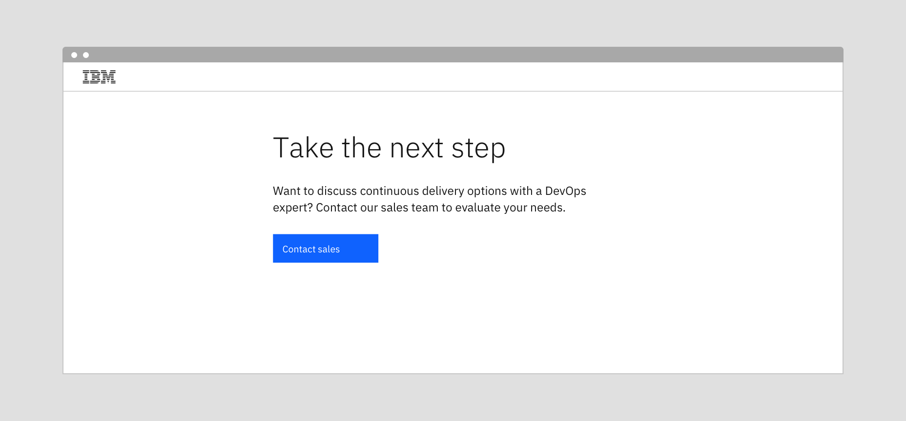
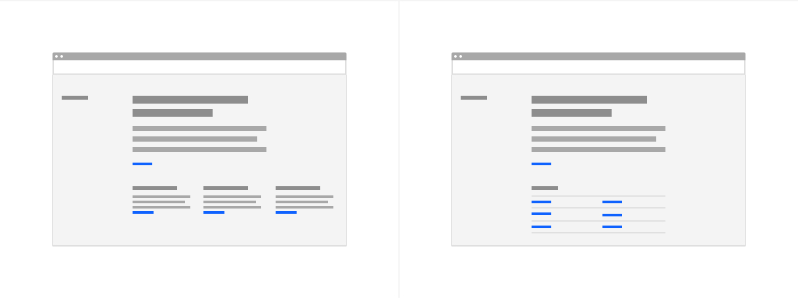
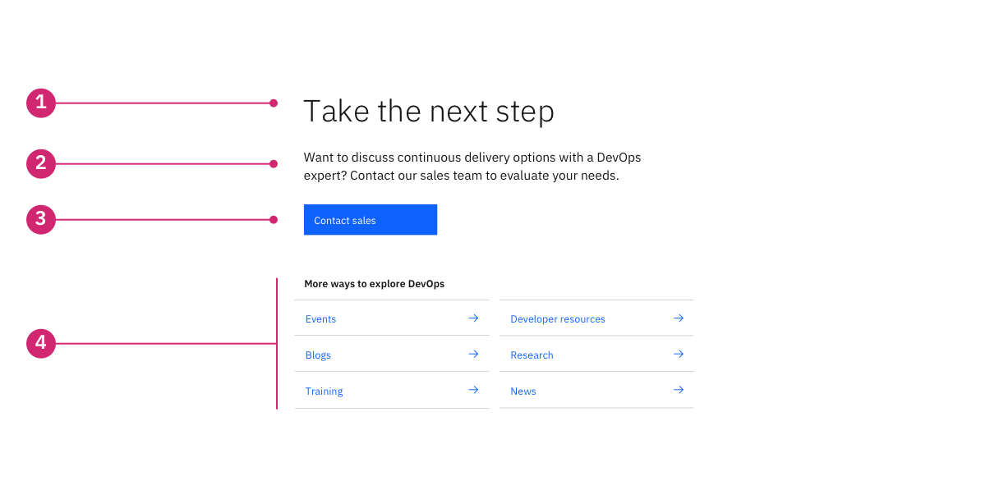
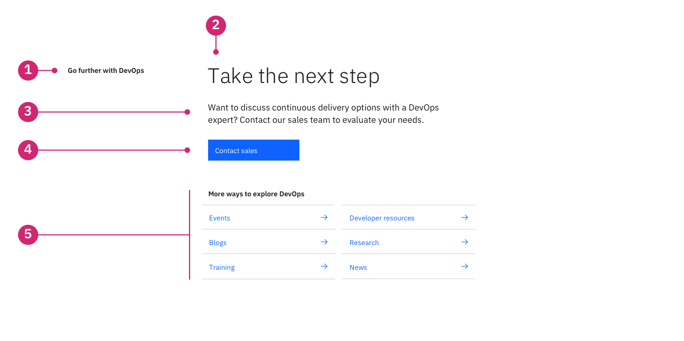
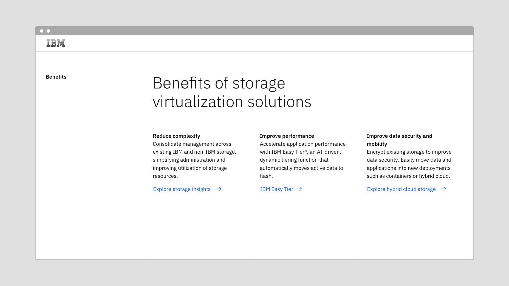
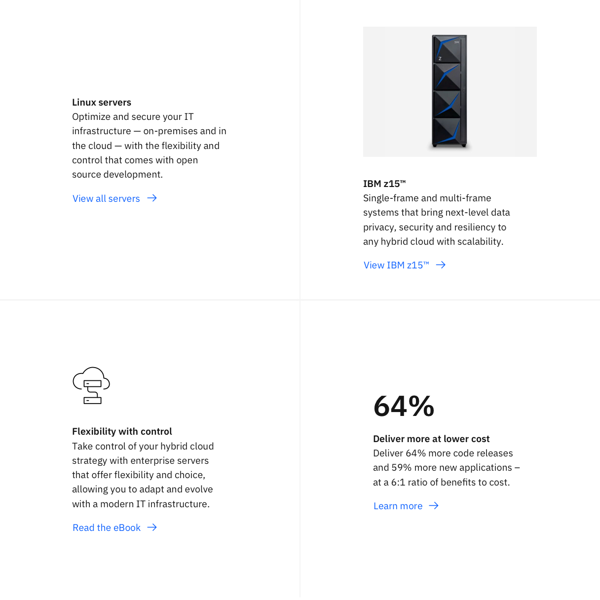
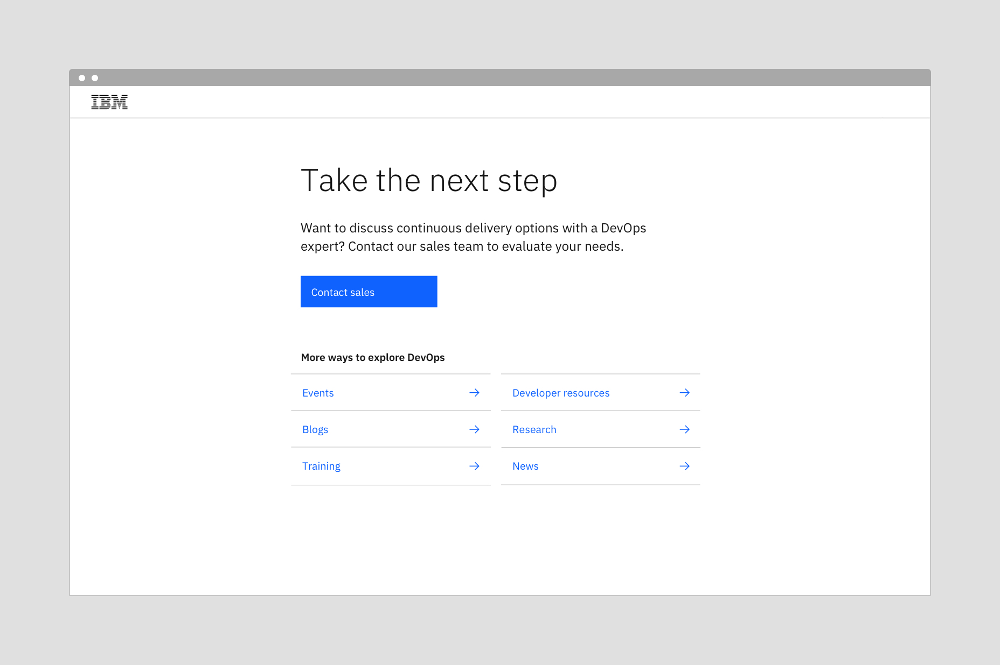

import ComponentDescription from 'components/ComponentDescription';
import ComponentFooter from 'components/ComponentFooter';
import ResourceLinks from 'components/ResourceLinks';

<ComponentDescription name="CTA section" type="layout" />

<AnchorLinks>

<AnchorLink>Overview</AnchorLink>
<AnchorLink>CTA block</AnchorLink>
<AnchorLink>CTA section</AnchorLink>
<AnchorLink>Modifiers</AnchorLink>
<AnchorLink>Feedback</AnchorLink>

</AnchorLinks>

## Overview

[CTA block](#cta-block) is a flexible component that can be configured with a heading, copy, and CTA(s). [CTA section](#cta-section) builds on CTA block and adds a content section heading.

Both CTA block and section typically appear near the end of a page to direct the user to the next step in the process or towards related content.

<Row>
<Column colMd={8} colLg={8}>

<Caption>Example of CTA block.</Caption>

</Column>
</Row>

Both CTA block and CTA section can add a collection of various [content items](#with-content-items) or a [link list](#with-link-list) below the primary CTA, this can be useful when there are multiple resources or features the user might be interested in exploring.

<Row>
<Column colMd={8} colLg={8}>

<Caption>
  From left to right: CTA section with content items, CTA section with link list
  in the gray 10 theme.
</Caption>

</Column>
</Row>

### Deciding what to use

| Variants                                  | Use cases                                                                                                                                              |
| ----------------------------------------- | ------------------------------------------------------------------------------------------------------------------------------------------------------ |
| [CTA block](#cta-block)                   | Heading, introductory copy and CTA(s) this component is typically used at the bottom of a page as the final primary action for the user to take.       |
| [CTA section](#cta-section)               | CTA section adds a content section heading to CTA block. This is useful when using the horizontal table of contents.                                   |
| [With content items](#with-content-items) | Both CTA block and CTA section can add various content items: text, media, pictogram or statistics. Each content item can accommodate one to two CTAs. |
| [With link list](#with-link-list)         | Both CTA block and CTA section can add a link list below the primary CTA.                                                                              |

## CTA block

CTA block combines a heading, copy and CTA(s), this component is typically used at the bottom of a page to guide the user towards the next step in their journey.

### Anatomy

<Row>
<Column colMd={8} colLg={8}>

</Column>
</Row>

1. **Heading:** Descriptive heading.
2. **Body copy:** Optional body copy can be added for additional description.
3. **CTA type:** Optional call to action for the user, button or text link can be used.
4. **Content item or link list:** Optional, add various content items or a link list.

<ResourceLinks name="CTA block" type="layout" multiComponent />

### Content guidance for CTA block

| Element                                                           | Content type | Required | Instances | Character limit  (English / translated) | Notes                          |
| ----------------------------------------------------------------- | ------------ | -------- | --------- | ------------------------------------------- | ------------------------------ |
| Heading                                                           | Text         | Yes      | 1         | 40 / 55                                     |                                |
| Copy                                                              | Text         | No       | 1         | 150 / 200                                   |                                |
| [CTA](https://www.ibm.com/standards/carbon/components/cta#button) | Component    | Yes      | 1–2       | –                                           | Button or text style CTA only. |

## CTA section

CTA section builds off of CTA block and adds a content section heading in the left most columns. This component is typically used with the Table of contents horizontal.

### Anatomy

<Row>
<Column colMd={8} colLg={8}>

</Column>
</Row>

1. **Content section heading:** Heading to describe the section, this is often used with the Table of contents horizontal.
2. **Heading:** Optional customizable heading.
3. **Body copy:** Optional body copy can be added for additional description.
4. **CTA type:** Optional call to action for the user, a button or text link can be used.
5. **Content item or link list:** CTA section allows for adding various content items or a link list.

<ResourceLinks name="CTA section" type="layout" multiComponent />

### Content guidance for CTA section

| Element                                                           | Content type | Required | Instances | Character limit  (English / translated) | Notes                          |
| ----------------------------------------------------------------- | ------------ | -------- | --------- | ------------------------------------------- | ------------------------------ |
| Section heading                                                   | Text         | Yes      | 1         | 40 / 55                                     |                                |
| Heading                                                           | Text         | No       | 1         | 40 / 55                                     |                                |
| Copy                                                              | Text         | No       | 1         | 150 / 200                                   |                                |
| [CTA](https://www.ibm.com/standards/carbon/components/cta#button) | Component    | No       | 1–2       | –                                           | Button or text style CTA only. |

## Modifiers

### With content items

This variation adds a collection of content items below the primary content, it could be used to display a list of features, multiple images or videos with descriptions, informative pictograms, or relevant statistics. Each content item can support up to two text style CTAs.

#### When to use

- If the resouces require additional context or supporting content.
- If the resouces require two CTAs.

<Row>
<Column colMd={8} colLg={8}>

<Caption>CTA section with text content items.</Caption>

</Column>
</Row>

**Types of content items**

<Row>
<Column colMd={8} colLg={8}>

<Caption>From left to right: text, media, pictogram, and statistic.</Caption>

</Column>
</Row>

**Deciding what to use**

| Type      | Use cases                                                                                                                                                                |
| --------- | ------------------------------------------------------------------------------------------------------------------------------------------------------------------------ |
| Text      | Use when the content is easily understood and does not need any supporting context.                                                                                      |
| Media     | Use when all items have a supporting image or video. See the [photography guidelines](https://www.ibm.com/design/language/photography/overview)                          |
| Pictogram | Use when a pictogram can enhance the user's understanding of the content. See the [pictogram libary](https://www.carbondesignsystem.com/guidelines/pictograms/library/). |
| Statistic | Use when an engaging statistic can support the content.                                                                                                                  |

**Content guidance for content item**

| Element                                                    | Content type | Required | Instances | Character limit  (English / translated) | Notes                                                              |
| ---------------------------------------------------------- | ------------ | -------- | --------- | ------------------------------------------- | ------------------------------------------------------------------ |
| Heading                                                    | Text         | Yes      | 1         | 20 / 32                                     |                                                                    |
| Copy                                                       | Text         | Yes      | 1         | 150 / 200                                   |                                                                    |
| [CTA](https://www.ibm.com/standards/carbon/components/cta) | Component    | Yes      | 1-2       | 25 / 35                                     | Required for the CTA section component, button or text style only. |
| Style                                                      | Option list  | Yes      | 1         | –                                           | Text, stats, pictogram, or media.                                  |

For more information, see the [character count standards](https://www.ibm.com/standards/carbon/guidelines/content#character-count-standards).

### With link list

This variation adds a link list below the primary content and is typically used to collect relevant links or resouces for the user. Use a link list when the additional links do not require any supporting context, otherwise use content items.

<Row>
<Column colMd={8} colLg={8}>

<Caption>CTA block with link list.</Caption>

</Column>
</Row>

**Content guidance for link list**

| Element                                                     | Content type | Required | Instances | Character limit  (English / translated) | Notes                       |
| ----------------------------------------------------------- | ------------ | -------- | --------- | ------------------------------------------- | --------------------------- |
| Heading                                                     | Text         | Yes      | 1         | 40 / 55                                     |                             |
| [CTA](https://www.ibm.com/standards/carbon/components/cta/) | Component    | Yes      | Max 12    | 40 / 55                                     | Text style CTA is required. |

For more information, see the [character count standards](https://www.ibm.com/standards/carbon/guidelines/content#character-count-standards).

<ComponentFooter name="CTA section" type="layout" />
