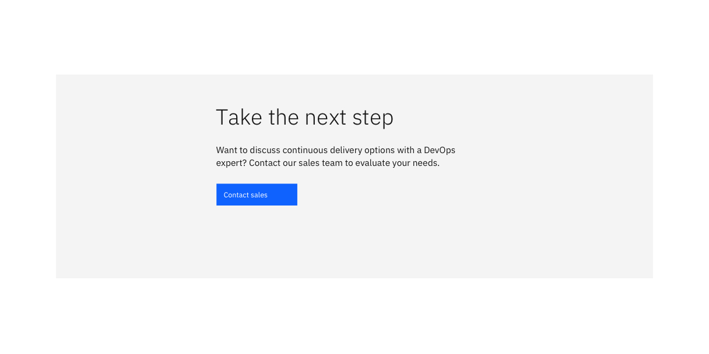
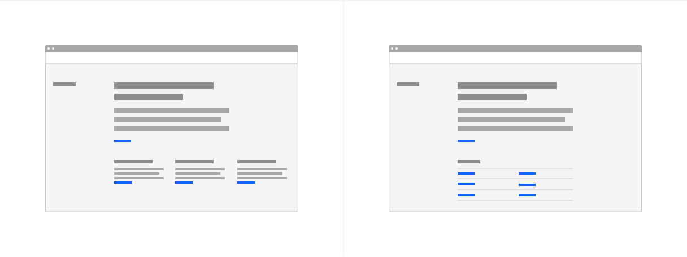
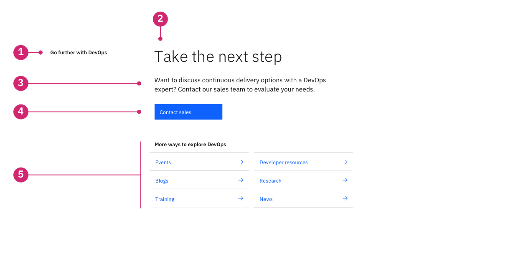

import ComponentDescription from 'components/ComponentDescription';
import ComponentFooter from 'components/ComponentFooter';
import ResourceLinks from 'components/ResourceLinks';

<ComponentDescription name="CTA section" type="layout" />

<AnchorLinks>

<AnchorLink>Resources</AnchorLink>
<AnchorLink>Overview</AnchorLink>
<AnchorLink>Variants</AnchorLink>
<AnchorLink>Content guidance</AnchorLink>
<AnchorLink>Feedback</AnchorLink>

</AnchorLinks>

<ResourceLinks name="CTA section" type="layout" />

## Overview

CTA (call-to-action) section is a flexible component that can be configured with a heading, copy, and CTA. This component is typically used at the bottom of a page as the final call to action for the user.

<Row>
<Column colMd={8} colLg={8}>

</Column>
</Row>

CTA section also allows for a collection of various content items or a link list to be added below the primary CTA.

<Row>
<Column colMd={8} colLg={8}>

<Caption>
  From left to right: CTA section with content items, CTA section with link
  list.
</Caption>

</Column>
</Row>

### Anatomy

<Row>
<Column colMd={8} colLg={8}>

</Column>
</Row>

1. **Section heading:** Optional section sub-heading to describe the section, this is often used with the Table of contents horizontal.
2. **Heading:** Customizable heading.
3. **Body copy:** Optional body copy can be added for additional description.
4. **CTA type:** Optional call to action for the user, button or text link can be used.
5. **Content item or link list:** CTA section allows for adding various content items or a link list.

## Variants

### CTA section with content items

CTA section with content items adds on to CTA section simple, and allows for a variety of content items: text, media, pictogram or statistics.

This component could be used to display a list of features, multiple images or videos with descriptions, informative pictograms, or relevant statistics.

### CTA section with link list

CTA with link list combines CTA section simple and link list. This component is typically used to collect relevant links at the bottom of a page.

## Content guidance

### CTA section

| Element                                                                                                  | Content type | Required | Instances | Character limit  (English / translated) | Notes                                                                                  |
| -------------------------------------------------------------------------------------------------------- | ------------ | -------- | --------- | ------------------------------------------- | -------------------------------------------------------------------------------------- |
| Heading                                                                                                  | Text         | Yes      | 1         | 40 / 55                                     |                                                                                        |
| Copy                                                                                                     | Text         | No       | 1         | 150 / 200                                   |                                                                                        |
| [CTA](https://www.ibm.com/standards/carbon/components/cta#button)                                        | Component    | Yes      | 1–2       | –                                           | Button or text style CTA only.                                                         |
| [Content item](https://www.ibm.com/standards/carbon/components/cta-section#content-item-for-cta-section) | Component    | No       | 1–6       | –                                           | You can choose either Content items or the Link list component, up to 6 content items. |
| [Link list](https://www.ibm.com/standards/carbon/components/link-list/#end-of-section)                   | Component    | No       | 1         | –                                           | You can choose either Content items or the Link list component, up to 12 links.        |

### Content item for CTA section

| Element                                                    | Content type | Required | Instances | Character limit  (English / translated) | Notes                                                              |
| ---------------------------------------------------------- | ------------ | -------- | --------- | ------------------------------------------- | ------------------------------------------------------------------ |
| Heading                                                    | Text         | Yes      | 1         | 20 / 32                                     |                                                                    |
| Copy                                                       | Text         | Yes      | 1         | 150 / 200                                   |                                                                    |
| [CTA](https://www.ibm.com/standards/carbon/components/cta) | Component    | Yes      | 1         | 25 / 35                                     | Required for the CTA section component, button or text style only. |
| Style                                                      | Option list  | Yes      | 1         | –                                           | Text, stats, pictogram, or media.                                  |

For more information, see the [character count standards](https://www.ibm.com/standards/carbon/guidelines/content#character-count-standards).

### Link list

| Element                                                     | Content type | Required | Instances | Character limit  (English / translated) | Notes                       |
| ----------------------------------------------------------- | ------------ | -------- | --------- | ------------------------------------------- | --------------------------- |
| Heading                                                     | Text         | Yes      | 1         | 40 / 55                                     |                             |
| [CTA](https://www.ibm.com/standards/carbon/components/cta/) | Component    | Yes      | Max 12    | 40 / 55                                     | Text style CTA is required. |

For more information, see the [character count standards](https://www.ibm.com/standards/carbon/guidelines/content#character-count-standards).

<ComponentFooter name="CTA section" type="layout" />
