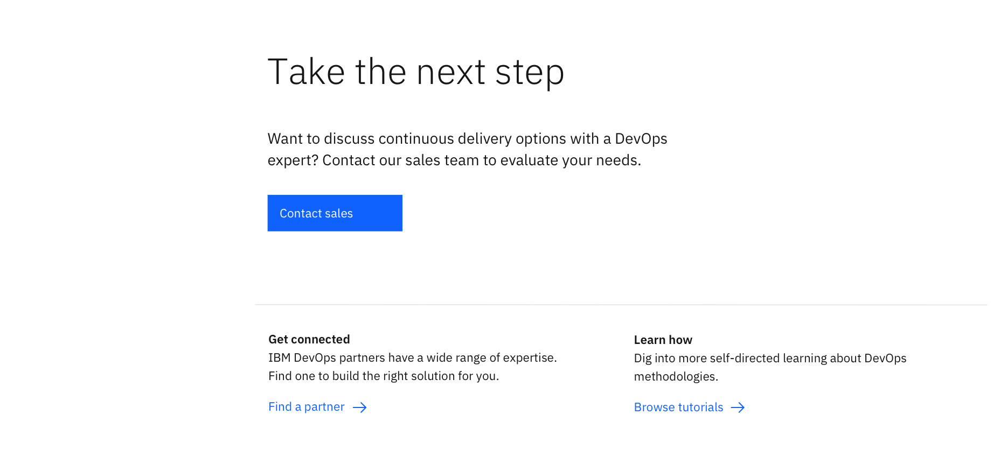

import ComponentDescription from 'components/ComponentDescription';
import ComponentFooter from 'components/ComponentFooter';
import ResourceLinks from 'components/ResourceLinks';

<ComponentDescription name="CTA section" type="layout" />

<AnchorLinks>

<AnchorLink>Resources</AnchorLink>
<AnchorLink>Overview</AnchorLink>
<AnchorLink>Content guidance</AnchorLink>
<AnchorLink>Feedback</AnchorLink>

</AnchorLinks>

<ResourceLinks name="CTA section" type="layout" />

## Overview

CTA (call-to-action) section is divided into two sub-sections. The first consists of a heading, introductory copy and
primary button CTA. This area is used to highlight the primary action that the user may take. The second sub-section
consists of two paragraph lists and is used to provide information and links to additional destinations.

 

## Content guidance

### CTA section

| Element                                                                                                  | Content type | Required | Instances | Character limit  (English / translated) | Notes                                                                                  |
| -------------------------------------------------------------------------------------------------------- | ------------ | -------- | --------- | ------------------------------------------- | -------------------------------------------------------------------------------------- |
| Heading                                                                                                  | Text         | Yes      | 1         | 40 / 55                                     |                                                                                        |
| Copy                                                                                                     | Text         | No       | 1         | 150 / 200                                   |                                                                                        |
| [CTA](https://www.ibm.com/standards/carbon/components/cta#button)                                        | Component    | Yes      | 1–2       | –                                           | Button style CTA only.                                                                 |
| [Content item](https://www.ibm.com/standards/carbon/components/cta-section#content-item-for-cta-section) | Component    | No       | 1–6       | –                                           | You can choose either Content items or the Link list component, up to 6 content items. |
| [Link list](https://www.ibm.com/standards/carbon/components/link-list/#end-of-section)                   | Component    | No       | 1         | –                                           | You can choose either Content items or the Link list component, up to 12 links.        |

### Content item for CTA section

| Element                                                    | Content type | Required | Instances | Character limit  (English / translated) | Notes                                                              |
| ---------------------------------------------------------- | ------------ | -------- | --------- | ------------------------------------------- | ------------------------------------------------------------------ |
| Heading                                                    | Text         | Yes      | 1         | 20 / 32                                     |                                                                    |
| Copy                                                       | Text         | Yes      | 1         | 150 / 200                                   |                                                                    |
| [CTA](https://www.ibm.com/standards/carbon/components/cta) | Component    | Yes      | 1         | 25 / 35                                     | Required for the CTA section component, text or button style only. |
| Style                                                      | Option list  | Yes      | 1         | –                                           | Text, stats, pictogram, or media.                                  |

For more information, see the [character count standards](https://www.ibm.com/standards/carbon/guidelines/content#character-count-standards).

<ComponentFooter name="CTA section" type="layout" />
