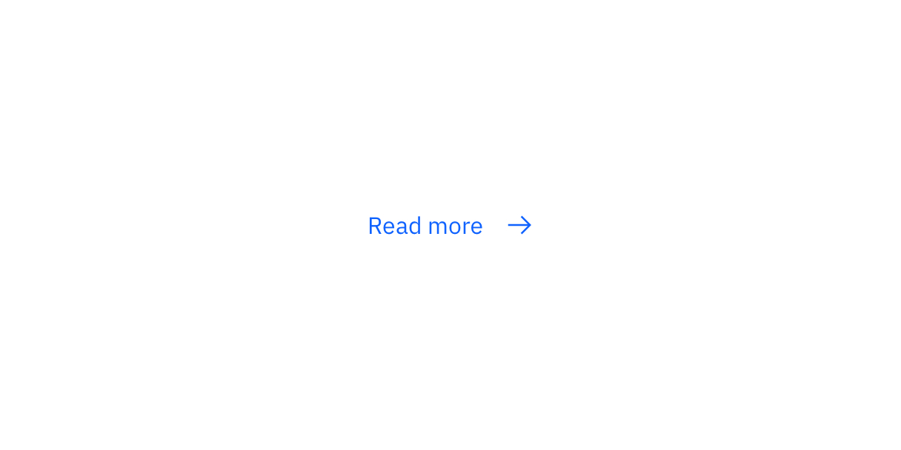
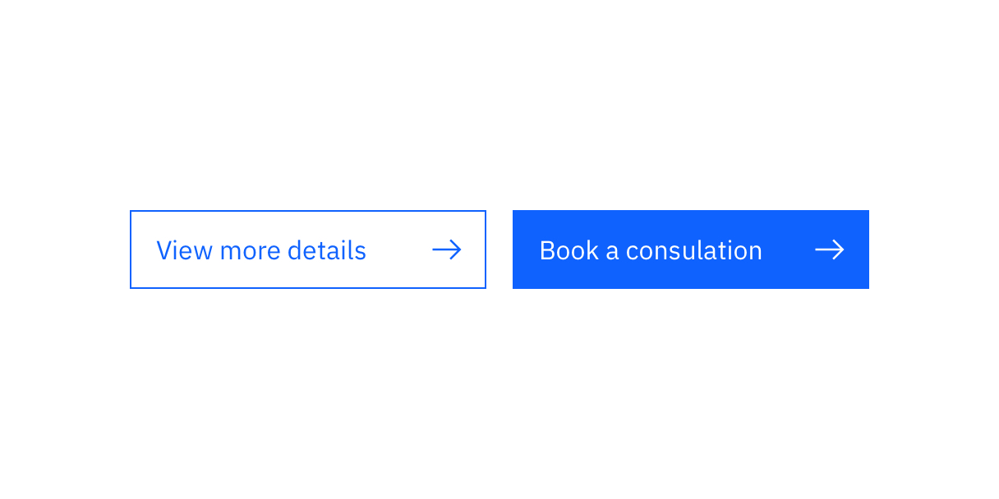
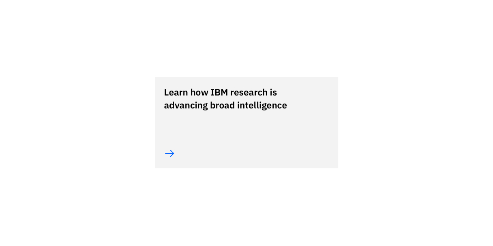
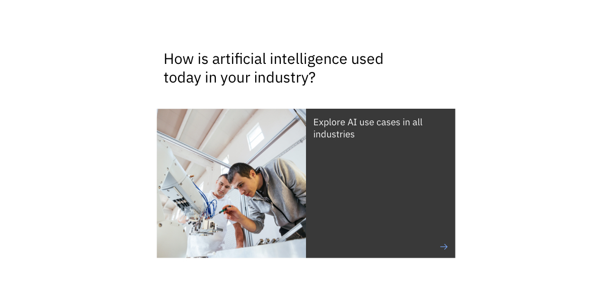

import ComponentDescription from 'components/ComponentDescription';
import ComponentFooter from 'components/ComponentFooter';
import ArrowDown20 from '@carbon/icons-react/es/arrow--down/20';
import ArrowLeft20 from '@carbon/icons-react/es/arrow--left/20';
import Launch20 from '@carbon/icons-react/es/launch/20';
import PlayOutline20 from '@carbon/icons-react/es/play--outline/20';
import ResourceLinks from 'components/ResourceLinks';

<ComponentDescription name="CTA" type="ui" />

<AnchorLinks>

<AnchorLink>Resources</AnchorLink>
<AnchorLink>Types</AnchorLink>
<AnchorLink>Styles</AnchorLink>
<AnchorLink>Feedback</AnchorLink>

</AnchorLinks>

<ResourceLinks name="CTA" type="ui" />

## Types

A CTA type defines the function of a given CTA to best inform the user what action to take.

| Type       | Icon              | Description                                                                                                                 |
| :--------- | :---------------- | :-------------------------------------------------------------------------------------------------------------------------- |
| _Jump_     | <ArrowDown20 />   | The jump link uses the down arrow to indicate to the user this link jumps down the page.                                    |
| _Local_    | <ArrowLeft20 />   | The local link is mainly used to navigate a user to another destination within IBM.com.                                     |
| _External_ | <Launch20 />      | The external link uses the launch icon to indicate that this link leaves the current page, and opens within a new tab.      |
| _Video_    | <PlayOutline20 /> | The video type CTA pulls metadata from Kaltura to populate the link’s content, and launches within the LightboxMediaViewer. |

 

## Styles

A CTA style defines the look of a given CTA to best express what action will occur when the user interacts with it.

### Text

The default Text style is a simple link with icon component. This type of CTA can be used at low levels within the page
hierarchy. <a href="https://www.carbondesignsystem.com/components/link/usage" target="_blank">See link usage
guidelines</a> on the Carbon Design System website to learn more.

### Button

The Button CTA style can communicate the primary and secondary action for that page to the user.

### Card

The [Card](https://www.ibm.com/standards/carbon/components/cards#card) CTA type is a small
[Card link](https://www.ibm.com/standards/carbon/components/cards#card-link) that can be used at higher levels within
the hierarchy.

### Feature

The feature CTA type is a larger version of [Card](https://www.ibm.com/standards/carbon/components/cards#card) and should only
be used once within a [Content block](https://www.ibm.com/standards/carbon/components/content-block-simple). See the
Feature card page to learn more about [Feature card](../components/cards#feature-card).

<ComponentFooter name="CTA" type="ui" />
