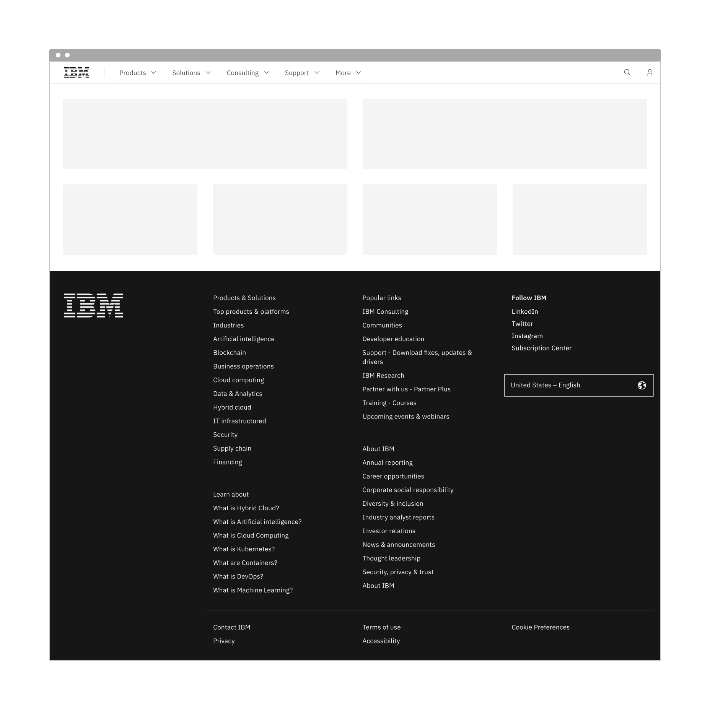

import ComponentDescription from 'components/ComponentDescription';
import ComponentFooter from 'components/ComponentFooter';
import ResourceLinks from 'components/ResourceLinks';

<ComponentDescription name="Dotcom shell" type="ui" />

<AnchorLinks>

<AnchorLink>Overview</AnchorLink>
<AnchorLink>Modifiers</AnchorLink>
<AnchorLink>Resources</AnchorLink>
<AnchorLink>Content guidance</AnchorLink>
<AnchorLink>Feedback</AnchorLink>

</AnchorLinks>

## Overview

The dotcom shell automatically includes the [masthead](../components/masthead) and [footer](../components/footer) components, which are wrapped in a shell that contains the Carbon Design System's [2x grid](https://carbondesignsystem.com/guidelines/2x-grid/overview/). This allows you to quickly get started building an IBM.com page with the required components and grid in place.

<Caption>Example of the dotcom shell with the masthead L0 and default footer.</Caption>

## Modifiers

### Configurations

The dotcom shell can be configred with any variation of the masthead or footer components to fit the needs of your experience.

<Row>
<Column colSm={2} colMd={4} colLg={4}>

#### Masthead
* L0
* L1
* Search open on load
* Etc

</Column>
<Column colSm={2} colMd={4} colLg={4}>

#### Footer
* Default
* Short
* Micro
* Local or language selector

</Column>
</Row>

<ResourceLinks name="Dotcom shell" type="ui" />

## Content guidance

Please reference the [masthead](../components/masthead) and [footer](../components/footer) guidance pages for content guidance for each component.

<ComponentFooter name="Dotcom shell" type="ui" />
